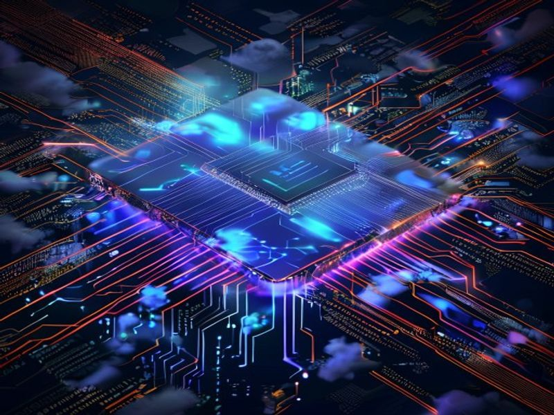

Meta dejó claro que ya no es solo una empresa de redes sociales y publicidad. Esta semana debutó **Meta Compute**, su nueva unidad de negocio cloud orientada a vender **infraestructura de IA y modelos foundation** a terceros. Sí, Meta ahora compite directamente con AWS, Azure y Google Cloud.

## Los números son brutales

- Meta tendrá **~7 GW de capacidad AI en 2026**, escalando a **14 GW en 2027**
- Según Wolfe Research, cada GW monetizado podría sumar **~20% al EPS**
- Las acciones subieron **15% en la semana** post-anuncio

## Iris: el chip propio

El otro bombazo: **Iris**, el chip AI diseñado por Meta en alianza con Broadcom y fabricado por TSMC, entra a producción en **septiembre 2026**. Puede correr workloads de training e inference, y reduce la dependencia de NVIDIA/AMD.

Menos dependencia de GPUs de terceros = menores costos de infraestructura a largo plazo. Simple.

## ¿Pero no todo es color de rosa?

Meta también tuvo baches esta semana:
- Retiró temporalmente **Muse Image** por preocupaciones de privacidad
- La UE metió multas adicionales
- Francia propuso obligar a publishers a aceptar pagos de Meta

Igual, el mercado lo ignoró todo y se enfocó en el potencial de Meta Compute. Las earnings del **29 de julio** van a ser clave: todos esperando guía de CapEx, timeline comercial de Meta Compute y detalles de Iris.

## ¿Por qué te importa?

Si estás evaluando providers de infra AI, Meta Compute es un nuevo jugador serio entrando al ring. Más competencia = mejores precios y más innovación para todos. Y si la estrategia del chip propio funciona, podría cambiar el panorama de costos de inference a nivel industria.

**Fuentes:** TradingKey, Wolfe Research, Meta IR
