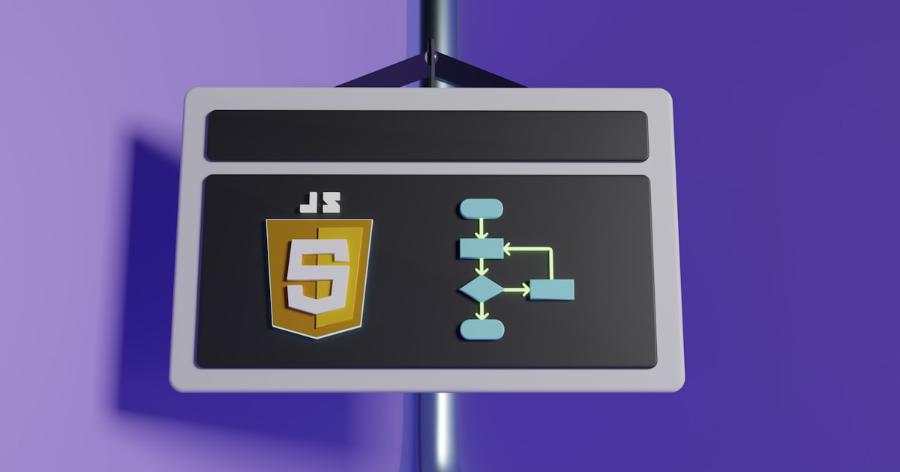

Kubernetes v1.37 sale el **26 de agosto de 2026** y trae **tres cambios breaking** que silenciosamente van a romper tu clúster durante el upgrade si los ignoras. Lo peor: los tres se anunciaron en el ciclo v1.35, así que ya llevan tiempo avisando, pero la mayoría de los equipos no ha hecho nada.

## 1. containerd 1.x se acaba

v1.37 **requiere containerd 2.0 o superior**. Fin de la historia. Si tienes nodos corriendo containerd 1.7.x, el kubelet simplemente no va a iniciar después del upgrade.

El modo de falla es insidioso: el control plane se actualiza bien, pero los worker nodes quedan en **NotReady**, workloads se evictan o se pierden. Desde la perspectiva del API server, todo se ve sano hasta que intentas programar algo.

**Qué hacer ahora:**
- `containerd --version` en cada nodo. Si ves v1.7.x, tienes trabajo.
- Sube a containerd 1.7.21+ primero, luego `ctr deprecations list` para ver incompatibilidades antes del salto a 2.0.
- Cualquier cosa que acceda al socket de containerd directamente debe usar **CRI v1 API** (v1alpha2 fue removido).
- Imágenes Docker Schema 1 deben migrarse a Schema 2 u OCI.

## 2. cgroup v1 no arranca

El flag `FailCgroupV1` viene en `true` por defecto desde v1.35. En v1.37, los nodos con cgroup v1 **sin override explícito** `failCgroupV1: false` en la config del kubelet directamente no van a iniciar.

Esto pega fuerte a clústeres **self-managed** (bare metal, VMs antiguas, todo lo que still corre en base CentOS 7-era). GKE, EKS y AKS probablemente ya lo manejaron, pero conviene verificar.

```bash
# En cada nodo — cgroup2fs = bien, tmpfs = problema
stat -fc %T /sys/fs/cgroup/
```

Si estás en cgroup v1, la solución es **actualizar el OS**: Ubuntu 22.04+, RHEL 9+ y Debian 12+ traen cgroup v2 por defecto.

## 3. Flags deprecados del kubelet removidos

`KubeletCgroupDriverFromCRI` es GA desde v1.36. En v1.37 se elimina el fallback legacy: el kubelet ahora **depende del CRI** para reportar el cgroup driver.

Revisa tus units de systemd y scripts de arranque del kubelet. Si tienes flags `--cgroup-driver`, **borralos**. Si usas Ansible, Puppet o Terraform para generar configs del kubelet, **actualiza esos templates ya**.

## Lo bueno: DRA para GPUs

No todo es dolor. **Dynamic Resource Allocation (DRA)** llegó a GA en v1.34, y en v1.37 el foco es **KEP-4815: Partitionable Devices** (alpha en v1.36). Esto permite **particionar una GPU** (A100, H100) en múltiples unidades lógicas con `DeviceClass` + `ResourceClaim`.

El scheduler MIG-aware de NVIDIA ya está estable. El modelo viejo de `nvidia.com/gpu: 1` sigue funcionando pero no da esta flexibilidad. Si corres inference serving, esto se traduce directamente en **ahorro de costos**.

## etcd v3.7.0

etcd v3.7.0 salió el **8 de julio** con `RangeStream`: los resultados grandes de `LIST` ahora se streamenan en chunks en vez de bufferarse server-side. Mejor uso de memoria para clústeres grandes.

## Resumen: ¿qué hacer?

1. **Inventario** de versiones de containerd en todos tus nodos
2. **Verificar** cgroup version con el comando de arriba
3. **Auditar** flags del kubelet en configs de systemd y IaC
4. **Probar** el upgrade en un clúster de staging antes de agosto

Tienes 44 días. A contar.

**Fuentes:** byteiota.com, Kubernetes release docs, containerd docs, Google Cloud docs

---

### Update: 9 de agosto, 2026 — Sneak Peek oficial de Kubernetes v1.37: Metrics API a GA, IPVS se despide y rootless kubelet a Beta

El equipo de Kubernetes publicó el **sneak peek oficial** de v1.37 el 31 de julio, confirmando los cambios que ya cubrimos y agregando detalles importantes que no estaban en los KEPs individuales. Resumen de lo nuevo:

**Metrics API por fin llega a GA (después de casi 9 años en Beta)**
La API `metrics.k8s.io` gradúa a **Stable (GA)** en v1.37. Esto es históricamente significativo: pasó casi una década en Beta. La API que alimenta `kubectl top`, HPA y VPA finalmente tiene el sello de estabilidad. Sin cambios funcionales — v1 y v1beta1 seguirán funcionando durante la transición.

**Deprecación de IPVS en kube-proxy**
El modo IPVS de kube-proxy (introducido en v1.8 para resolver bottlenecks de iptables) entra en deprecación oficial. El timeline:
- **v1.37:** warnings en startup si usas `mode: ipvs`
- **v1.40:** se deshabilita por defecto (aún seleccionable via feature gate)
- **v1.43:** se remueve completamente

La justificación es técnica: IPVS nunca pudo implementar Services completamente solo, siempre necesito iptables por debajo. El reemplazo es nftables (KEP-3866).

Para verificar tu modo actual:
```bash
kubectl -n kube-system get configmap kube-proxy -o jsonpath='{.data.config\.conf}' | grep 'mode:'
```

**Kubelet rootless (UserNS) a Beta**
El kubelet corriendo dentro de un user namespace Linux (rootless mode) gradúa a **Beta**. Esto permite que los componentes del nodo corran como usuario sin privilegios en el host, pero como root dentro del namespace. Reduce la superficie de ataque significativamente.

**SELinuxMount llega a GA**
Los volúmenes ahora se montan con `-o context=<label>` en vez de reetiquetarse recursivamente, pero **solo cuando el CSI driver lo opt-in** via `seLinuxMount: true`. Importante: pods con diferentes labels SELinux que compartían volumen en el mismo nodo vía recursive relabeling podrían fallar al iniciar. Si necesitas el comportamiento anterior: `seLinuxChangePolicy: Recursive` en el Pod spec.

**Static Pods: chau Secrets y ConfigMaps**
Se cierra un bug que permitía a Static Pods referenciar Secrets/ConfigMaps via `configMapRef` o `secretRef`. Static Pods no se crean via API server, así que nunca debieron tener acceso a API resources. El feature gate `PreventStaticPodAPIReferences` que permitía saltarse la restricción fue removido.

**`kubectl run -f` deprecado**
El flag `--filename` (`-f`) en `kubectl run` entra en deprecación. Tiene sentido: el pod generado siempre se construye solo desde argumentos CLI (`NAME` + `--image`), el flag no aportaba nada.

**cgroup v1: sigue la cuenta regresiva**
El override `failCgroupV1: false` sigue disponible en v1.37 pero es considerado fix temporal. Features como In-Place Pod Resizing y Tiered Memory Protection dependen exclusivamente de cgroup v2. La remoción completa viene en un release futuro.

La fecha de release sigue firme para el **26 de agosto**. Quedan 17 días.

**Fuente adicional:** [Kubernetes Blog oficial — Sneak Peek v1.37](https://kubernetes.io/blog/2026/07/31/kubernetes-v1-37-sneak-peek/), [heise online](https://www.heise.de/news/Developer-Haeppchen-Kotlin-LSP-fuer-Cursor-und-Sneak-Peak-fuer-Kubernetes-11399144.html)
