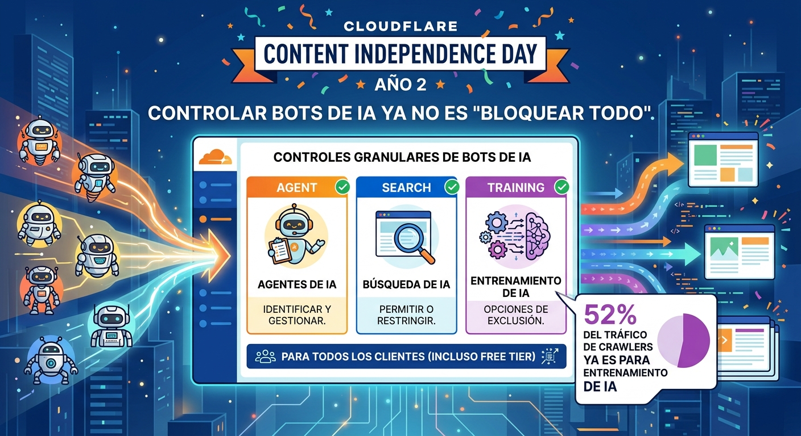

Hace un año, Cloudflare declaró el primer **Content Independence Day**: bloqueo por defecto de crawlers de IA para nuevos dominios, más un marketplace de Pay-Per-Crawl. La idea era simple: si los bots de IA se llevan tu contenido para entrenar modelos, debería haber compensación.

Hoy, el problema mutó. Ya no se trata solo de "bloquear IA". Se trata de que **el tráfico de internet ya no es mayoritariamente humano**, y los sitios necesitan herramientas más finas para decidir qué permiten y qué no.

## La nueva taxonomía de bots

Cloudflare ahora clasifica el tráfico de IA en tres categorías que cualquier cliente —incluido el plan gratis— puede gestionar de forma independiente:

- **Search:** bots que indexan tu contenido para responder preguntas después (ej. buscadores tradicionales y AI search engines). Acá esperas tráfico de referral como compensación.
- **Agent:** bots actuando en tiempo real en nombre de un humano (ej. ChatGPT-User, Gemini o Claude usando un navegador). Hay alguien al otro lado esperando una respuesta.
- **Training:** crawlers que se llevan tu contenido para entrenar o hacer fine-tuning de modelos. Este es el caso donde más se justifica bloquear o cobrar.

## Los datos son brutales

En el reporte del agentic internet que publicaron, hay cifras para asustarse:

- **52% de las peticiones de crawlers** son para entrenamiento de IA (junio 2026), arriba del 22% en primavera de 2025.
- **30% de la humanidad** (2.5 billones de usuarios) ya usa IA generativa regularmente. La curva de adopción va a velocidad 2x comparada con los smartphones.
- Por cada hora que la gente pasa buscando información online, **solo 15 minutos son en la web abierta**. El resto se lo llevan las AI answer engines.

## ¿Por qué esto importa para infra/DevOps?

Si gestionas sitios web o APIs, esto cambia el juego:

1. **El bloqueo binario ya no funciona.** No puedes simplemente bloquear todo lo que no sea humano, porque perderías visibilidad en buscadores y agents que sí te dan valor.
2. **Pay-Per-Crawl es real.** Cloudflare está construyendo un marketplace donde los sites pueden cobrar por crawl. Esto podría transformar la economía del contenido.
3. **La web "agentic" necesita infraestructura diferente.** Los AI agents interactúan distinto: hacen requests en tiempo real, esperan respuestas estructuradas, y no siguen el patrón de "crawlea y muestra links" que funcionó por 30 años.

Cloudflare está apostando fuerte a ser **la capa de control del internet agentic**. Y con ~20% del web pasando por su red, tienen la posición para hacerlo.

> **Fuente:** [Cloudflare Blog - AI traffic options](https://blog.cloudflare.com/content-independence-day-ai-options/), [Cloudflare Blog - Agentic Internet Report](https://blog.cloudflare.com/agentic-internet-bot-report/)

### Update: 23 de agosto, 2026 — Bot Preference Sync: dilo una sola vez

Cloudflare dio otro paso en esta misma línea con **Bot Preference Sync**, disponible para _todos_ los clientes desde el tier Free hasta Enterprise (anunciado el 21 de agosto).

El problema que resuelve es el clásico dedo-en-la-llaga: terminas con un `robots.txt` que dice `Disallow` para cierto crawler, pero tus reglas de enforcement en el edge no lo bloquean (o al revés). Cuando tus preferencias declaradas y tus reglas reales no coinciden, **algunos crawlers tratan esa inconsistencia como pretexto para ignorar tus preferencias** o intentar bypasear tus reglas.

Bot Preference Sync alinea automáticamente el `robots.txt` con tus políticas de bots de IA para los tres perfiles que lanzaron el 1 de julio: **Search, Agent y Training**. En vez de mantener archivos estáticos a mano en múltiples capas, declaras la política una vez y Cloudflare sincroniza tanto la señal (robots.txt gestionado) como el enforcement en el edge.

Para los equipos que venían manejando esto con scripts caseros y drift permanente entre declaración y configuración, es una preocupación menos. Y refuerza la tesis del post original: Cloudflare sigue consolidándose como la capa de control del tráfico agentic.

> **Fuente del update:** [Cloudflare Blog - Bot Preference Sync](https://blog.cloudflare.com/bot-preference-sync/)
