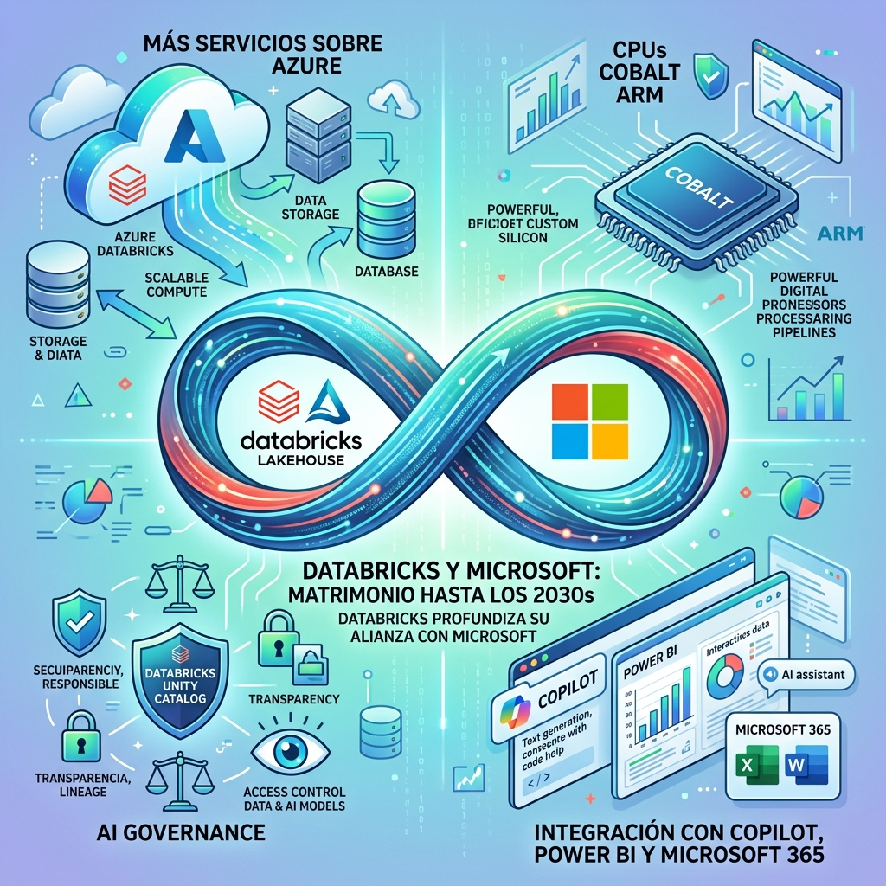

Casi una década de relación y ahora oficial hasta los **2030s**. Databricks y Microsoft anunciaron una expansión profunda de su alianza que básicamente convierte a Azure en la casa de Databricks y mete las herramientas de IA de Databricks directamente en el ecosistema Microsoft.

## Los puntos clave

**1. Databricks se muda a Azure (oficialmente):**
Databricks va a correr sus **operaciones internas y analytics** sobre Azure Databricks — el servicio conjunto. Básicamente van a usar su propio producto sobre la nube de Microsoft a escala masiva. Es un move de *"drink your own champagne"* para mostrar a clientes enterprise que el platform aguanta cargas reales.

**2. Azure Cobalt ARM:**
Databricks ya está usando los CPUs **Cobalt 100** (ARM-based de Microsoft) y planea adoptar el **Cobalt 200**, que entrega hasta **50% mejor performance** con encriptación de memoria por defecto. Esto es parte del push de Microsoft para competir con AWS Graviton en el espacio ARM.

**3. Integración profunda con el stack Microsoft:**
Las herramientas de IA de Databricks se integran con:
- **Microsoft 365 y Copilot** — Genie (el AI co-worker de Databricks) dentro del ecosystem
- **Power BI y Power Platform** — datos y modelos directos
- **Microsoft Entra y Purview** — governance y seguridad unificada
- **Azure Data Lake Storage y OneLake** — storage conjunto
- **Unity AI Gateway** — gobernanza de modelos, agentes y spending

## Por qué importa

Esto es un **lock-in play** de Microsoft. La estrategia es clara: si los datos viven en Databricks sobre Azure, y los modelos de IA se gobiernan desde ahí, y los resultados se consumen en Copilot/Teams/Power BI... **¿para qué dejar Azure?**

Para Databricks, el deal les da:
- Acción directa al canal de ventas Microsoft (miles de ejecutivos enterprise)
- Validación de escala (clientes como Unilever, SMBC, Bupa, Fonterra ya citados)
- Costos de infra potencialmente menores con Cobalt ARM

## El contexto competitivo

El mercado de **plataformas de datos para IA enterprise** está que arde:
- **Snowflake** está haciendo su propio push con container services y NVIDIA
- **Google Cloud** tiene BigQuery + Vertex AI
- **AWS** tiene Redshift + SageMaker + Bedrock

Databricks+Microsoft es probablemente el combo más fuerte para empresas que ya están en Microsoft 365 y quieren hacer IA sobre sus datos sin saltar a otro proveedor.

## La pregunta incómoda

¿Es esto bueno para los clientes o es **vendor lock-in disfrazado de partnership**? La respuesta depende de cuánto valoren la integración nativa vs la flexibilidad de multicloud. Con esta movida, salirse del combo Databricks-Azure se vuelve cada vez más caro y complejo.

*Fuente: IT Brief Asia, Databricks, Microsoft*
