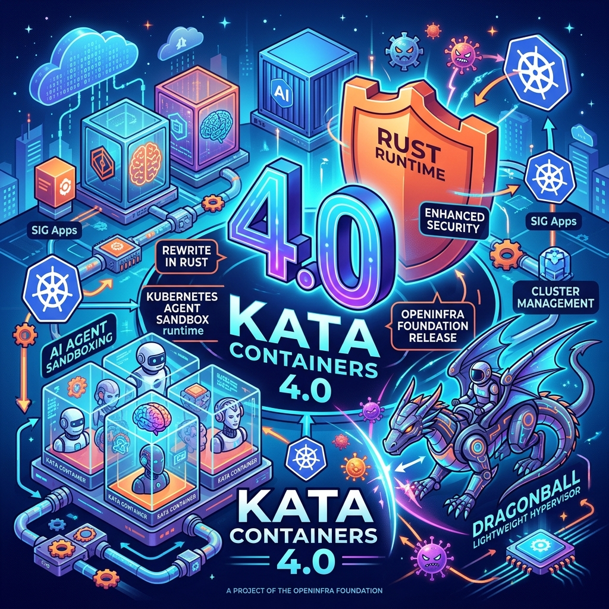

Si hay un problema que nadie ha resuelto bien todavía, es cómo aislar agentes IA en producción. Los contenedores tradicionales asumen workloads deterministas; los agentes son todo lo contrario. La OpenInfra Foundation acaba de hacer su apuesta: **Kata Containers 4.0**, con un runtime reescrito en Rust y posicionado directamente como infraestructura para agent sandboxing en Kubernetes.

## Qué es Kata Containers (versión corta)

Kata Containers levanta **micro-VMs ligeras** que se comportan como contenedores — misma UX, pero con aislamiento a nivel de hipervisor. Cada workload corre en su propia VM con kernel dedicado. No es nuevo como concepto, pero la versión 4 cambia bastantes cosas.

## Qué trae la versión 4.0

**Runtime en Rust (runtime-rs)** que reemplaza al anterior en Go. Los gains concretos:

- **Memory safety** de partida (Rust → menos clases de bugs)
- **Menor footprint** de memoria y arranque más rápido
- **Multi-queue networking** para todos los hipervisores
- **Block storage management** mejorado en entornos Kubernetes
- **Sandbox resource accounting** que ahora incluye overhead del runtime — importante para scheduling de pods

**Dragonball**, el nuevo hipervisor in-process desarrollado por Ant Group (Alibaba), viene como default. Es más liviano que QEMU o Cloud Hypervisor, las otras opciones soportadas.

## Por qué importa para agentes IA

Aquí está la parte interesante. La OpenInfra Foundation posicionó explícitamente Kata como **runtime para Agent Sandbox**, un proyecto umbrella de Kubernetes SIG Apps para manejar sandboxes seguras de agentes IA.

La lógica es directa, y la planteó bien Zvonko Kaiser de NVIDIA en un panel de OpenInfra:

> Los microservices tienen execution paths estrictos. Los agentes son **no deterministas** — un eufemismo para "impredecibles".

Si un agente puede moverse lateralmente por un cluster, lo hará. Kata ofrece aislamiento a nivel VM: cada agente en su propia máquina virtual, con kernel propio. Si el agente hace algo raro, el blast radius es esa VM.

Ant Group ya lo usa en producción para sus agentes — partieron con batch workloads, después core online services, y ahora IA. El caso real existe.

## El contexto más amplio

Esto no viene solo. Esta semana vimos:

- **Red Hat** publicando sobre layered sandboxing con OpenShift + OpenShell + Kata (artículo del 16 julio)
- **OpenAI** documentando su Sandbox Agents API para entornos containerizados
- **OpenSandbox** como proyecto open-source general-purpose en GitHub

La industria está convergiendo en que los agentes necesitan **múltiples capas de aislamiento**, y Kata se está posicionando como la capa de VM-level isolation dentro del stack de Kubernetes.

## Lo que falta

Kata 4.0 es una release sólida, pero el ecosistema de agent sandboxing todavía está ensamblándose. El proyecto Agent Sandbox de SIG Apps es relativamente joven, y la integración real con plataformas de agentes (Bedrock AgentCore, AI Foundry, etc.) todavía requiere plumbing considerable.

Pero como pieza de infraestructura base — VMs ligeras con isolation fuerte y performance decente — es probablemente la mejor opción open-source disponible hoy.

> 💡 **TL;DR:** Si estás corriendo agentes IA en Kubernetes y necesitas más aislamiento que un container pero no quieres levantar VMs completas, Kata 4.0 con el runtime Rust + Dragonball es tu herramienta. El ecosistema de agent sandboxing aún es joven, pero la capa base acaba de mejorar sustancialmente.
