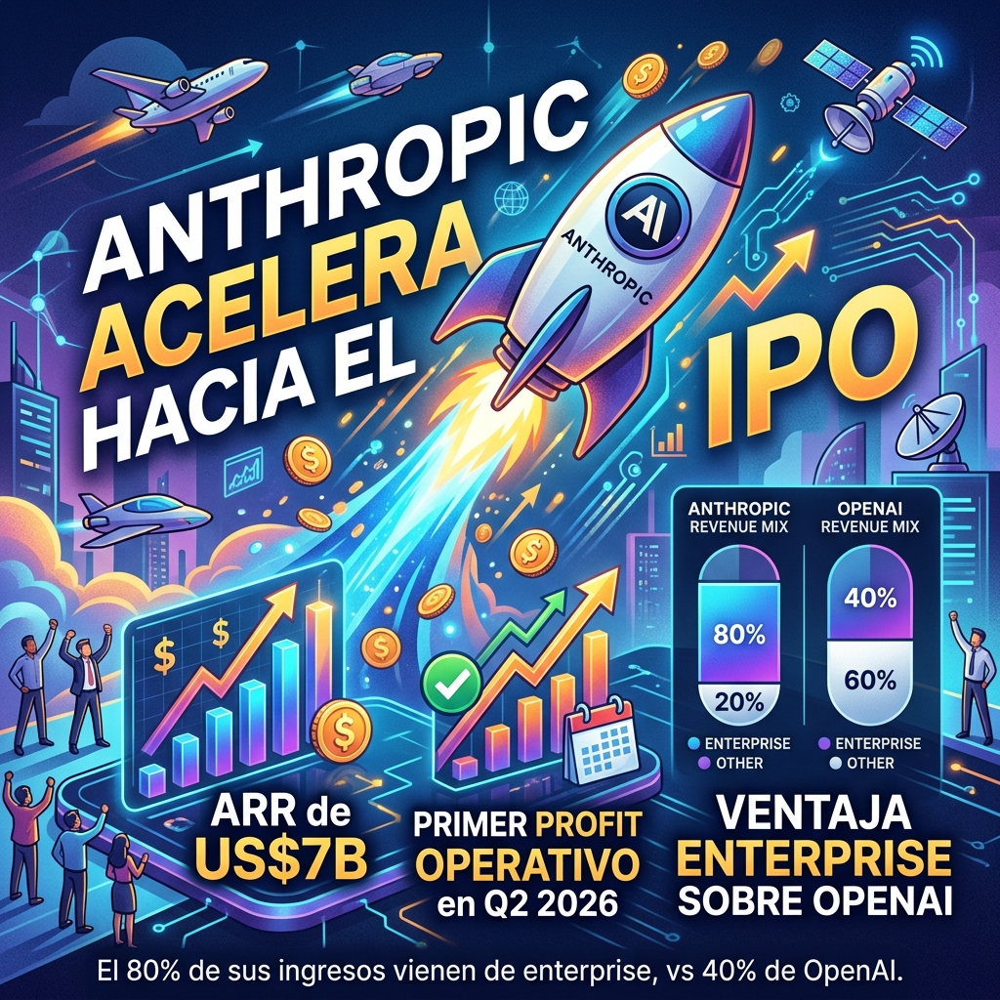

Mientras el mundo discute si Claude Opus 5 es mejor que GPT-5.6 Sol, la historia más grande de Anthropic se cuenta en números: **la empresa está camino al IPO y en mejor forma de lo que se piensa**.

## Los números que importan

- **ARR (Annualized Revenue Run Rate):** US$47 mil millones a mediados de 2026, arriba de US$9B a fin de 2025. Eso es un crecimiento de **~130% en seis meses**.
- **Primer profit operativo:** Q2 2026. Anthropic originalmente proyectaba 2028 como su primer año rentable. Adelantó dos años el cronograma.
- **Valuación:** US$965 mil millones en su última ronda. A punto de cruzar el billón.
- **IPO estimado:** Según reportes de mercado, el target sería **octubre 2026**, con filing confidencial ya presentado ante la SEC.

## La ventaja enterprise

El dato más revelador: **80% del revenue de Anthropic viene de enterprise** (API + developer tools). OpenAI, en contraste, genera solo ~40% de empresas — el resto es consumer (ChatGPT Plus, Pro, etc.).

Esto es estratégicamente masivo por varias razones:

1. **Revenue enterprise es sticky.** Una vez que tu CI/CD, tu code review, tu atención al cliente y tus workflows internos están integrados con la API de Claude, migrar es caro y doloroso.
2. **Enterprise paga mejor.** Los contratos B2B son anuales, predecibles, y con ASP (Average Selling Price) muy superiores a suscripciones consumer de $20/mes.
3. **OpenAI tiene el problema opuesto.** 1 billón de usuarios activos mensuales es impresionante, pero monetizar casual users es difícil. La mayoría no paga.

## Anthropic vs OpenAI como IPO stocks

The Motley Fool publicó un análisis comparando ambas compañías como inversiones de IPO, y las métricas favorejan claramente a Anthropic:

| Métrica | Anthropic | OpenAI |
|---------|-----------|--------|
| ARR 2026 | ~$47B | ~$25B |
| Revenue multiple | ~20.5x | ~34.1x |
| % Enterprise | 80% | 40% |
| Profit operativo | Q2 2026 (alcanzado) | No antes de 2030 |
| Valuación privada | $965B | $852B |

OpenAI está valuado más caro respecto a sus ingresos, genera menos revenue total, y su camino a la rentabilidad es dos años más largo. La única ventaja: tamaño de usuario y brand recognition global.

## El riesgo OpenAI

OpenAI está diversificando con hardware (smart home speaker), pero ese es un mercado saturado y de márgenes bajos. Si la jugada no funciona, podría ser una distracción cara mientras Anthropic captura más wallet share enterprise.

## El bottom line

La narrativa de "OpenAI vs Anthropic" suele centrarse en benchmarks y capacidades de modelos. Pero la historia real es de **modelo de negocio**: Anthropic eligió enterprise desde el día uno, y eso le está dando un runway financiero superior. Si el IPO se concreta en octubre, sería **el debut público más grande del año en tech**.

Para los que trabajamos en infra y DevOps, esto importa porque define qué plataformas van a tener el presupuesto para seguir invirtiendo en capacidad, safety y features. Y por ahora, Anthropic tiene el viento a favor.

*Fuentes: The Motley Fool, Yahoo Finance, TradingView, GuruFocus*
