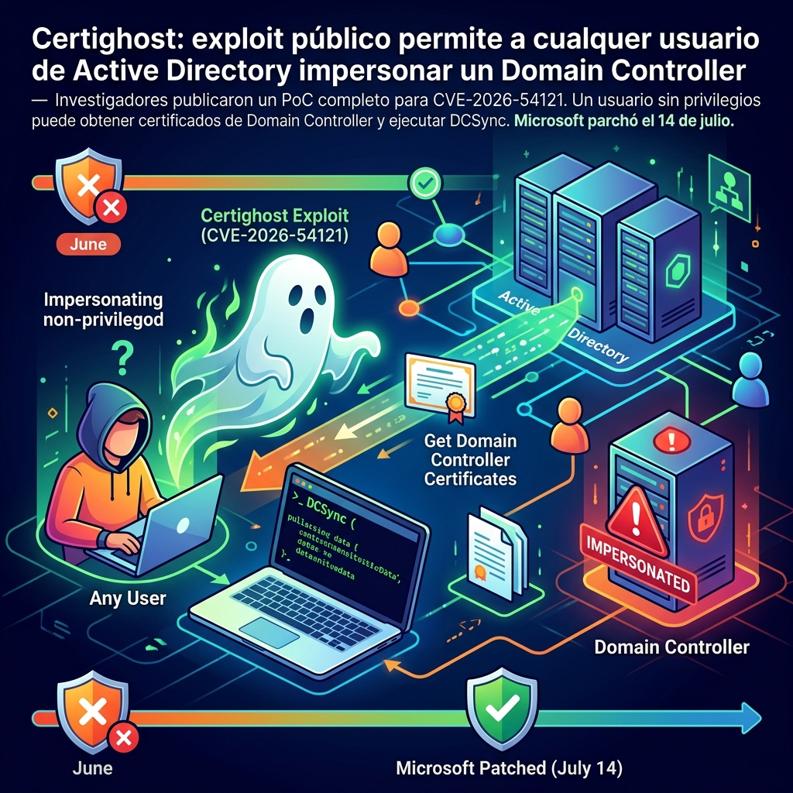

Si tu infraestructura usa **Active Directory Certificate Services (AD CS)** con una Enterprise CA, esto merece tu atención inmediata.

## Qué pasó

El 24 de julio, los investigadores **H0j3n** y **Aniq Fakhrul** publicaron un exploit funcional — bautizado **Certighost** — que permite a cualquier usuario del dominio (sin derechos de admin) obtener un certificado de **Domain Controller** y autenticarse como esa máquina.

La consecuencia directa: el atacante obtiene credenciales Kerberos con derechos de replicación, lo que habilita **DCSync** — es decir, puede extraer el hash de `krbtgt` y comprometer todo el bosque de AD.

El bug es **CVE-2026-54121**, patcheado por Microsoft el 14 de julio como parte del Patch Tuesday. CVSS 8.8.

## Cómo funciona el ataque

El flujo es elegante en lo malo:

1. El atacante (con solo cuenta de Domain Users) crea o reutiliza una **computer account** — el default quota de AD lo permite (`ms-DS-MachineAccountQuota = 10`)
2. Explota un fallback del protocolo de enrollment llamado **"chase"**: cuando una CA no puede resolver la info del end entity, el protocolo permite que el solicitante provea el host DC (`cdc`) y el objeto machine (`rmd`) a contactar
3. El CA **no validaba** que ese host fuera realmente un Domain Controller — seguía al host indicado por el atacante via SMB y LDAP sin verificación
4. El atacante levanta servicios LSA y LDAP rogue, relaya el challenge de la CA al DC real via Netlogon, y obtiene el `objectSid` y `dNSHostName` del DC objetivo
5. La CA firma la identidad del DC en el certificado. Fin del juego!

Con PKINIT, el atacante autentica como el DC objetivo y ejecuta DCSync.

## Mitigación

**Opción 1 (recomendada):** Instalar el update del 14 de julio en todos los hosts con AD CS. El patch agrega `CRequestInstance::_ValidateChaseTargetIsDC` en `certpdef.dll`, que valida que el destino del chase sea exactamente un DC real.

**Opción 2 (si no puedes patchear inmediatamente):** Deshabilitar el flag de chase y reiniciar Certificate Services:

```powershell
certutil -setreg policy\EditFlags -EDITF_ENABLECHASECLIENTDC
Restart-Service CertSvc -Force
```

⚠️ Los investigadores advierten que esto puede romper flujos de enrollment legítimos. Testear antes de aplicar en producción.

## Detalles técnicos relevantes

- El PoC está **público en GitHub** ([aniqfakhrul/CVE-2026-54121](https://github.com/aniqfakhrul/CVE-2026-54121))
- Afecta Windows Server 2012 hasta 2025 (incluyendo Server Core)
- Requiere: red accesible + cuenta de dominio + Enterprise CA que siga el path vulnerable
- **No requiere interacción del usuario** ni privilegios administrativos
- Al 24 de julio, **no estaba en el catálogo de KEV de CISA** (pero el PoC es público)

## El detalle del patch

El fix de Microsoft agrega varias validaciones antes de seguir un chase:

- Rechaza literales IP y nombres demasiado largos
- Bloquea metacaracteres LDAP
- Exige exactamente un objeto computer en AD cuyo DNS coincida con el destino
- Verifica que la cuenta tenga `SERVER_TRUST_ACCOUNT` (8192) en `userAccountControl`
- Comparación posterior de SID para evitar sustitución de objetos

---

El nombre "Certighost" es bastante apropiado: el DC fantasma que la CA nunca validó. Si tienes Enterprise CA en tu infraestructura, **hoy es un buen día para verificar que los parches del 14 de julio están aplicados**.

*Fuentes: The Hacker News, NVD, GitHub (aniqfakhrul), Microsoft MSRC*
