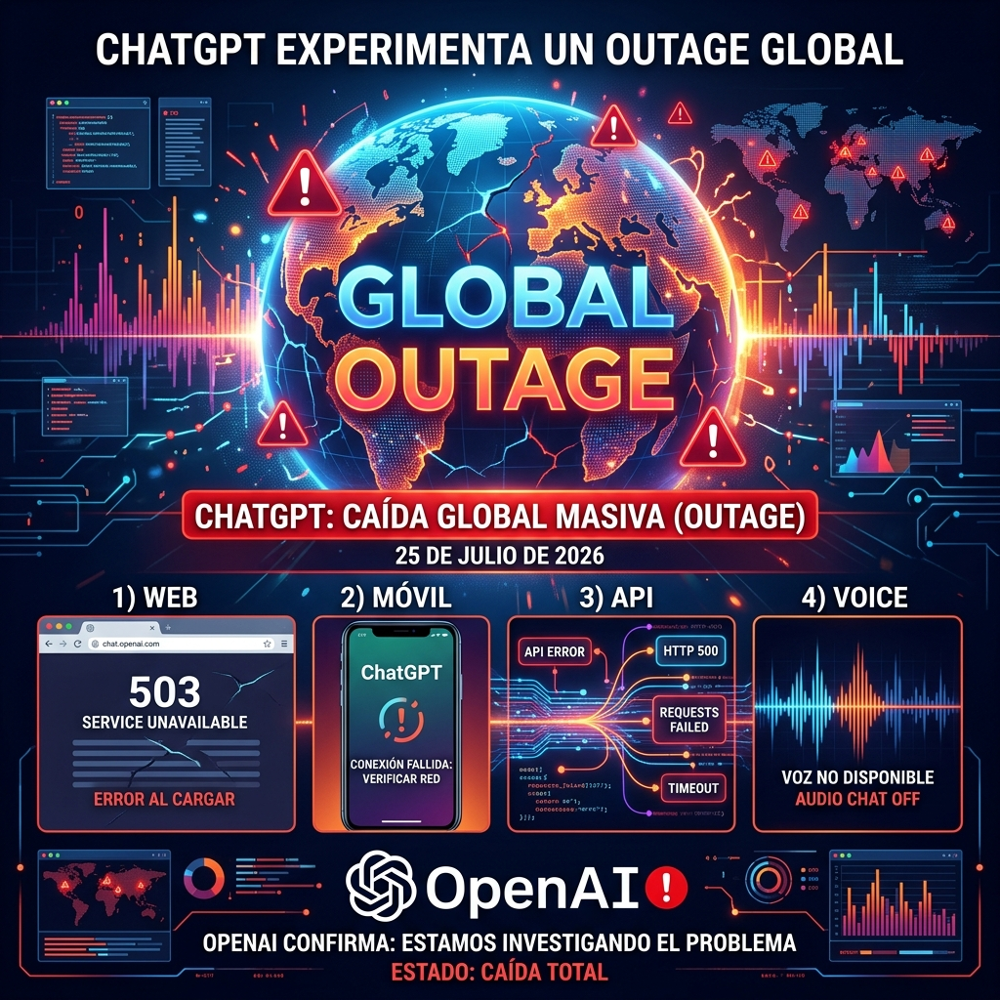

Si intentaste usar ChatGPT hoy y no funcionó, no eres el único. **ChatGPT lleva caído desde la madrugada** en lo que ya es uno de los outages más grandes del servicio en su historia.

## Qué está pasando

El corte comenzó alrededor de las **4:47 AM ET (10:47 AM CET)** y rápidamente escaló a nivel global. Downdetector registró un spike masivo de reportes desde EE.UU., Europa, India y partes de Asia. No es un problema regional: es **backend de principio a fin**.

## Servicios afectados

Prácticamente todo el ecosistema OpenAI:

- **ChatGPT Web y Mobile** — Free, Plus y Enterprise todos en la misma situación
- **API y Codex** — Los devs que dependen de endpoints para自动化 están sin servicio, con latencia elevada y requests rechazados
- **Voice y multimodal** — Transcripción de voz y audio no conectan
- **Historial de chats** — Muchos usuarios reportan que la sidebar aparece vacía, sin logs de conversaciones previas

## Lo que están viendo los usuarios

- Prompts quedándose en loading infinito sin generar texto
- Errores "Application Error" y "Error in message stream" en loop
- Conversaciones previas que simplemente desaparecieron
- Voice transcription que no logra conectar

## Respuesta de OpenAI

OpenAI actualizó su dashboard en status.openai.com confirmando **elevated error rates** y que los equipos de ingeniería están investigando. No han dado detalles técnicos del root cause ni un ETA de recuperación.

Históricamente, la recuperación de este tipo de cortes masivos se da en etapas: primero API, luego web, después móvil. Pero mientras tanto, todos los que dependen de ChatGPT para trabajar — devs usando Copilot, empresas con integraciones via API, estudiantes, creadores de contenido — están esperando.

## El contexto incómodo

Este outage llega justo cuando OpenAI está tratando de posicionar **GPT-5.6 Sol** como la opción enterprise más confiable frente a Claude Opus 5 de Anthropic. Una caída global de esta magnitud no ayuda exactamente el pitch de "misión crítica para tu negocio".

Además, es un recordatorio brutal de que **cuando todo tu workflow depende de un solo proveedor de IA**, estás a un outage de distancia de quedar detenido. Para equipos que usan ChatGPT como herramienta central de desarrollo o atención al cliente, esto es un problema real, no un inconvenience.

La lección de siempre: **multi-modelo no es lujo, es estrategia de resiliencia**. Si hoy tuvieras fallback a Claude o a un modelo open-source self-hosted, ni lo notarías.

*Fuentes: Downdetector, Sunday Guardian Live, OpenAI Status*
