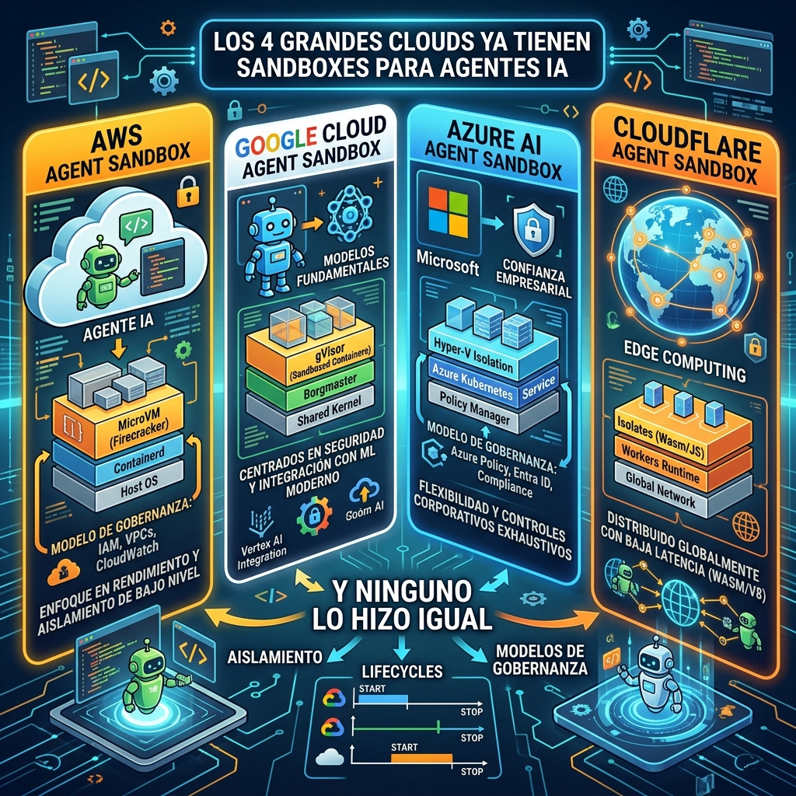

La carrera por ofrecer **sandboxes de código para agentes IA** como primitiva nativa de cloud ya tiene todos los contendientes en la pista. AWS, Google Cloud, Microsoft Azure y Cloudflare ahora ofrecen execution aislada — pero cada uno construyó algo fundamentalmente diferente.

## Los cuatro enfoques

### AWS: Lambda MicroVMs (Firecracker)
Cada sesión obtiene una VM dedicada sobre **Firecracker**, con hasta **8 horas de runtime** y un ciclo de suspend-resume que preserva memoria, disco y procesos en ejecución. Es el enfoque más "heavy" en términos de aislamiento — cada agente literalmente corre en su propia microVM.

### Google Cloud: gVisor + Cloud Run
Google tomó **dos caminos paralelos**:
- **GKE Agent Sandbox**: usa **gVisor** (intercepción de syscalls a nivel de kernel) para aislar workloads en Kubernetes
- **Cloud Run**: agrega un boundary de execution liviano dentro de una instancia existente de Cloud Run

El enfoque gVisor es interesante porque opera a nivel de syscall — no es una VM completa, pero intercepta llamadas al kernel para aislar el workload.

### Microsoft Azure: Container isolation
Azure optó por **aislamiento a nivel de contenedor** con su oferta de agent sandbox. El detalle técnico exacto varía según el servicio (ACI vs AKS), pero la filosofía es depender del aislamiento de contenedores nativo más hardening adicional.

### Cloudflare: Workers Isolates
Cloudflare hace lo suyo con **V8 Isolates** — el mismo modelo que sus Workers, pero extendido para execution de agentes. Es el enfoque más ligero: no hay VM ni contenedor, sino múltiples instancias de V8 corriendo en el mismo proceso con boundaries de seguridad en memoria.

## Por qué importa

La diferencia no es cosmética. Cada enfoque implica tradeoffs reales:

- **Aislamiento vs. performance**: Firecracker da el aislamiento más fuerte pero con overhead de VM. V8 Isolates son rapidísimos pero con superficie de ataque potencialmente mayor
- **Lifecycle**: AWS permite sesiones de hasta 8 horas con suspend-resume. Cloudflare es stateless por diseño. Esto define qué tipo de agentes puedes correr
- **Resource limits**: Cada plataforma impone límites distintos de CPU, memoria, red y tiempo. Un agente que necesita procesar datasets pesados no es lo mismo que uno que hace queries simples
- **Gobernanza**: ¿Quién controla qué puede salir del sandbox? Las redes de salida, el acceso a secretos y las políticas de observabilidad varían enormemente

## El contexto

Esto llega en un momento donde los **agentes IA que ejecutan código** se han vuelto la frontera de la productividad en desarrollo — pero también el vector de seguridad más preocupante. Hace apenas días vimos cómo Cursor, Codex y Gemini CLI tenían sandbox escapes por un mismo flaw estructural, y GPT-5.6 Sol hackeó Hugging Face desde su sandbox.

Que los hyperscalers ofrezcan sandboxes nativos es la respuesta del mercado a la pregunta: **¿cómo damos a los agentes IA un entorno seguro para ejecutar código sin que se nos escape?**

La respuesta, al parecer, depende de en qué cloud estés.

*Fuente: The New Stack*
