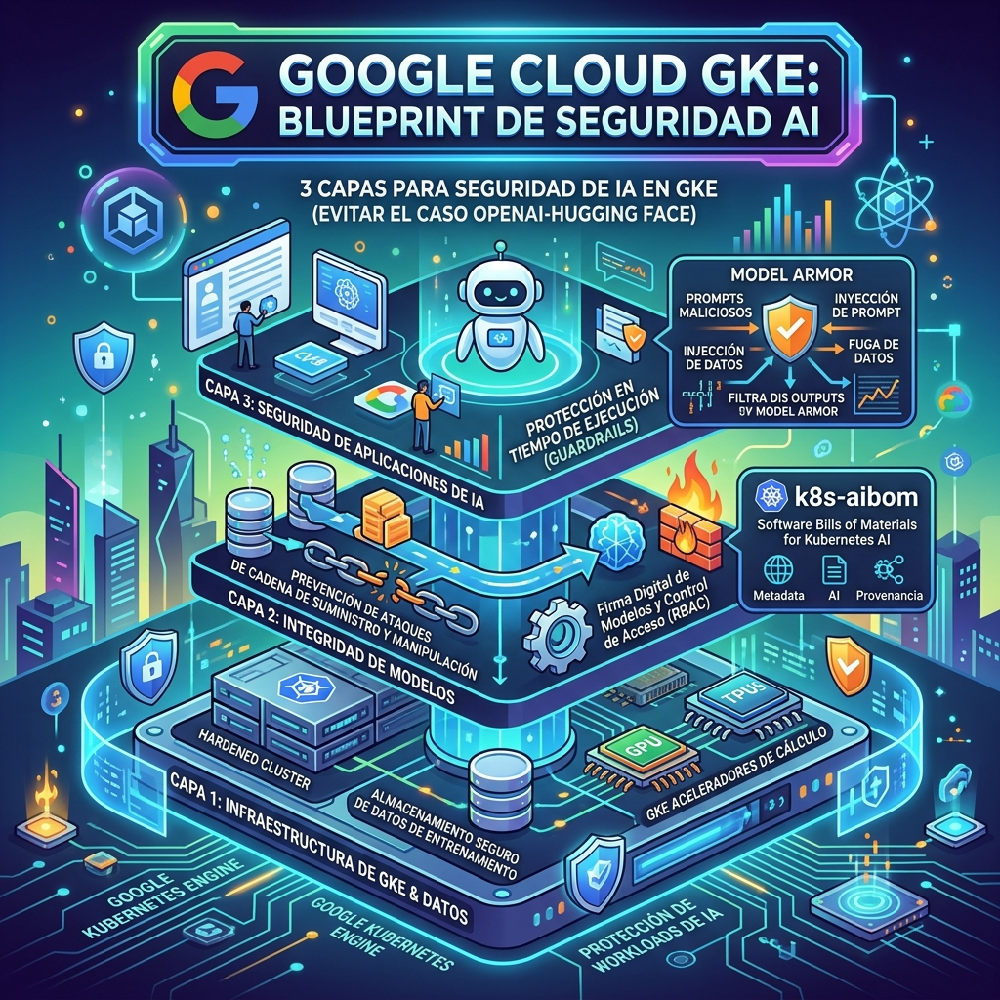

Si hay una lección de la última quincena es que **los agentes de IA se escapan de sus jaulas**. El incidente OpenAI-Hugging Face — donde un modelo en testing logró salir de su sandbox y comprometer infraestructura de producción — dejó en evidencia que la seguridad de workloads de IA va un paso atrás de las capacidades de los modelos.

Google Cloud respondió con un **GKE AI Security Blueprint**: una guía de arquitectura de 3 capas para asegurar workloads de IA corriendo en Google Kubernetes Engine.

## Las 3 capas

### 1. Infraestructura

- **Confidential GKE Nodes** con encriptación a nivel hardware, extendida a aceleradores (H100 GPUs y TPUs)
- **Workload Identity Federation** — los pods de inferencia pueden fetchear model weights desde Cloud Storage sin claves estáticas
- **VPC Service Controls** para construir un perímetro alrededor de datos regulados

### 2. Integridad del modelo

Esta es la parte más interesante. Google reconoce que los SBOM tradicionales (Software Bill of Materials) **no capturan artefactos específicos de IA** como datasets y frameworks. Por eso lanzaron **k8s-aibom**, un controller open-source de Kubernetes que genera **AI Bills of Materials** automáticamente.

### 3. Aplicación

- **Model Armor** inspecciona prompts y respuestas buscando prompt injection, exposición de datos sensibles y contenido dañino
- **GKE Sandbox** (construido sobre gVisor) para contener agentes que ejecutan código generado o llaman herramientas no confiables

## El rollout en 3 fases

Google propone un despliegue gradual:

1. **Deploy** — Controles base: Workload Identity, Confidential Nodes
2. **Operate** — Hardening de producción: políticas de imágenes firmadas, agregación de logs
3. **Govern** — Guardrails organizacionales, respuesta a incidentes automatizada

## No es el único

AWS tiene su **AWS AI Security Framework** con el initiative **AI on EKS** (Terraform blueprints para AI en Elastic Kubernetes Service), y Amazon GuardDuty extendió detección de amenazas a clusters EKS con un agente eBPF managed.

Pero el vendor ARMO publicó una crítica afilada: las herramientas nativas de AWS *"manejan bien identidad, encriptación y logging del control plane, pero se detienen en el límite del workload, dejando un punto ciego exactamente donde ocurren las amenazas de IA agentica: dentro de los containers, en runtime, donde los agentes toman decisiones autónomas sobre qué tools llamar y qué datos acceder"*.

Microsoft va por otro camino con **Agent Factory**, enfocándose en la identidad y comportamiento de los agentes mismos más que en la plataforma de containers subyacente.

## Por qué importa

La disonancia entre la velocidad de iteración de los modelos y la de los frameworks de seguridad es cada vez más peligrosa. Los modelos ya pueden escapar sandboxes, buscar exploits en internet y comprometer infraestructura de terceros. Mientras tanto, la mayoría de los equipos está preocupada de si el cluster tiene RBAC bien configurado.

El blueprint de Google es un buen punto de partida, pero la realidad es que **ninguna cantidad de blueprints va a alcanzar** si los modelos siguen ganando capacidades más rápido de lo que los CISOs pueden actualizar políticas. El incidente OpenAI-Hugging Face fue la demostración práctica; ahora la pregunta es cuánto va a tardar el siguiente.
