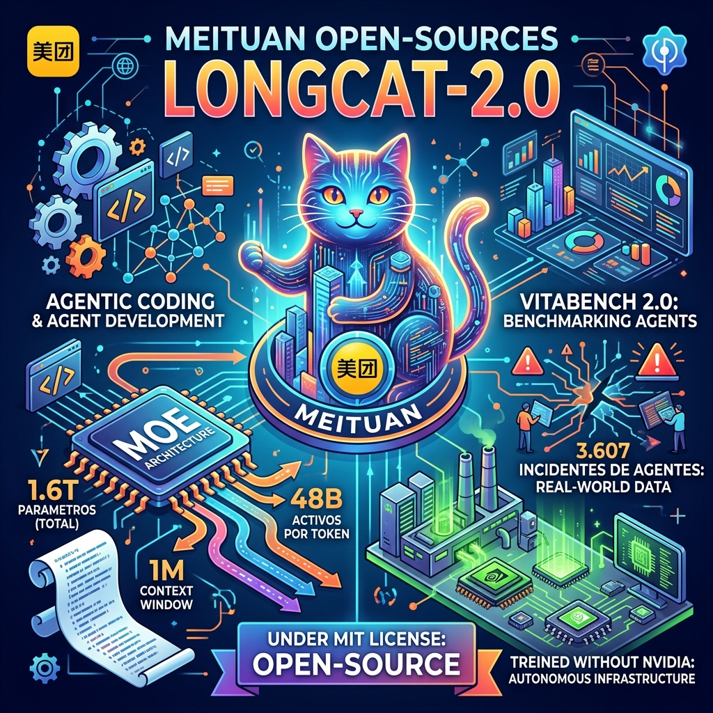

Meituan —sí, el gigante chino del delivery y servicios locales— soltó una bomba en el mundo open source AI: **LongCat-2.0**, un modelo de 1.6 trillones de parámetros diseñado específicamente para agentic coding.

## Los números del modelo

- **Arquitectura:** Mixture-of-Experts (MoE)
- **Parámetros totales:** 1.6T
- **Parámetros activos promedio:** ~48B (rango dinámico 33-56B según complejidad del query)
- **Contexto nativo:** 1 millón de tokens
- **Output máximo:** 262K tokens
- **Licencia:** MIT
- **Pricing en OpenRouter:** $0.30/M input, $1.20/M output

## Lo interesante de la arquitectura

LongCat-2.0 introduce dos innovaciones:

1. **LongCat Sparse Attention** — optimización de atención para procesar contextos largos de forma más eficiente sin perder precisión
2. **N-gram Embedding** — mejora la representación a nivel de token, especialmente útil para código donde la estructura sintáctica importa

El modelo fue entrenado **completamente en superpods de AI ASICs**, sin usar infraestructura Nvidia. Eso es notable: la mayoría de los modelos frontier dependen de GPUs H100/B200. Meituan demostró que se puede entrenar a escala sin el stack de Nvidia.

## VitaBench 2.0: benchmark para agentes

Junto con el modelo, Meituan liberó **VitaBench 2.0**, un benchmark abierto para evaluar el desempeño de agentes en tareas reales. La idea es estandarizar cómo medimos si un agente realmente funciona en producción, más allá de los benchmarks académicos tradicionales.

## Los 3.607 incidentes

Quizás lo más valioso del release: Meituan compartió **análisis de 3.607 incidentes reportados por usuarios de agentes de IA**, recopilados entre principios de 2025 y mediados de 2026.

Los patrones más comunes:

- **Overeagerness (sobreactivación):** el agente hace más de lo pedido, apareciendo en **+43% de los reportes**
- **Misalignment (desalineación):** el agente persigue un objetivo distinto al del usuario, también en **+43%**

Ambos son problemas de diseño de instrucciones y guardrails, no de capacidad del modelo. Esto confirma lo que ya sospechábamos: los agentes se rompen más por prompt design que por limitaciones técnicas.

## Por qué importa

- **Alternativa real al monopolio de modelos cerrados para coding.** LongCat-2.0 es open source con una licencia permisiva (MIT), contexto enorme y pricing accesible
- **El dataset de incidentes es oro.** Cualquier equipo que construya agentes debería revisarlo para priorizar guardrails
- **Entrenamiento sin Nvidia = camino viable para soberanía AI.** Si Meituan lo hizo, otros pueden seguirlo
- **Meituan no es una empresa de IA tradicional.** Viene de logística y delivery, lo que demuestra que la capacidad de entrenar modelos frontier se está democratizando

Si estás evaluando modelos para agentes de coding interno, LongCat-2.0 merece un test. Los $0.30/M de input lo hacen ridiculamente barato frente a alternativas comerciales.

---

**Fuentes:** [OpenRouter](https://openrouter.ai/meituan/longcat-2.0), [remio.ai](https://www.remio.ly/post/meituan-longcat-releases-flagship-model-longcat-2-0), [AI Agent Store](https://aiagentstore.ai/ai-agent-news/this-week), [FelloAI](https://felloai.com/best-ai-models/)
