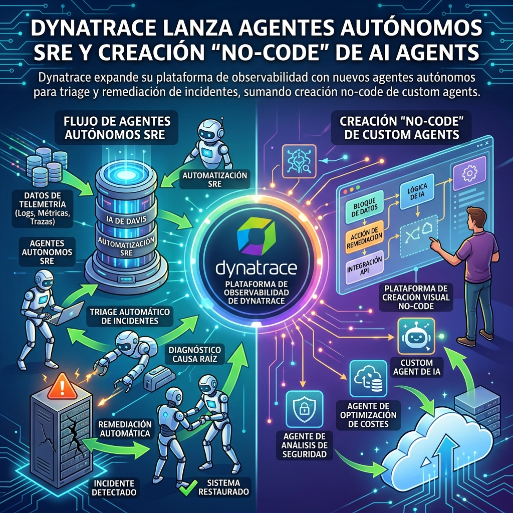

La carrera por inyectar agentes en operaciones de infraestructura sigue a tope. **Dynatrace** acaba de anunciar nuevas capacidades en su plataforma, atacando directamente "la parte más difícil de las operaciones con IA": la remediación autónoma.

## ¿Qué hay de nuevo?

Según cobertura de *The New Stack*, Dynatrace lanzó:
- **Agentes autónomos out-of-the-box:** Listos para hacer triage (diagnóstico inicial) y remediación directa sobre incidentes en producción.
- **Custom Agent Creation (No-code):** Ya no necesitas saber Python o armar workflows complejos para que un agente de IA interactúe con tus logs y métricas. 
- **Integraciones expandidas:** Amplían las capacidades autónomas directo hacia los pipelines de CI/CD y las plataformas cloud subyacentes.

## Observabilidad Activa

Esto refuerza la tendencia que venimos viendo en 2026: **la observabilidad ya no es solo dashboards y alertas pasivas**. Con Datadog y Dynatrace pisando el acelerador de los agentes, la plataforma no solo te avisa que el servidor se cayó, sino que despacha un SRE virtual (el agente) para leer los logs, buscar el commit culpable y proponer el rollback.

La gran apuesta de Dynatrace es el *No-code* para agentes, democratizando quién en la empresa puede armar un flujo de remediación sin depender del equipo core de Platform Engineering.