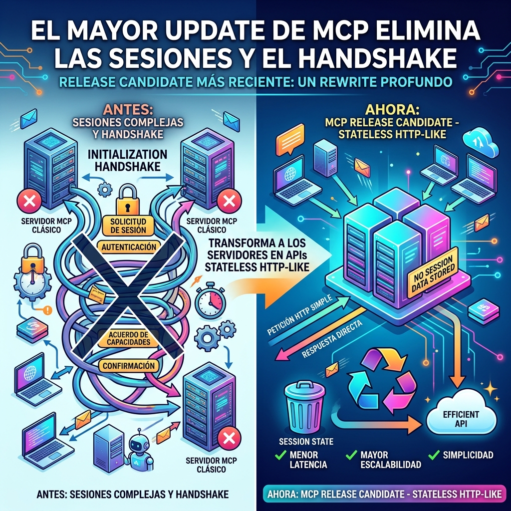

El ecosistema de agentes de IA acaba de recibir un terremoto en su capa fundamental. Según reporta *The New Stack*, la última revisión mayor (Release Candidate) de **Model Context Protocol (MCP)** ha eliminado de tajo la maquinaria sobre la que se construyeron decenas de servidores en los últimos meses.

## Adiós al estado, hola Stateless

El cambio principal redefine cómo los agentes se comunican con el mundo exterior:
- **Chao Sessions:** Se eliminó el concepto de sesiones mantenidas entre el LLM y el servidor MCP.
- **Chao Initialization Handshake:** Se acabó el setup complejo y pesado que debían hacer los clientes.
- **Todo a Handles:** El estado ahora se pasa explícitamente a través de "handles" o tokens.
- **Stateless by design:** Los servidores remotos MCP ahora se comportan casi idéntico a una API REST / HTTP sin estado.

## Por qué importa

Hasta ahora, mantener un servidor MCP para agentes requería gestionar sockets, sesiones largas y estados intermedios. Esto era un cacho enorme en infraestructuras Cloud Native y Kubernetes, donde los pods mueren y escalan constantemente. 

Al volver a MCP una arquitectura stateless, **escalar servidores de herramientas de IA será trivial**, poniéndolo a la par con cualquier microservicio tradicional.

Sin embargo, esto rompe la compatibilidad hacia atrás. Todos los equipos que armaron servidores MCP stateful en la primera mitad del año tendrán que reescribir buena parte de su código para adaptarse al nuevo estándar.