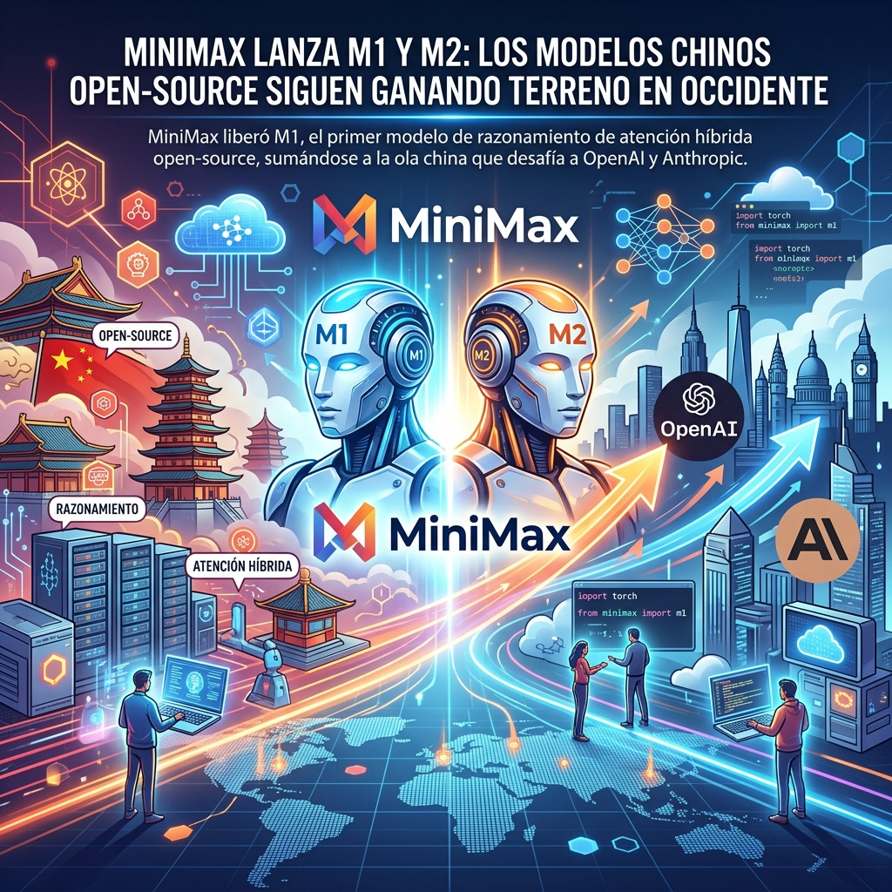

La presión desde Asia en el ecosistema de IA no da tregua. Mientras Estados Unidos debate sobre restricciones y regulaciones, los laboratorios chinos continúan inundando el mercado con modelos open-weight altamente capaces y mucho más baratos.

Esta semana, **MiniMax** anunció el lanzamiento de **MiniMax-M1**, promocionado como el "primer modelo de razonamiento de atención híbrida a gran escala open-source del mundo".

## ¿Qué trae de nuevo MiniMax M1?

A diferencia de la arquitectura Transformer tradicional que domina el mercado, el M1 utiliza un enfoque de **hybrid-attention** para optimizar el razonamiento extendido. 

Lo más relevante para el ecosistema DevOps y Cloud:
- Los pesos completos del modelo fueron liberados de inmediato en **Hugging Face** y GitHub.
- Trae soporte nativo para despliegue de inferencia en **vLLM**, lo que facilita muchísimo su adopción en clusters Kubernetes existentes.
- Acompañando a M1, lanzaron también su agente **MiniMax M2**, extendiendo el periodo de prueba gratuito en su API para empujar la adopción de desarrolladores globales.

## El panorama: China hace inroads en EE. UU.

El lanzamiento de MiniMax no es un evento aislado. Reportes recientes de AP News destacan que la rápida adopción de modelos chinos en territorio estadounidense está cambiando la dinámica competitiva. 

Startups como **DeepSeek**, **Z.ai (Zhipu)**, **Moonshot** y ahora **MiniMax** están ofreciendo modelos que rinden a un nivel casi "frontier" (compitiendo de tú a tú con GPT-5.6 y Claude Fable 5), pero a una fracción del costo y con licencias open-weight. 

Para las empresas que buscan correr cargas de IA en sus propias VPCs sin depender de APIs propietarias, estas opciones se están volviendo el estándar de facto, obligando a laboratorios occidentales como Anthropic a lanzar modelos más baratos (como el reciente Claude Opus 5) para no perder cuota de mercado en casos de uso masivos.