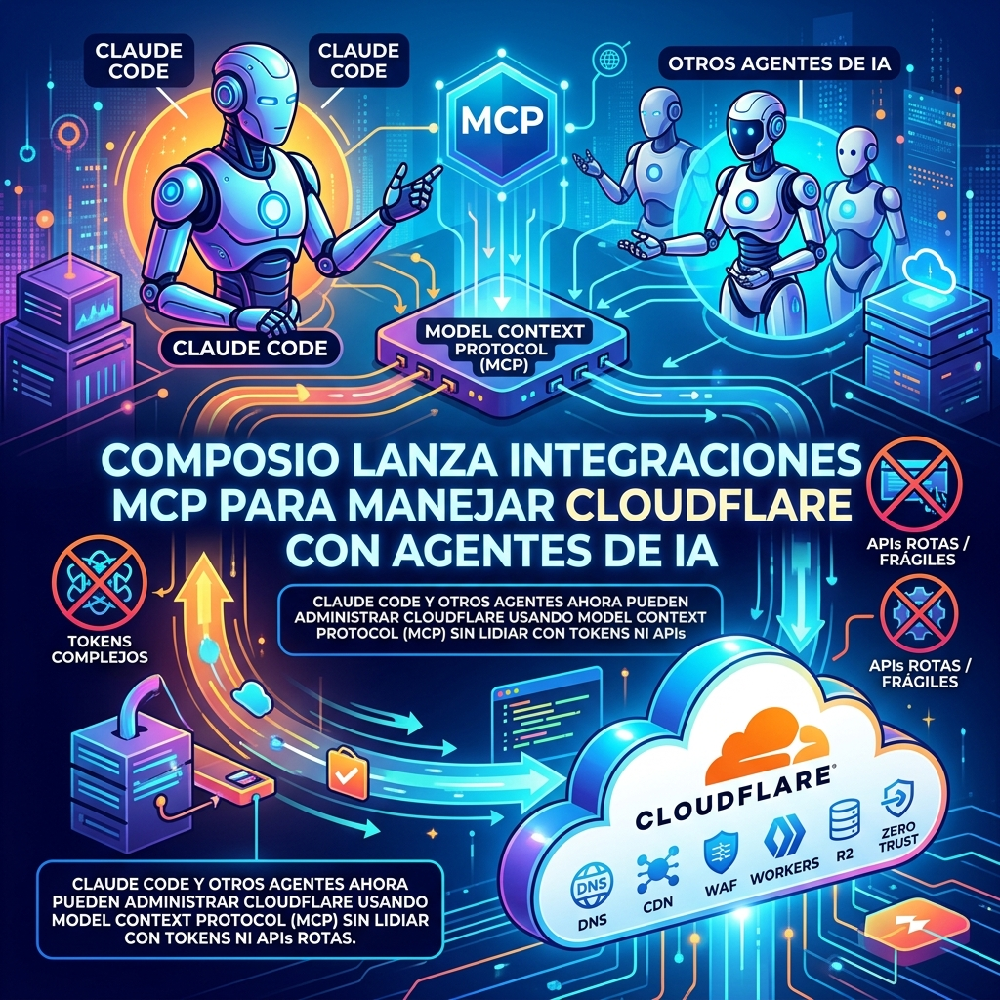

El ecosistema de herramientas para agentes de IA sigue creciendo rapidísimo. Hoy Composio anunció su integración nativa de **Cloudflare vía MCP (Model Context Protocol)**. 

¿Qué significa esto en la práctica? Que si estás usando **Claude Code, Codex, o cualquier agente compatible**, ahora puedes pedirle en lenguaje natural que administre tu infraestructura en Cloudflare. Literalmente puedes decirle al agente: *"Revisa todas las reglas del firewall para mi zona y bloquea los bots de OpenAI"*, y el agente se conecta por MCP, ejecuta los cambios, actualiza los DNS o lo que le pidas.

Lo interesante de este approach con MCP es que te olvidas de lidiar con los flujos OAuth, renovar tokens manualmente o sufrir porque cambiaron el endpoint de una API de Cloudflare. El agente ya entiende el contexto y tiene las herramientas listas.

Definitivamente, el futuro de DevOps (o AgentOps) pinta para allá: infraestructura manejada de forma conversacional pero con un protocolo estándar por debajo. 

*Fuentes: Composio Dev Blog.*
