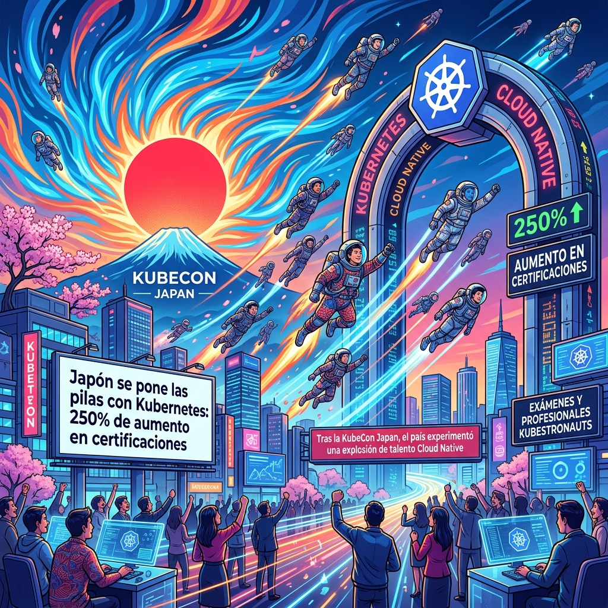

La CNCF soltó un dato que deja claro dónde se está cocinando el talento de infraestructura para la era de la IA: **Japón está viviendo un boom absoluto en skills Cloud Native**.

## Los números hablan

Todo partió con la primera KubeCon + CloudNativeCon Japan en Tokio (junio de 2025). En los 12 meses posteriores a ese evento, la cantidad de exámenes de Kubernetes rendidos en Japón se pegó un salto brutal del **250%**.

Pero no se trata solo de certificaciones básicas (CKA o CKAD). La comunidad japonesa está yendo por el nivel "hardcore". El número de **Kubestronauts** (la certificación más brigida y completa del ecosistema) en Japón aumentó un **170%**. 

El crecimiento se dio en dos niveles clave:
- El tier estándar de Kubestronaut creció un 121%.
- Los **Golden Kubestronauts** (el nivel dios de la certificación) pasaron de 0 a 31 en solo un año.

## Infraestructura para la era IA

¿Por qué tanto interés de golpe? La respuesta corta: **la IA**. La CNCF señala que este colectivo de profesionales hiper-certificados es exactamente lo que se necesita para correr cargas de trabajo de inferencia y entrenamientos a gran escala. Mantener infraestructuras robustas y probadas en producción (production-tested) es vital cuando los clusters de Kubernetes tienen que orquestar miles de GPUs y agentes sin caerse.

Parece que en Japón entendieron clarito el mensaje: la IA será la revolución, pero Kubernetes es el sistema operativo donde debe correr todo de forma escalable.