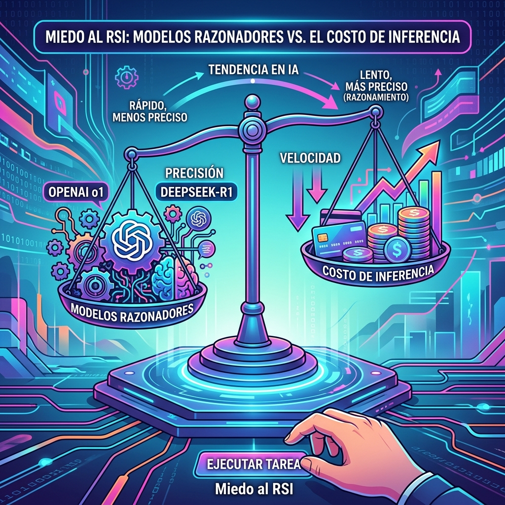

Si estás siguiendo de cerca las releases de IA, habrás notado un patrón claro en lo que va de mes. El enfoque pasó de "modelos más rápidos y baratos" a los llamados **"reasoning models"** (modelos de razonamiento).

Exponentes como **OpenAI o1** y el reciente **DeepSeek-R1** están definiendo el estándar: **intercambian latencia (velocidad) por precisión**. En vez de predecir el siguiente token a lo loco, se toman su tiempo, simulan pasos de razonamiento (Chain-of-Thought oculto) y luego entregan respuestas mucho más precisas en problemas matemáticos, lógica pura o coding avanzado.

## El problema del Contexto vs Precio

Mientras la industria experimenta con workflows agénticos, la ventana de contexto de 8K o 32K está quedando corta. Un agente autónomo devorando repositorios necesita mucho espacio. 

Aquí entra la guerra de precios y soberanía de hardware. Un reporte brutal (titulado *"Thrift-maxxing puts OpenAI and Anthropic IPOs at risk"*) puso los números sobre la mesa:
> "Un millón de tokens generados cuesta **$50 USD** con Anthropic y **87 centavos** con DeepSeek".

## El ecosistema reacciona

Empresas chinas como **Meituan** y **DeepSeek** no solo están igualando a modelos norteamericanos (Meituan afirma que su modelo LongCat-2.0 está a la par con releases recientes y fue entrenado puramente con procesadores locales), sino que su estructura de costos amenaza directamente el modelo de negocios y valuaciones pre-IPO de laboratorios gringos como Anthropic y OpenAI.

Por otro lado, figuras de la industria (OpenAI, Anthropic, GDM, Meta) co-firmaron una carta sobre "pacing" (llevar el ritmo) del desarrollo de la IA, mientras vemos que el machine-speed offensive en ciberseguridad es una realidad que sigue creciendo en foros y hackeos (hola de nuevo, Hugging Face).