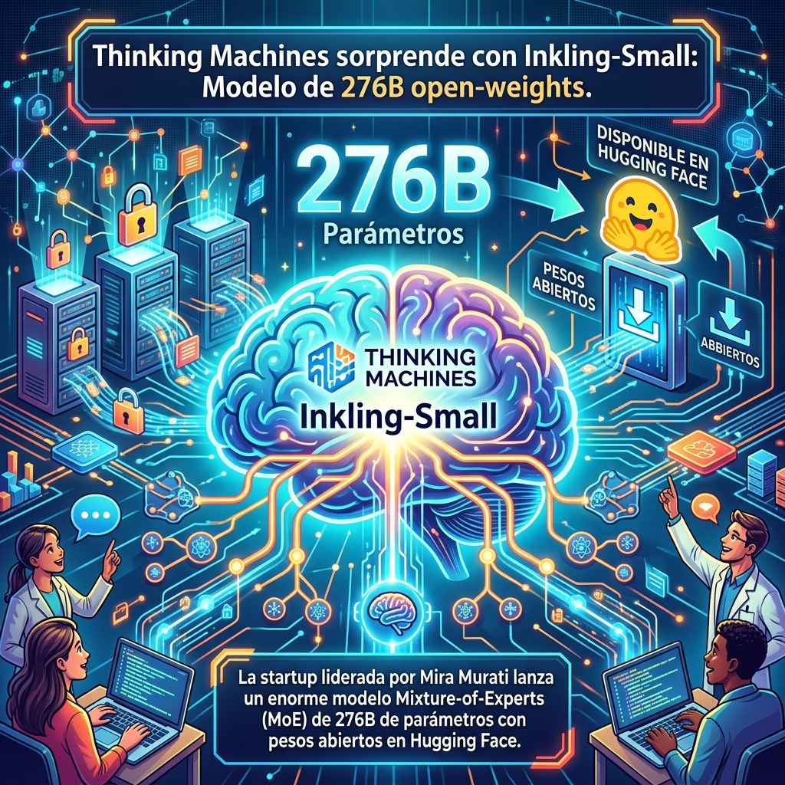

Justo cuando creíamos que la carrera de los modelos de pesos abiertos (*open-weights*) estaba dominada exclusivamente por DeepSeek y Meta, **Thinking Machines Lab**, la startup liderada por Mira Murati (ex CTO de OpenAI), acaba de patear el tablero.

Han lanzado **Inkling-Small**, un modelo masivo con arquitectura *Mixture-of-Experts* (MoE), que ya está disponible para la comunidad.

## Los números de Inkling-Small

Aunque el nombre diga "Small", las cifras no son nada pequeñas:
- **276 billones (B) de parámetros totales**.
- **12 billones (B) de parámetros activos** por cada token inferido.
- **Pesos totalmente abiertos** y disponibles para descargar en Hugging Face.

## Por qué es relevante

Que una startup dirigida por ex-pesos pesados de OpenAI libere un modelo tan grande en formato open-weights es una señal potente. Va en dirección opuesta a la mentalidad cerrada de su antigua compañía, y se suma a la tendencia de democratizar el acceso a modelos verdaderamente capaces que compitan en la liga *frontier*.

Con 12B de parámetros activos, busca un balance entre rendimiento bestial y eficiencia en inferencia, apuntando directamente a competir con las opciones MoE de la competencia.

Habrá que estar atentos a los benchmarks independientes en las próximas semanas, pero la comunidad open-source ya tiene un nuevo juguete pesado para armar agentes y afinar sistemas de inteligencia artificial.