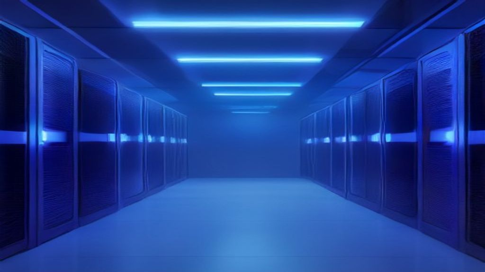

Si has intentado alquilar una GPU H100 en AWS últimamente, sabes que duele. Y no solo el precio: los lead times para enterprise llegan a **52 semanas** en 2026. Ahí es donde entran los **neoclouds**, una nueva categoría de proveedores cloud que está reescribiendo las reglas.

## Qué es un neocloud

Según SemiAnalysis (quien acuñó el término), un neocloud es un proveedor cloud enfocado casi exclusivamente en **rentar GPUs de alta gama para workloads de IA**. A diferencia de los hyperscalers que venden cientos de servicios, los neoclouds mantienen un catálogo mínimo centrado en compute crudo, bare-metal o VMs livianas, y networking rápido.

Las características clave:

- **GPU-first:** hardware NVIDIA más reciente, siempre
- **Virtualización ligera:** performance casi nativa, sin el overhead de los hypervisors pesados
- **Pricing simple:** sin cláusulas complicadas, sin egress fees absurdos
- **Setup en horas, no semanas:** clusters listos para entrenar en el mismo día

## La matemática del ahorro

Acá es donde se pone interesante. Un VM con A100 80GB on-demand:

| Proveedor | Precio/hr |
|---|---|
| Thunder Compute | $1.09 |
| Oracle Cloud | ~$4.00 |
| AWS (on-demand) | ~$3.40-$4.10 |

Eso es **70-80% más barato** por el mismo silicio. Si estás entrenando modelos a escala, la diferencia se mide en cientos de miles de dólares por mes.

## Por qué están ganando

1. **Escasez estructural de GPUs:** desde 2020 el mercado ha tenido ciclos boom-bust brutales. En 2026, los lead times enterprise para GPUs llegan a **52 semanas** según Gartner. Los neoclouds consiguen hardware porque es su único negocio.

2. **Velocidad:** los hyperscalers optimizan para todo (SaaS, bases de datos, serverless, storage). Los neoclouds optimizan para **una sola cosa**: throughput de IA. Redes tuned para collective-communication patterns, storage para datasets masivos, cero overhead.

3. **El boom de IA:** con más de 500 modelos LLM disponibles entre commercial APIs y open source, la demanda por compute de inferencia y training se disparó. Empresas como CoreWeave ya soportan a más de un millón de ingenieros de IA para 2026, con clientes como Cognition, Cursor, ElevenLabs y Suno.

## Ojo con los catches

No todo es color de rosas. Los neoclouds tienen desventajas reales:

- **Menos servicios:** si necesitas bases de datos managed, CDN, serverless o cualquier cosa que no sea GPU cruda, vas a tener que armarlo tú o combinar con otro proveedor.
- **Durabilidad:** son startups. Si el neocloud donde tienes tus checkpoints quiebra o se cae, no hay SLA de multinacional que te respalde.
- **Compliance:** para empresas con requisitos regulatorios estrictos (HIPAA, FedRAMP, SOC 2), los hyperscalers siguen siendo la opción segura.

El patrón emergente es **híbrido**: usar hyperscalers para stateful services y neoclouds para compute intensivo de IA. Muchos equipos ya están haciendo exactamente eso.

## Conclusión

Los neoclouds no van a matar a AWS, Azure o GCP. Pero sí les van a quitar una porción significativa del mercado de compute de IA — que es justamente el segmento de mayor crecimiento. Para cualquier equipo que esté haciendo training o inference a escala, ignorar esta opción es básicamente regalar plata.

**Fuentes:** [Thunder Compute](https://www.thundercompute.com/blog/neoclouds-the-new-gpu-clouds-changing-ai-infrastructure), [SemiAnalysis](https://newsletter.semianalysis.com/p/ai-neocloud-playbook-and-anatomy), [Gartner 2026](https://www.gartner.com/en/newsroom/press-releases/2026-02-26-gartner-says-surging-memory-costs-will-reduce-global-pc-and-smartphone-shipments-in-2026)

### Update: 2 de Agosto de 2026 - Goldman Sachs confirma: la inversión en IA ya se está democratizando más allá de los hyperscalers

Goldman Sachs soltó un reporte de investigación que valida exactamente la tesis de este artículo. Según el banco, la inversión en infraestructura de IA durante julio **continuó ampliándose más allá de los hyperscalers**, con tres motores de crecimiento claros:

1. **Adopción enterprise:** las empresas ya no solo consumen IA через APIs — están construyendo su propia infraestructura de compute, a menudo fuera de los grandes clouds.
2. **Iniciativas soberanas:** gobiernos de todo el mundo están invirtiendo en capacidad de IA nacional (lo que Goldman llama "sovereign AI initiatives"). Países que no quieren depender de AWS/Azure/GCP para su inteligencia.
3. **GPU backstop programs:** los neoclouds están usando programas de "backstop" de GPUs para expandir la disponibilidad de compute — básicamente, garantizando capacity a precios competitivos que los hyperscalers no pueden igualar.

Goldman lo llama el **"ciclo de inversión más hambriento de capital en la historia"** — un superciclo de capex que se extiende más allá de chips y chatbots hacia energía, infraestructura y data centers. Y las rippling effects van a tocar prácticamente todos los sectores.

Esto confirma lo que dijimos arriba: los neoclouds no son un fenómeno temporal. Son una **reestructuración del mercado** de compute de IA, y vienen para quedarse.

**Fuente:** [Goldman Sachs via Moneycontrol](https://www.moneycontrol.com/news/business/ai-infrastructure-expansion-broadens-beyond-hyperscalers-as-enterprise-sovereign-demand-grows-goldman-sachs-13990861.html)
