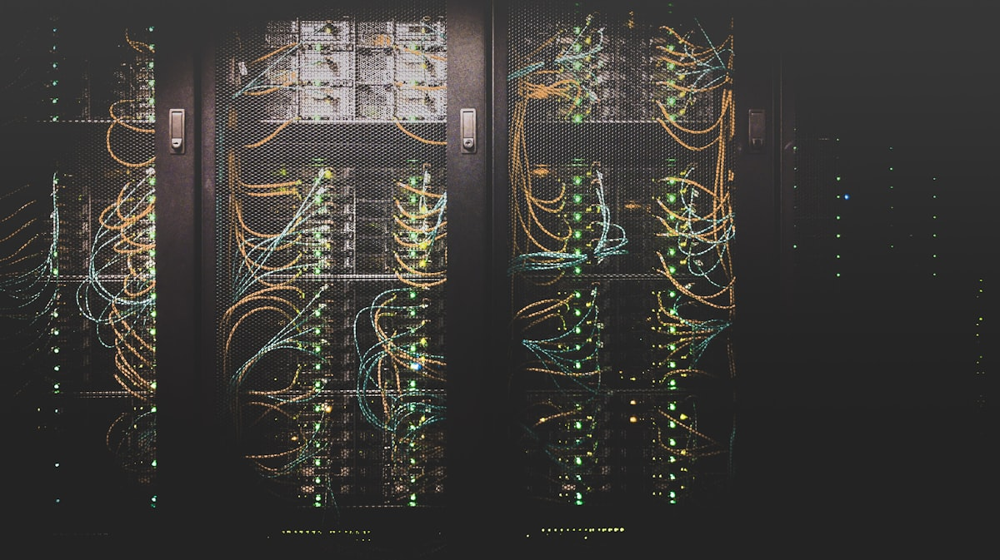

Mientras AWS, Azure, Google Cloud y Meta anuncian cientos de miles de millones en capex para infraestructura de IA, hay algo que nadie en las earnings calls quiere hablar: **la gente no quiere data centers en su backyard**. Y en 2026, esa resistencia se está convirtiendo en un factor estructural que afecta directamente la expansión del cloud.

## Los datos fríos

Según **Data Center Watch**, empresa que monitorea el fenómeno:

- **Q1 2026:** al menos **75 proyectos valorados en US$130 mil millones** fueron frenados o retrasados por oposición comunitaria
- Eso es *"roughly matching the scale of all of 2025"* en un solo trimestre
- En 2025, la oposición local frenó o canceló proyectos por **US$156 mil millones**
- **300+ bills estatales** relacionados a data centers han sido presentados en legislaturas de EE.UU.
- Un estudio de marzo 2026 muestra que **70% de los encuestados se opone** a la construcción de nuevos data centers en su vecindario

## 37 arrestos y contando

Según un recuento de Futurism, al menos **37 personas han sido arrestadas** este año en protestas relacionadas a data centers en EE.UU. Otros 12 casos involucran intervención policial preventiva.

Los perfiles son sorprendentemente diversos: desde **farmers en Oklahoma** hasta un **profesor de física en Kansas**, pasando por un **manager de mantenimiento en Indiana**. No son activistas profesionales — son ciudadanos comunes que sienten que el sistema democrático está fallando.

### Casos emblemáticos

**Pablo Payan (Indiana):** Arrestado en mayo durante una reunión pública sobre un data center de Amazon en Hobart. Fue sacado por negarse a identificarse antes de hablar. *"Fue un flex de power para demostrar que la ley está de su lado."*

**Lux Claridge (Kansas):** Profesor de física arrestado por **aplaudir** durante una reunión sobre un campus de 1,000 acres. Un comisionado había prohibido los aplausos. Claridge dijo: *"I have a right to clap, and if you want me out, you're going to have to drag me out."*

## Moratorias: el arma local

No son solo protestas. Los condados están usando su poder regulatorio:

- **Nueva York** pausó todos los proyectos de mega data centers, incluyendo uno de **500MW y US$19.5 mil millones** en Genesee County
- **Moratorias a nivel condado** son cada vez más comunes, incluso en áreas conservadoras que normalmente son pro-business
- La gobernadora de NY, Kathy Hochul, advirtió que *"las comunidades podrían heredar el desastre"*

## ¿Por qué importa para DevOps e Infra?

Esto no es un tema político abstracto. Tiene impacto directo en la industria:

1. **La capacidad de cloud depende de poder construir data centers.** Si AWS admite que la capacidad es insuficiente (y lo hizo), y las comunidades frenan proyectos, el bottleneck empeora
2. **Los precios suben.** Menos capacidad nueva = más escasez = costs más altos para todos
3. **Los neoclouds y regiones alternativas ganan.** Si construir en Virginia o Texas es cada vez más difícil, CoreWeave, Nebius y otros van a buscar regiones menos hostiles
4. **Sustainability importa de verdad.** Parte de la oposición es por consumo de agua y energía. Los data centers del futuro van a tener que ser más verdes, no por marketing sino por supervivencia

## El contexto mayor

POLITICO bautizó este movimiento como **"The New Luddites"** en un reportaje publicado el 2 de agosto. La comparación no es casualidad: así como los ludditas originales del siglo XIX destruían maquinaria textile que amenazaba su forma de vida, las comunidades de 2026 ven los data centers como una fuerza externa que destruye su entorno sin traer beneficios tangibles.

La diferencia es que esta vez no es anti-tecnología per se — es contra un modelo donde **las ganancias se privatizan y los costos (energía, agua, ruido, uso de suelo) se socializan**. La pregunta de fondo es válida: ¿quién paga realmente por la revolución de la IA?

---

**Fuentes:** [POLITICO](https://www.politico.com/news/magazine/2026/08/02/the-new-luddites-01017824), [Futurism](https://futurism.com/artificial-intelligence/regular-people-data-center-arrest-protest), [EC&M](https://www.ecmweb.com/design/article/55394047/the-rising-challenge-of-moratoriums-on-data-center-construction-and-industry-adaptation), [The Cool Down](https://www.thecooldown.com/green-tech/new-york-pauses-data-center-projects/), [Wikipedia](https://en.wikipedia.org/wiki/Opposition_to_AI_data_centers)
