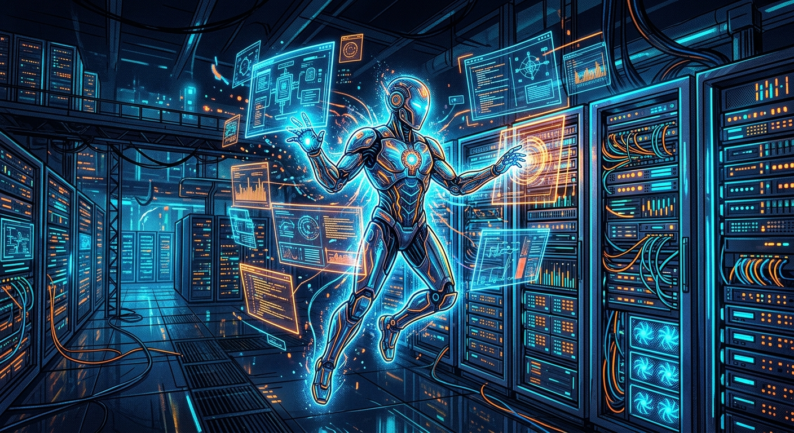

AWS acaba de subir la apuesta en automatización de operaciones. Según su más reciente anuncio, lanzaron **AWS DevOps Agent**, una herramienta de IA diseñada para investigar de manera autónoma un abanico creciente de incidentes en producción.

No es solo otro asistente tipo chatbot; este agente hace *troubleshooting* directo en la infraestructura. Entre sus capacidades destacan:
- **Diagnóstico de Kubernetes:** Analiza de forma autónoma fallas como el clásico *CrashLoopBackOff*, averiguando por qué los pods no logran levantar.
- **Rastreo en Audit Logs:** Es capaz de identificar y seguir el rastro de la eliminación de un `ConfigMap` revisando los registros de auditoría.
- **Correlación de métricas:** Analiza eventos del cluster en paralelo con métricas de Amazon CloudWatch, encontrando la aguja en el pajar sin que un humano tenga que revisar múltiples dashboards de forma manual.

## ¿Qué significa esto para el ecosistema?

Ya veníamos viendo cómo la IA se metía en la observabilidad, pero que AWS integre un agente de forma tan nativa para interactuar directamente con Kubernetes y CloudWatch es un paso gigante. 

Esto consolida la tendencia del "autonomous troubleshooting" en 2026. La inteligencia artificial ya no solo ayuda a escribir código, ahora también se está encargando del triaje operativo, buscando reducir drásticamente el MTTR (Mean Time to Recovery). Falta ver cómo lo adoptan los equipos SRE y qué tantas políticas de seguridad requerirá para funcionar en entornos críticos, pero la promesa es tremenda.
