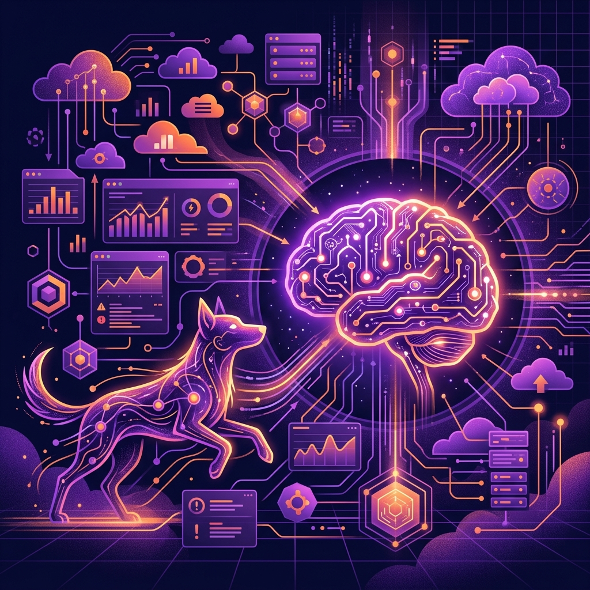

La guerra por ser el ecosistema donde viven tus agentes SRE acaba de sumar otro capítulo. Datadog hizo oficial la llegada de su **Datadog MCP Server** directamente al **Anthropic Plugin Marketplace**.

Con esta movida, puedes instalar el plugin oficial y conectar a Claude (y cualquier otro agente que soporte Model Context Protocol) directamente a tu entorno de Datadog. Ya no es solo copiar y pegar logs en el chat; el agente ahora tiene las skills empaquetadas para consultar directamente tu telemetría, métricas y trazas en tiempo real para hacer troubleshooting autónomo.

Además, el plugin promete actualizaciones automáticas cuando salgan nuevas versiones de skills. La barrera entre tus datos de observabilidad y los LLMs de frontera acaba de desaparecer por completo. A este ritmo, los dashboards manuales tienen los días contados.