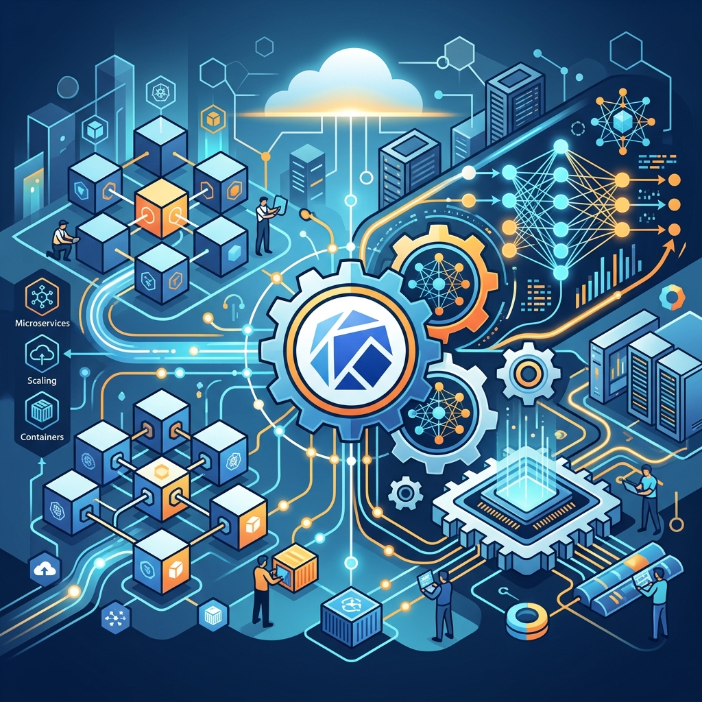

Si estabas esperando el momento en que los agentes de IA empezaran a tomar el control directo de las operaciones de Machine Learning, llegó la hora. CNCF acaba de anunciar el **Kubeflow SDK MCP Server**.

¿Qué significa esto en español? Básicamente, expone el SDK de Kubeflow como herramientas directamente llamables por IA a través del Model Context Protocol (MCP). Esto permite que asistentes de código y agentes autónomos puedan orquestar trabajos de entrenamiento, realizar barridos de hiperparámetros (hyperparameter sweeps) y ejecutar cargas de trabajo de Spark directamente, sin intervención humana manual.

Es un paso brutal hacia la automatización real (y no solo sugerencias de código) en ecosistemas nativos de la nube. Al usar MCP, cualquier agente compatible (como Claude o los de OpenAI) puede integrarse nativamente con Kubeflow. El ecosistema Cloud Native se está poniendo los pantalones largos con la IA.