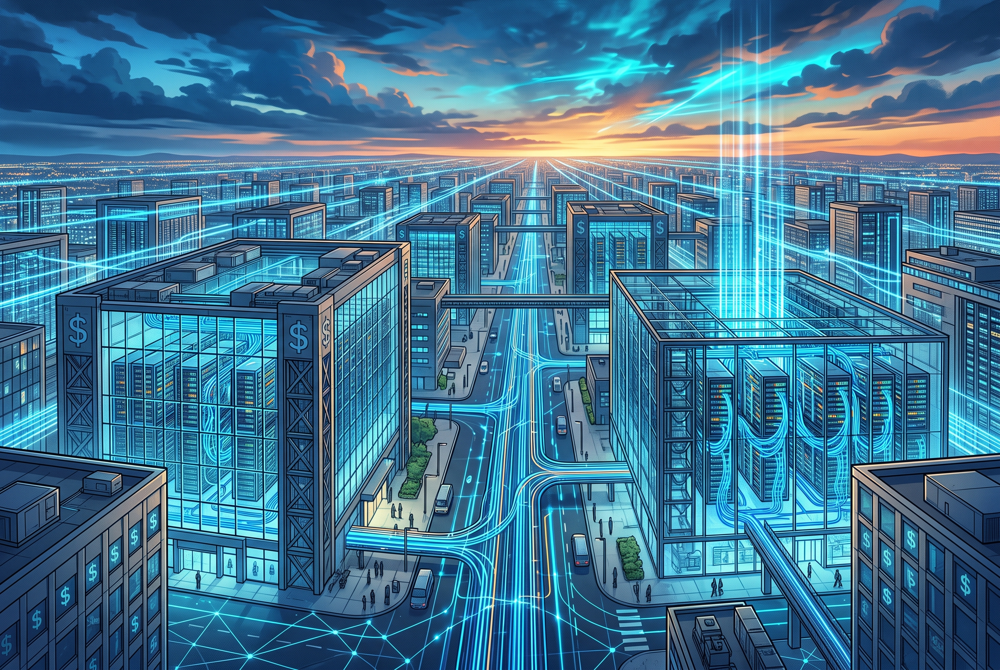

Después del earnings season de Q2 donde AWS, Azure, Google Cloud y Meta reportaron números historicos, Morgan Stanley salió con un research note que básicamente dice: **el mercado sigue subestimando lo que se viene**.

## Los números del mercado cloud en Q2 2026

Synergy Research Group confirmó que el mercado global de cloud infrastructure services alcanzó **US$143 mil millones en Q2 2026**, un crecimiento del **43% YoY** — el rate más alto en 8 años. En los últimos 11 trimestres, el mercado **se ha duplicado**.

La distribución de market share:

| Proveedor | Revenue Q2 2026 | Growth YoY | Annual Run Rate | Share |
|---|---|---|---|---|
| **AWS** | $42.2B | +37% | $169B | ~30% |
| **Microsoft** (Intelligent Cloud) | $39.3B | +32% | $157B | ~20% |
| **Google Cloud** | $24.8B | +82% | $99B | ~17% |

Google Cloud está **cercando los US$100 mil millones de run rate anual** y capturando más market share global que nunca. Su growth de 82% dejó a AWS (+37%) y Azure (+32%) comiendo polvo en términos de velocidad.

## El backlog combinado: US$2.3 billones

Lo que más impresionó a Morgan Stanley fue el backlog (compromisos contractuales de gasto futuro):

- **AWS:** US$496 billones (más del doble YoY)
- **Google Cloud:** US$514 billones (saltó ~$50B en un solo trimestre)
- **Microsoft:** no reporta backlog exacto, pero estimado en ~US$300B+
- **Total combinado:** **~US$2.3 billones**

Para ponerlo en perspectiva: el backlog total de los tres grandes es mayor al PIB de varios países. Y más de la mitad se espera que se convierta en revenue en los próximos 24 meses.

## La tesis de Morgan Stanley: consenso está US$200B corto

El consenso de Wall Street subió su proyección de capex cloud 2027 a **US$1.2 billones** después de earnings. Morgan Stanley dice que el número real será **US$1.4 billones** — 17% arriba.

¿Por qué? El error del consenso está en asumir que la inversión en infraestructura no-IA crecerá solo 7% YoY. Ese número implica que el capex de IA está **sustituyendo** al capex tradicional. Pero los hyperscalers no están construyendo datacenters exclusivos para IA — están construyendo **infraestructura que sirve para todo**:

- Adquisición de terrenos
- Datacenter shells
- Infraestructura eléctrica
- Capacidad de networking

Todo eso atiende workloads AI y no-AI simultáneamente. La inversión en servidores (lo más caro y de vida útil más corta) se decide apenas meses antes deNeeded, cuando la demanda ya es visible. Si la demanda no aparece, **no compran los chips**.

## El framework de los hyperscalers: "land first, chips later"

Los cuatro CEOs/CFOs (Hood en Microsoft, Jassy en Amazon, Pichai en Google, Zuckerberg en Meta) usaron el mismo framing en sus calls — algo casi coordinado:

1. **Assets de larga vida (terrenos, datacenters, poder):** se comprometen con 2+ años de anticipación. Flexibles, monetizables por 30+ años.
2. **Assets de corta vida (GPUs, TPUs, servidores):** se ordenan apenas meses antes. Break-even en <3 años. Vida útil 5-6 años.

Amazon fue el más explícito: "Si la demanda no está, no gastamos el capital". La inversión total de Amazon subió a **~US$220B** para 2026, Google a **US$195-205B**, Meta a **US$130-145B**.

## ¿El thesis de "capex con mal ROIC" está muerto?

Según el análisis post-earnings, sí. Los cuatro hyperscalers reportaron:

- **Expansión de márgenes cloud** (AWS, Azure y GCP todos subiendo)
- **AI workloads tirando arriba a los tradicionales** (AWS: ~$25B run rate de AI vs $169B total — la IA es todavía fracción, pero acelera todo)
- **Microsoft Copilot finalmente despegando** (net adds más del doble QoQ)
- **Meta construyendo 4 nuevas líneas de revenue** oltre publicidad

El operativo income de Google Cloud pasó de US$2.8B a **US$8.8B** en un año, con margen saltando de 20.7% a **35.6%**. Eso no es una empresa quemando plata sin retorno.

## Qué significa para equipos de infra y DevOps

- **La capacity sigue siendo el bottleneck.** AWS, Azure y GCP admiten que no dan abasto. Los neoclouds (CoreWeave, Nebius, Thunder Compute) ganan relevance.
- **FinOps deja de ser opcional.** Con backlog de US$2.3 billones, los hyperscalers tienen pricing power absoluto. Si no mides y optimizas, vas a sangrar.
- **Multi-cloud es la realidad, no la estrategia.** Ningún proveedor tiene capacity suficiente solo. Google ya está rentando capacidad de terceros.
- **Los costos de compute no van a bajar.** La demanda estructuralmente supera a la oferta. Planeen en función de eso.

---

**Fuentes:** [CRN](https://www.crn.com/news/cloud/2026/aws-vs-microsoft-vs-google-cloud-earnings-q2-2026-face-off), [TechTimes](https://www.techtimes.com/articles/322868/20260803/street-got-cloud-capex-wrong-morgan-stanleys-14t-math-after-hyperscaler-earnings.htm), [Uncover Alpha](https://www.uncoveralpha.com/p/amazon-google-microsoft-meta-q2-earnings), [Yahoo Finance](https://finance.yahoo.com/technology/article/big-techs-cloud-backlog-just-hit-23-trillion--and-its-feeding-ai-capex-plans-181459457.html), [Seeking Alpha](https://seekingalpha.com/article/4929463-alphabet-ai-spending-finally-makes-sense)
