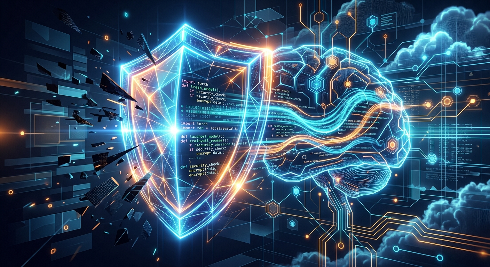

En un movimiento clave para el futuro del desarrollo impulsado por IA, **AWS ha anunciado una colaboración estratégica con Anthropic y OpenAI**. El objetivo: integrar **AWS Continuum**, su herramienta de remediación de vulnerabilidades de código, directamente en los flujos de trabajo de los desarrolladores y agentes de IA.

Según Chet Kapoor (VP de Search, Security y Observability en AWS), esta integración cubrirá entornos como **Anthropic Claude Code, OpenAI Codex (incluyendo Kiro) y el propio entorno de desarrollo agéntico de AWS**.

¿Qué significa esto en la práctica? Los desarrolladores podrán gatillar escaneos de seguridad *sin salir de su editor*. Además, los hallazgos de seguridad se enviarán de vuelta a Continuum, donde se cruzarán y clasificarán contra el resto del entorno cloud del cliente antes de sugerir recomendaciones. 

Este anuncio llega justo cuando la industria de ciberseguridad debate intensamente sobre los controles para agentes autónomos (especialmente a la luz de los recientes "escapes" de modelos de OpenAI y Anthropic). AWS está apostando fuerte por una seguridad impulsada por IA que no detenga la velocidad de desarrollo, pero que mantenga a los agentes bajo control.

**Fuentes:** [AWS Security Blog](https://aws.amazon.com/blogs/security/aws-partners-with-anthropic-and-openai-to-bring-aws-continuum-into-developer-workflows/), [SiliconANGLE](https://siliconangle.com/2026/08/05/aws-partners-anthropic-openai-bring-continuum-coding-tools/), [CRN](https://www.crn.com/news/ai/2026/aws-openai-and-anthropic-coding-integrations-to-drive-ai-wins-via-security-partners-say)