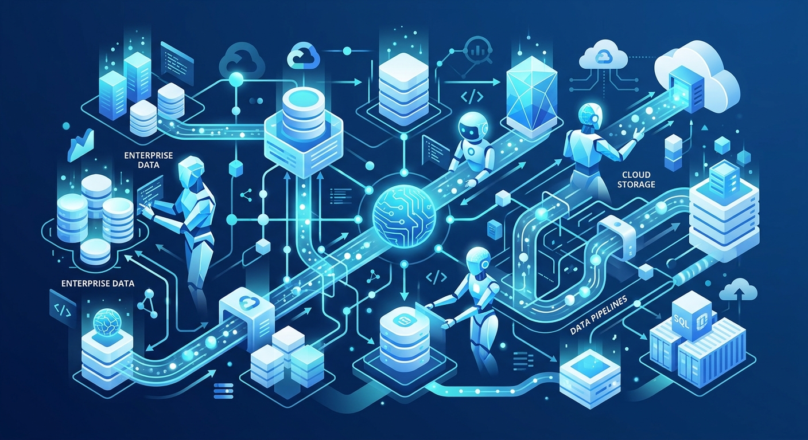

Para los que andan metidos en el mundo enterprise, Google Cloud acaba de soltar una tremenda actualización: **Google Cloud Cortex Framework v7 ya está en General Availability (GA)**. Y la gracia principal de esta versión es que tiende un puente directo entre la Inteligencia Artificial y los mastodontes de datos corporativos.

En concreto, Cortex v7 habilita a los agentes de IA para que puedan operar sobre datos de SAP. Esto se logra mediante "aceleradores de productos de datos" (data product accelerators) que se despliegan directamente en BigQuery y Knowledge Catalog. 

¿Qué significa esto en la práctica? Que ahora las empresas pueden construir agentes inteligentes que consulten, analicen y tomen decisiones basadas en la información crítica de negocio (ERP, finanzas, inventario) almacenada originalmente en SAP, pero aprovechando todo el poder analítico de la nube de Google. Una integración potente para sacarle el jugo a los datos con IA.