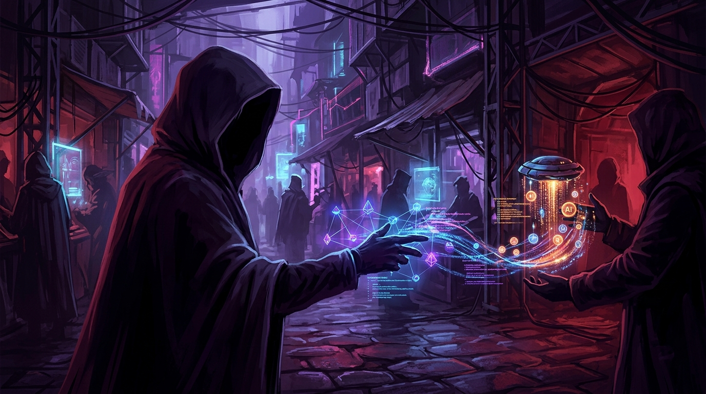

Si creías que el mercado negro era solo para Netflix y Spotify, te equivocaste. Ahora también hay mercado negro para **tokens de IA**. Investigadores de Okta descubrieron más de media docena de servicios ilegales en foros underground y plataformas de mensajería que revenden acceso a modelos frontier a precios ridículamente bajos — con un detalle no menor: **el operador ve absolutamente todos tus prompts**.

## Cómo funciona Poison Claude

El servicio más notorio se llama **Poison Claude**, y ofrece acceso a los modelos top de Anthropic: Opus 4.8, Opus 4.7, Opus 4.6 y Sonnet 4.6. Los precios son ridículos: entre **5% y 15% del precio oficial por token**. Aceptan pagos en cripto y te dan una API key compatible con la API de Anthropic.

¿Cómo logran precios tan bajos? La respuesta es simple y brutal: **abusan de créditos gratuitos de cloud providers**. Explican en su propio sitio que registran cuentas en AWS (que da US$100 en créditos de Bedrock a cuentas nuevas), las agregan a un pool, y enrutan las peticiones de los usuarios a través de esas cuentas. Básicamente, **farming de créditos cloud a escala industrial**.

Okta encontró un endpoint expuesto por error de configuración (`api.claudeopus.shop/api/status`) que mostraba **881 usuarios totales, 872 activos en ese momento**. El dominio principal está detrás de Cloudflare CDN, y aunque Cloudflare le puso una advertencia de phishing al sitio principal, el dominio de la API sigue operativo con Turnstile para protección anti-bot.

## El problema de privacidad (el verdadero peligro)

El riesgo más grave no es que te corten el acceso. Es que **todos tus prompts pasan por el proxy del operador antes de llegar al modelo**. Eso significa que quien controla Poison Claude puede:

- **Leer, almacenar y vender** todos los prompts que envías
- **Filtrar información sensible** que pongas en tus consultas
- **Hacer prompt injection** en las respuestas que recibes
- **Cambiar el modelo** que pediste por uno más barato sin que te des cuenta

Si estás usando Claude Code con tu código fuente, tus credenciales, tu lógica de negocio... todo eso le llega al operador del servicio. Es como darle las llaves de tu casa a un desconocido porque te ofreció alquilarla más barato.

## No es el único: Ecomagent y el mercado chino

Un servicio similar llamado **Ecomagent.in** tiene cerca de **970 usuarios** y ofrece acceso con descuento a Opus 4.8, Opus 4.6, Sonnet 4.6 y GPT Codex 5.5 de OpenAI vía un endpoint custom.

El fenómeno es especialmente fuerte en **China**, donde ChatGPT y otros modelos de labs estadounidenses están bloqueados por la Gran Muralla. Hay toda una industria de **plataformas de API relay/proxy** que permiten a desarrolladores chinos acceder a modelos occidentales. Anthropic ya había acusado a empresas chinas de hacer exactamente esto en febrero.

## ¿Qué significa para equipos de seguridad?

1. **Monitorea tu consumo de API.** Si tienes créditos cloud (AWS Bedrock, Google Vertex, Azure OpenAI), asegúrate de que no estén siendo abusados por cuentas falsas
2. **Revisa los endpoints de IA que usan tus devs.** Si alguien configuró Claude Code con un endpoint que no es `api.anthropic.com`, es una bandera roja gigante
3. **Educación.** Los devs pueden estar usando estos servicios por ignorancia (más barato) o por restricciones de acceso. Asegúrate de que tengan canales oficiales para acceder a herramientas de IA
4. **Supply chain risk.** Si un dev está mandando código por un proxy ilegal, tu propiedad intelectual se está filtrando

---

**Fuentes:** [The Hacker News](https://thehackernews.com/2026/08/poison-claude-sells-discounted-claude.html), [Okta Threat Intelligence](https://www.okta.com/blog/threat-intelligence/free_tokens_for_sale/), [GBHackers](https://gbhackers.com/hackers-abuse-cloud-startup-credits/), [CyberSecurity News](https://cybersecuritynews.com/poison-claude-selling-cheap-ai-tokens/), [IT Pro](https://www.itpro.com/security/cyber-crime/cyber-criminals-are-selling-discount-ai-tokens-on-underground-forums)
