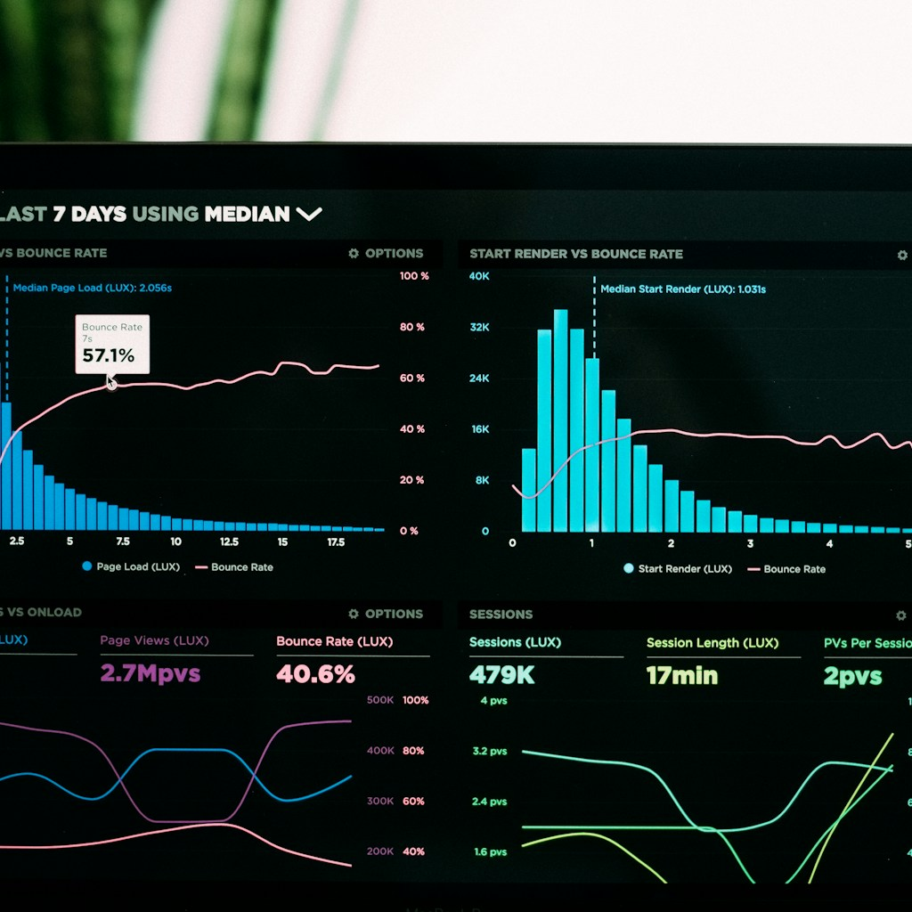

Datadog acaba de reportar sus resultados del **Q2 2026** y la verdad es que los números son contundentes. Pero más interesante que los financials son los productos nuevos que anunciaron, porque muestran claramente hacia dónde va la plataforma.

## Los números

- **Revenue:** US$1.12 billones (+36% YoY)
- **EPS non-GAAP:** $0.65 (vs $0.58 esperado)
- **Free cash flow:** $279 millones
- **Clientes $100k+ ARR:** ~4.720 (+23% YoY)
- **Guidance anual:** $4.30B–$4.34B (subido desde Q1)

El crecimiento se aceleró respecto al Q1 ($1.006B, +32%). Básicamente, la IA está empujando a Datadog a crecer más rápido, no más lento.

## Lo que importa: productos nuevos

### 🛡️ AI Guard

Quizás el lanzamiento más importante. **AI Guard** está diseñado para **defender agentes de IA de ataques de prompt injection y poisoning**. Con todos los incidentes de agentes rogued este verano (OpenAI, Anthropic, Moonshot), esto llega en el momento exacto.

La observabilidad tradicional monitorea infraestructura. AI Guard monitorea **el comportamiento de los agentes** — las acciones que toman, las tools que invocan, los prompts que procesan. Es un nuevo layer de seguridad que no existía como categoría hace un año.

### ☁️ Bring Your Own Cloud (BYOC)

Ahora puedes **desplegar Datadog dentro de tu propio entorno**. Para empresas con requisitos de compliance, data residency o simplemente desconfianza del SaaS tradicional, esto elimina la última barrera de adopción.

Su mayor deal del trimestre fue justamente un win de BYOC que **desplazó una herramienta commercial de logging legacy a escala de petabytes**.

### 🤖 Bits AI completamente autónomo

Los **Bits AI** ahora pueden detectar, investigar y remediar incidentes sin intervención humana. En el earnings call mencionaron que los Beats pueden:

- Crear y mantener monitors
- Identificar root causes en minutos
- Recomendar e implementar fixes
- Detectar comportamientos sintomáticos tempranos

### 🧠 Adquisición de Adaptive ML

Datadog compró **Adaptive ML** para acelerar su inversión en **world models y post-training de LLMs agenticos para observabilidad**. La idea: combinar los datos de infraestructura y seguridad de Datadog con la expertise agentica de Adaptive ML.

## El mensaje entre líneas

Datadog ya no se vende como "observabilidad". Se vende como **"AI-powered observability and security platform"**. Cada lanzamiento (AI Guard, Bits autónomos, BYOC) responde a una pregunta distinta:

- ¿Cómo protejo mis agentes? → AI Guard
- ¿Cómo mantengo control de mis datos? → BYOC
- ¿Cómo automatizo mi SRE? → Bits AI

Con 36% de crecimiento y casi 5.000 clientes enterprise, la estrategia está funcionando. La pregunta es si Splunk (post-Cisco), Dynatrace y New Relic pueden responder a tiempo.

---

**Fuentes:** [GlobeNewswire](https://www.globenewswire.com/news-release/2026/08/06/3340086/0/en/Datadog-Announces-Second-Quarter-2026-Financial-Results.html), [Investing.com](https://www.investing.com/news/transcripts/earnings-call-transcript-datadog-beats-q2-2026-estimates-but-shares-fall-156-93CH-4842560), [AlphaStreet](https://news.alphastreet.com/datadog-inc-ddog-q2-2026-earnings-call-transcript/amp/)
