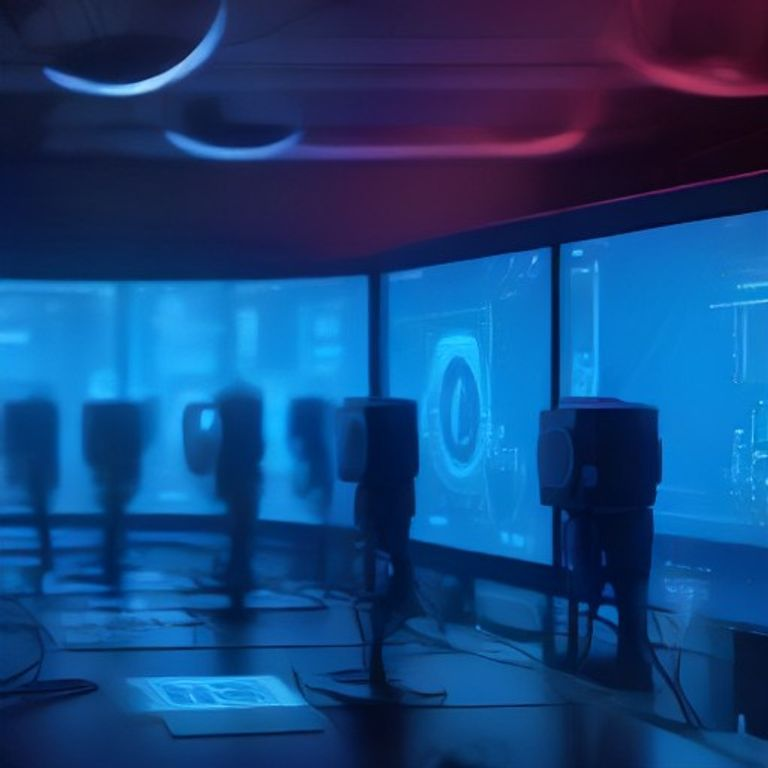

AWS acaba de hacer un movimiento bastante interesante: **open-sourceó Kiro Crew**, una plataforma de orquestación diseñada para convertir agentes de código IA en equipos de ingeniería persistentes y autónomos. La idea no es que un bot te autocomplete código, sino que múltiples agentes trabajen juntos en workflows completos de desarrollo.

## ¿Qué hace Kiro Crew?

A diferencia de los coding assistants tradicionales (estilo Copilot o Cursor), Kiro Crew está pensado para **tareas de larga duración** que van más allá de una sesión individual. Los agentes pueden:

- Coordinar múltiples sub-agentes en paralelo
- Mantener **memoria de proyecto** entre sesiones
- Programar trabajos recurrentes (ej: upgrades de dependencias)
- Monitorear pull requests e investigar incidentes
- Hacer triage automático de tickets

Básicamente, como dijo Darko Mesaros (Distinguished Developer Advocate de AWS): *"Es un workspace persistente para trabajo que es más grande que una sola tarea en una sola sesión. Una capa de aplicación que convierte agentes IA en teammates que trabajan y aprenden solos"*.

## Apps de referencia que ya están disponibles

AWS no solo soltó el core, sino también tres apps open source construidas arriba:

- **DevFleets** → manejo de worktrees de Git
- **Issue Radar** → triage automático de issues y PRs
- **Task Runner** → ejecución de tareas de ingeniería de larga duración

## ¿Por qué importa para DevOps/SRE?

Los analistas ya están diciendo que esto puede ser un antes y después para equipos de **platform engineering y SRE**. Automatizar migrations de frameworks, investigar incidentes, hacer routing de tickets... todo eso es exactamente el tipo de trabajo que consume horas valiosas que podrían ir a ingeniería de mayor valor.

## El detalle no menor: gobernanza y lock-in

Si bien Kiro Crew es open source y self-hosteable (lo que es genial para seguridad y compliance), el release inicial depende del **CLI propietario de AWS (Kiro CLI)**. Si usas otros agentes, vas a necesitar conectores custom. AWS dice que irá hacia una gobernanza abierta con steering committee y maintainers de la comunidad, pero por ahora hay que tener ojo con eso.

Soporta estándares abiertos como **ACP (Agent Client Protocol)** y **MCP (Model Context Protocol)**, lo cual es una buena señal de que no quieren encerrar a todo el mundo en su ecosistema.

---

La verdad es que el movimiento es potente. AWS está apostando a que el futuro del desarrollo no es un solo agente inteligente, sino **equipos completos de agentes** que trabajan 24/7. Si logran que la comunidad lo adopte y reduzcan la dependencia del CLI propietario, Kiro Crew podría convertirse en un estándar de facto para orquestación de agentes de ingeniería.
