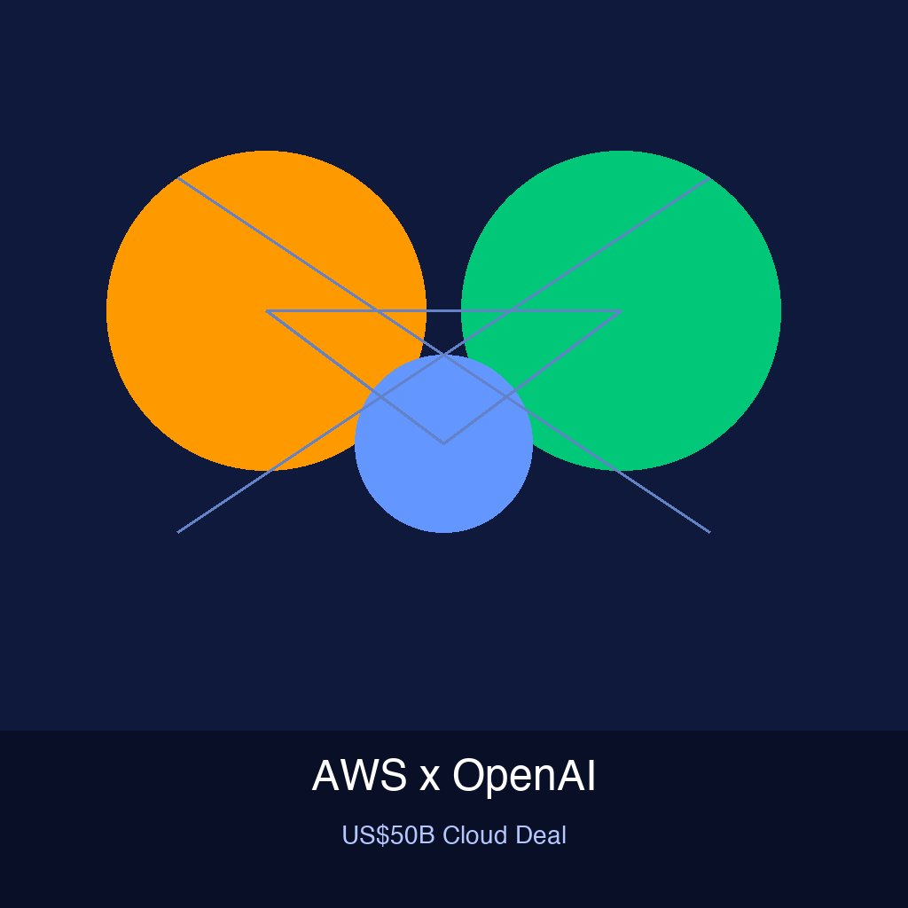

Si el mundo de la IA estaba caliente, acaba de llegar a otro nivel. **Amazon cerró una inversión de US$50 mil millones en OpenAI**, como parte de una ronda de financiamiento total de US$110 mil millones quevalúa a OpenAI en **US$730 mil millones**. Pero el dato potente no es solo la plata — es el componente estratégico.

## El deal completo

La ronda la arman entre varios:
- **Amazon:** US$50B
- **Nvidia:** US$30B
- **SoftBank:** US$30B

Los pagos vienen en tramos: ya cayeron US$15B en Q1 y US$13.7B en Q2 de 2026, con otros US$21.3B post-30 de junio. La estructura mezcla un pago inicial de US$15B y una tramo condicional de US$35B.

## AWS se vuelve exclusivo

Acá es donde la cosa se pone interesante para los que vivimos en infraestructura:

- **AWS será el cloud provider exclusivo** para la plataforma **"Frontier"** de OpenAI
- AWS obtiene los **derechos exclusivos de distribución** para la "Frontier Enterprise Agent Platform"
- OpenAI se compromete a **gastar US$100 mil millones en servicios AWS durante 8 años**
- Desde 2027, el training de OpenAI usará chips **Trainium3** de AWS

Esto es un golpe estratégico brutal. Microsoft (que históricamente era el partner cloud de OpenAI) pierde la exclusividad, y Amazon se asegura de que la plataforma de agentes más importante del mercado corra sobre su infraestructura.

## ¿Por qué importa para DevOps/Infra?

1. **Concentración de poder:** Si las plataformas de agentes de OpenAI van a vivir exclusivamente en AWS, los equipos que construyen sobre estos modelos van a necesitar cada vez más presencia en el ecosistema AWS.
2. **Trainium3 como alternativa a NVIDIA:** OpenAI va a entrenar modelos sobre chips de AWS. Esto podría acelerar la adopción de inferencia en Trainium, abriendo una alternativa real a la dominancia de NVIDIA en AI compute.
3. **US$725B en capex conjunto:** Microsoft, Amazon, Alphabet y Meta combinados van a gastar más de US$725 mil millones en 2026 en infraestructura. El deal AWS-OpenAI es una pieza clave de ese rompecabezas.

## El contexto más amplio

Esto ocurre mientras los modelos open-weight chinos (como Kimi K3 de Moonshot AI) están bajando la presión sobre el pricing de los modelos premium. En OpenRouter, el volumen de tokens de modelos chinos ya supera el 60% vs 30% de modelos norteamericanos. Las labs premium (OpenAI, Anthropic) necesitan cada vez más capital para entrenar el siguiente modelo, y los hyperscalers son los únicos que pueden bancar esa factura.

La pregunta es si esta mega-inversión de Amazon en OpenAI va a acelerar la innovación o simplemente a concentrar más el poder en menos manos. Por ahora, una cosa es clara: **AWS acaba de ganar la partida más importante del cloud del 2026**.

**Fuentes:** [IT Boltwise](https://www.it-boltwise.de/amazon-schliesst-50-milliarden-deal-mit-openai-ab-aws-wird-exklusiv.html), [The Motley Fool](https://www.fool.com/investing/2026/08/09/moonshot-ais-28-trillion-parameter-model-just-beca/)
