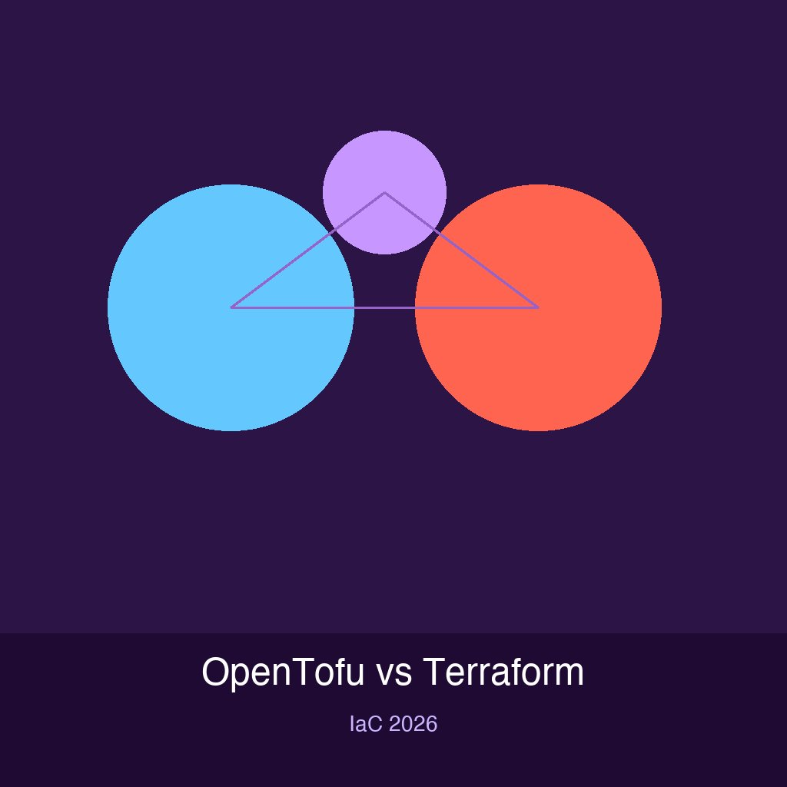

Hace menos de tres años, cuando HashiCorp cambió la licencia de Terraform de MPL 2.0 a BSL 1.1, una parte de la comunidad bifurcó el proyecto y nació OpenTofu. Hoy, con la versión **1.12** ya en la calle, ya no se puede describir simplemente como "el fork open source de Terraform". Es una herramienta con identidad propia.

## Lo nuevo de OpenTofu 1.12

Las features que marcan la diferencia:

### `prevent_destroy` dinámico
Antes, `prevent_destroy` era una decisión estática dentro de la configuración. Ahora puede controlarse con **variables y valores del módulo**. Por ejemplo: un mismo módulo de base de datos puede bloquear la destrucción en producción y permitirla en desarrollo. Simple, pero super útil.

### `destroy = false`
Permite ejecutar un `tofu apply` que aplique cambios sin destruir recursos que normalmente deberían irse. Reduce el riesgo en pipelines automatizados.

### Encriptación nativa de state y plan
Los archivos de state y plan ahora se pueden **encriptar de forma nativa**, sin herramientas externas. Para equipos que manejan infraestructura sensible, esto es un win de seguridad importante que Terraform todavía no ofrece out-of-the-box.

## Compatibilidad: la migración es casi transparente

OpenTofu mantiene compatibilidad alta con Terraform:
- Los archivos `.tf`, HCL, módulos y providers se mantienen
- El workflow es idéntico: `tofu init`, `tofu plan`, `tofu apply` (en vez de `terraform ...`)
- Ecosistema de **+3.900 providers y +23.600 módulos**
- Gobernanza bajo la **Linux Foundation** con licencia MPL 2.0

La migración desde Terraform es prácticamente renombrar el binario. Para muchos equipos, vale la pena probarlo en un proyecto chico y evaluar.

## ¿Terraform u OpenTofu?

La respuesta clásica: depende.

- **Terraform** sigue dentro del ecosistema comercial de HashiCorp/IBM. Si tu organización ya usa Terraform Cloud o necesita soporte enterprise, tiene sentido quedarse.
- **OpenTofu** es para equipos que valoran el open source real, quieren las features nuevas (encriptación nativa, prevent_destroy dinámico) y no quieren atarse a la licencia BSL de HashiCorp.

La pregunta de 2023 era si la comunidad podía mantener un fork viable de Terraform. La pregunta en 2026 es **qué herramienta se ajusta mejor a tu estrategia de IaC**. Ese cambio de narrativa lo dice todo.

**Fuente:** [Cloud News](https://cloudnews.tech/opentofu-1-12-confronts-terraform-whats-changing-and-which-to-choose-for-iac/)
