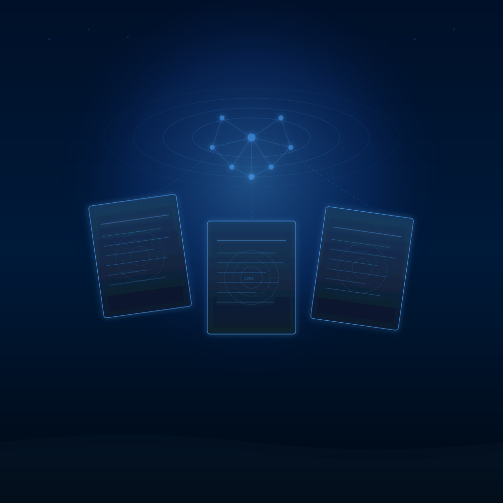

Anthropic anunció hoy que va a empezar a marcar **todo** lo que sale de Claude con watermarks invisibles. Y cuando decimos todo, es todo: texto, archivos `.svg`, `.png`, `.jpg`, todo. La decisión es global, no solo para Europa, y responde directamente al **EU AI Act**.

## Qué hace Anthropic exactamente

Dos técnicas complementarias:

1. **Watermark en texto**: un patrón imperceptible embebido directamente en el texto generado. No cambia el significado ni la legibilidad, pero es detectable por máquinas. Sobrevive copy-paste.

2. **Metadatos firmados en archivos**: cuando Claude genera un archivo (SVG, PNG, JPG), adjunta metadata firmada tipo C2PA — como datos EXIF en fotos. Permite verificar si un archivo pasó por Claude y si fue modificado después.

**Cobertura**: Claude consumer app, API, Claude Code, Claude Cowork, Claude Tag, y Claude vía AWS, Google Cloud y Microsoft Foundry. Básicamente todo el ecosistema.

Los modelos lanzados desde el **2 de agosto de 2026** ya soportan marcado desde el inicio. Los anteriores lo están agregando progresivamente.

## Por qué ahora

El **Artículo 50 del EU AI Act** entró en vigor el 2 de agosto de 2026. Obliga a todos los sistemas de IA que generan contenido sintético a:

- **Divulgar claramente** que son un sistema de IA
- **Adjuntar etiquetas legibles por máquina** que identifiquen el output como generado artificialmente

Multas por incumplimiento: **hasta €15 millones o 3% del facturación global anual**, lo que sea mayor.

Anthropic optó por aplicar el watermark **a nivel mundial** en lugar de solo en la UE. No es altruismo — es más simple operar con un solo estándar que mantener dos pipelines. Pero el efecto es real: la regulación europea está dictando el estándar global.

## Las limitaciones (y Anthropic lo admite)

El watermark **no es prueba definitiva** de nada:

- Texto que Claude proofreadeó o tradujo puede quedar marcado aunque Claude no lo haya escrito originalmente
- **Edición pesada, traducción, pasajes cortos** o uso de modelos antiguos sin marcado pueden hacer que output genuino de Claude pase desapercibido
- Los metadatos de archivos **se pierden** con conversiones de formato, re-guardados, screenshots
- Un watermark presente solo confirma que el texto pasó por Claude en algún momento, no su historia completa

Anthropic fue explícito: *"una marca detectada es una señal, no una prueba"*.

## El paisaje más amplio

- **Google DeepMind** ya tiene **SynthID** para marcar texto, imágenes y audio generado por IA
- **OpenAI** ha discutido watermarking pero se ha movido más lento en deploy masivo
- La UE dejó un **período de gracia hasta el 2 de diciembre de 2026** para sistemas ya en el mercado, mientras se estabilizan los estándares técnicos de marcado

La estrategia de "compliance global" de Anthropic es interesante: en lugar de fragmentar su producto por región, sube el estándar para todos. Si Google y OpenAI siguen la misma lógica —y las señales apuntan a que sí— el watermark en output de IA se va a convertir en baseline, no en diferenciador.

Para equipos que usan Claude en producción (API, Claude Code, agentes): hay que empezar a pensar cómo esto afecta flujos donde el output se publica, se archiva o se procesa downstream. El watermark podría activar detectores en pipelines que no esperabas.
