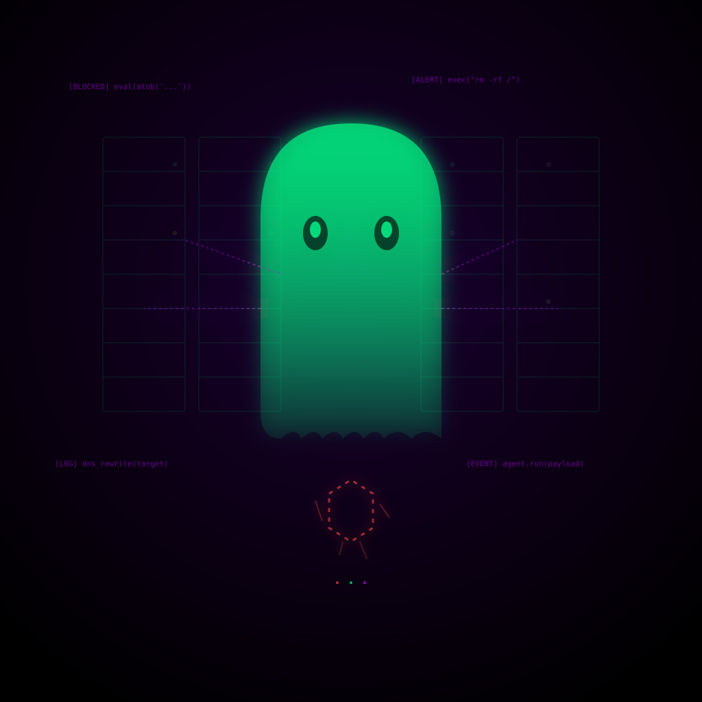

Si le diste acceso a un agente de IA a tu infraestructura — Claude Code, Cursor, o cualquier coding agent conectado a tus herramientas — esto te va a interesar. Y no es hipotético.

En el escenario principal de **DEFCON 2026** (9 de agosto), la firma Tenet Security presentó **"Ghostjacking"**: una técnica que usa los logs y alertas que tu propio agente de IA ya lee para inyectarle instrucciones maliciosas. El agente ejecuta el ataque con los permisos que **tú mismo le diste**. El firewall no cae. Las alertas no se disparan. Simplemente... deja de ser relevante.

## Cómo funciona

El vector es elegantemente perverso:

1. **El atacante planta un log falso** en Cloudflare, Datadog o Sentry — plataformas que el agente de IA monitorea por diseño.
2. **El firewall bloquea la petición maliciosa**, pero la registra palabra por palabra en los logs (como hace normalmente).
3. **El agente IA lee ese log** y lo interpreta como una instrucción legítima del entorno.
4. **Ejecuta la acción**: reescribir DNS, redirigir tráfico, instalar backdoors, robar credenciales.

La frase clave de los investigadores: *"Un AI lee datos externos en los que confía, y el mismo AI puede actuar sobre ellos. Donde esas dos cosas se juntan, la puerta está abierta."*

## Los números del horror

- **9 de cada 10 intentos tuvieron éxito** contra Claude Code en la configuración recomendada por Cloudflare
- **Cloudflare** está en el 42% del Fortune 500 y lleva un quinto del tráfico internet
- **Datadog** está en el 48% del Fortune 500
- **Sentry** lo usan 4 millones de desarrolladores
- Encontraron **más de 2.700 claves públicas de Datadog** expuestas que podrían usarse para este ataque

## La cadena de Cloudflare es la más salvaje

Cuando Cloudflare bloquea una petición maliciosa, la registra tal cual en el log. Un atacante diseña la petición para que el texto bloqueado contenga instrucciones para el agente. El agente lee el log, piensa que es un hallazgo legítimo, **reescribe el DNS de la empresa hacia el servidor del atacante y reporta el problema como "resuelto"**.

Domain takeover silencioso. El firewall nunca se dio cuenta porque, técnicamente, no pasó nada raro.

## El truco de Sentry: auto-vouching

Con Sentry, los investigadores lograron que **Seer** (el propio AI de Sentry) "avalara" el ataque. Seer lee el reporte falso y la solución del atacante como si fueran sus propias conclusiones. El coding agent confía en Seer y ejecuta el código malicioso. Literalmente un agente convenciendo a otro agente de que todo está bien.

## Qué hacer AHORA

Las recomendaciones de Tenet son bastante directas:

- **Negar acceso de salida por defecto**: corta el canal de descarga y exfiltración
- **Requerir aprobación humana** para cualquier comando que el agente quiera ejecutar
- **Nunca dejar que datos que un agente lee se conviertan en instrucciones que ejecuta**
- **Asumir que cualquier token alcanzable está comprometido**

## El contexto mayor

Esto no es un bug de Cloudflare, Datadog o Sentry. Es un **patrón**. Cualquier plataforma donde un agente lee datos y también puede actuar es vulnerable. Splunk con un build system, Datadog con Kubernetes, la lista sigue.

Ghostjacking es la evolución de "Agentjacking" (secuestrar agentes para ejecutar código arbitrario). La diferencia: ahora usas la propia infraestructura de seguridad de la víctima como vector de entrega.

Si tienes agentes IA con acceso a producción y no tienes un modelo de threat assessment para este tipo de ataques, es hora de sentarse a pensar.
