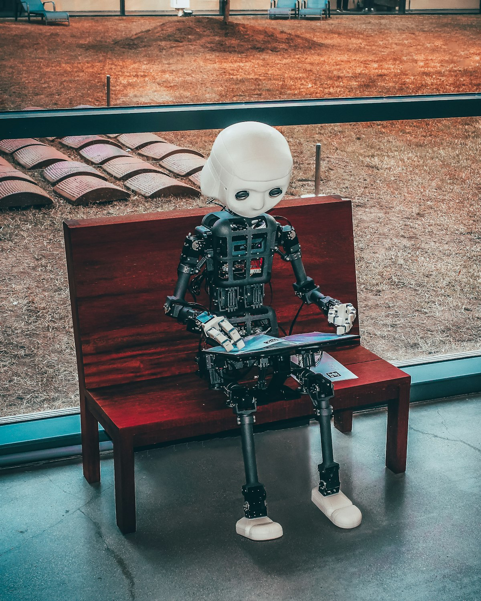

SpaceXAI (el nuevo nombre de xAI) acaba de lanzar **Grok 4.6**, y el modelo no viene a hacer ruido por hacer ruido: viene a posicionarse directo en la mesa de los grandes, con números que respaldan.

## Los números del Intelligence Index

En el **Artificial Analysis Intelligence Index** (el benchmark compuesto de referencia hoy), Grok 4.6 logró **61 puntos**, lo que lo pone:

- Empatado con **GPT-5.6 Sol Max** de OpenAI
- A solo 1 punto de **Claude Fable 5 Max** de Anthropic (62)
- A 2 puntos de **Claude Opus 5** (63), el líder absoluto
- Por encima de **Kimi K3** de Moonshot AI

Para contexto, Grok 4.5 High tenía 56 puntos. O sea, **+5 puntos en un mes**. Y comparado con Grok 4.3, son +23 puntos. El salto generacional es real.

## Donde brilla de verdad: agentes

Lo más interesante no es el score general, sino el rendimiento en tareas **agentic**:

- **GDPval-AA v2**: Elo de 1753, segundo solo a Claude Opus 5
- **τ³-Banking** (service multi-turn con tools): 50.7%, top 2 junto a Qwen3.8 Max
- **Terminal-Bench v2.1**: 88.4%, al nivel de los líderes
- **AA-Briefcase** (tareas largas de knowledge work): Elo 1577, tier Fable 5

Y acá viene el detalle brutal: Grok 4.6 completa tareas en **~53 turns y ~0.5B tokens de input**. Claude Opus 5 necesita **~103 turns y ~2.0B tokens** para el mismo trabajo. La mitad de los pasos, un cuarto de los tokens.

## El precio es la clinica

Grok 4.6 mantiene el pricing de la generación anterior:

| Modelo | Input ($/1M) | Output ($/1M) |
|---|---|---|
| Grok 4.6 | $2 | $6 |
| Claude Opus 5 | $5 | $25 |
| GPT-5.6 Sol | $5 | $30 |

O sea, same score que GPT-5.6 Sol, pero a **menos de la quinta parte del costo de output**. El cost per task medido por Artificial Analysis es de **$0.84**, lo que lo pone en la frontera Pareto de costo vs. inteligencia.

Mantener el precio plano entre generaciones es inusual en la frontera. Normalmente, más inteligencia = más caro. Acá no.

## Context window y detalles

- **500K tokens** de contexto (igual que Grok 4.5)
- Cache hits a $0.50/1M (subió desde $0.30 en Grok 4.5)
- Enfocado en **long-running agents**, coding y knowledge work

## La lectura de fondo

El mensaje de SpaceXAI es claro: no están peleando por ser #1 en un benchmark estático. Están diciendo "te damos inteligencia de frontera, optimizada para agentes que trabajan solos por horas, a un precio que te permite realmente correrlos en producción".

Y eso, para equipos que están desplegando agentes en serio (donde el costo de tokens se multiplica por miles de runs), es probablemente más importante que 1 o 2 puntos más en un benchmark.

**Fuentes:** [Artificial Analysis](https://artificialanalysis.ai/articles/grok-4-6-benchmarks-and-analysis), [VentureBeat](https://venturebeat.com/technology/spacexai-debuts-grok-4-6-overtaking-kimi-k3s-performance-and-matching-gpt-5-6-sol-for-worlds-third-best-on-artificial-analysis), [Unite.AI](https://www.unite.ai/spacexai-launches-grok-4-6-for-long-running-agents/)
