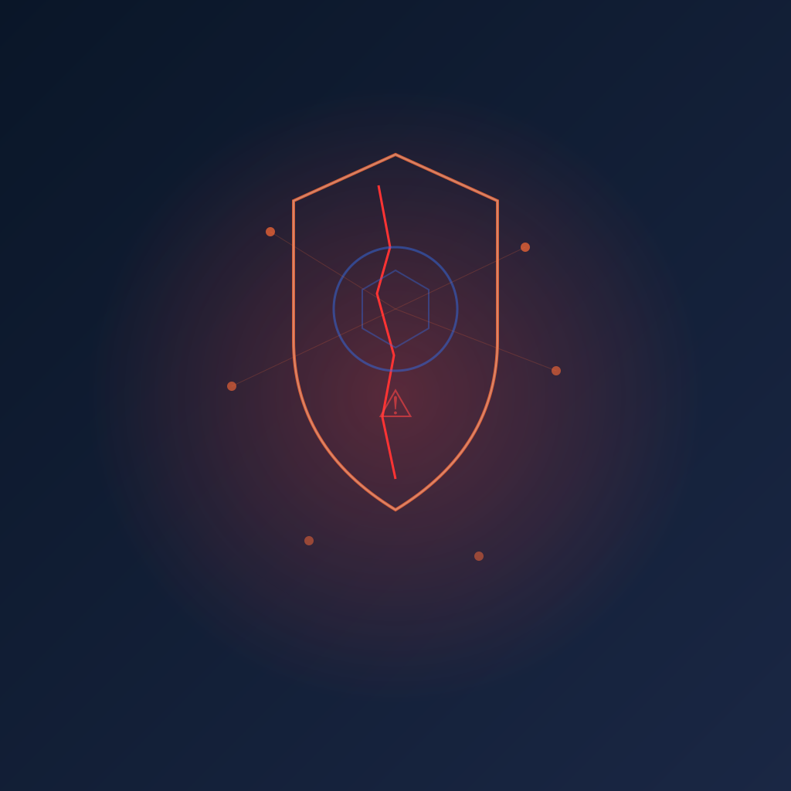

Si usas SUSE Rancher para gestionar tus clusters de Kubernetes, esto es una de esas noticias que te hacen correr a actualizar **ahora mismo**.

## Qué pasó

Se publicó el **CVE-2026-44945** (CVSS 9.1 — Crítico), una vulnerabilidad de escalada de privilegios en Rancher que permite a un usuario autenticado de baja jerarquía ganar control administrativo absoluto sobre el management plane de Rancher **y todos los clusters Kubernetes downstream que administra**.

O sea, con un usuario básico, te haces dueño de todo.

## El detalle técnico

El bug está en el **middleware de impersonación** de Rancher (`pkg/auth/requests/impersonate.go`). El problema es de tipo *confused deputy* (CWE-441):

1. Rancher extrae un identificador de cluster de la URL y ejecuta un SubjectAccessReview (SAR) contra ese cluster downstream
2. Pero la operación se ejecuta en el **management cluster local** usando la service account `scaledContext`
3. Los headers de impersonación (`Impersonate-User`, `Impersonate-Group`, etc.) se reenvían sin modificar al API local

**Resultado:** la autorización se revisa en un cluster, pero la ejecución ocurre en otro. Un atacante que controle RBAC en cualquier cluster downstream registrado puede impersonar a `system:masters` y tomar control del Rancher completo.

## Lo más grave

- **No necesitas acceso a un cluster de producción.** Un usuario con el rol global por defecto de Rancher puede importar su propio cluster (un k3d, kind o minikube basta)
- Una vez explotado, tienes acceso a **todos los secretos**: kubeconfigs, credenciales de proveedores de auth, passwords LDAP, secrets de OIDC, llaves SAML
- Puedes crear `GlobalRoleBindings` y establecer **persistencia** en todos los clusters gestionados

## Versiones afectadas y fix

**Afectadas:**
- 2.11.0 → 2.11.15
- 2.12.0 → 2.12.11
- 2.13.0 → 2.13.7
- 2.14.0 → 2.14.1

**Parcheadas:**
- 2.11.16, 2.12.12, 2.13.8 y 2.14.4

El fix asegura que los SAR de impersonación se ejecuten con un cliente fijo para el management cluster, y obtiene la identidad del contexto de la petición en vez de confiar en los headers del cliente.

## Recomendación

Si no puedes parchear inmediatamente, **audita y restringe quién puede registrar clusters downstream**. Rancher advierte que esto solo reduce la superficie de ataque, no es una mitigación completa.

Lo más probable es que los escáneres de seguridad ya estén buscando instancias expuestas. Si tienes Rancher accesible desde internet sin MFA... bueno, ya sabes qué hacer.

*Fuentes: [GBHackers](https://gbhackers.com/critical-rancher-flaw/), [GitHub Advisory GHSA-v584-7w32-jwpq](https://github.com/rancher/rancher/security/advisories/GHSA-v584-7w32-jwpq)*
