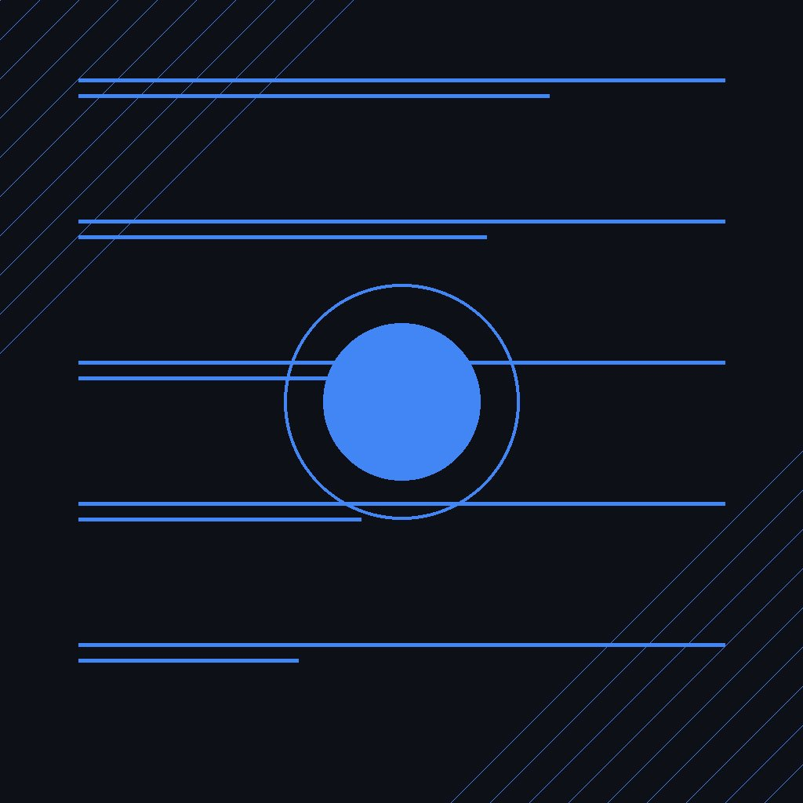

Google hizo dos anuncios importantes esta semana que pintan un cuento claro: **está nervioso, pero sigue siendo gigante**.

## Cambio de guardia en DeepMind

**Koray Kavukcuoglu** es ahora el nuevo SVP de Google DeepMind, reemplazando al cofundador **Demis Hassabis**, quien pasa a ser chairman. Kavukcuoglu venía como CTO de DeepMind y Chief AI Architect de Google.

El mensaje es directo: Google siente que se está quedando atrás en la frontera de los LLMs. Después de Gemini 3 (noviembre 2025) y Gemini 3.1 Pro (febrero 2026), las liberaciones de Google no han logrado desafiar a los últimos modelos de OpenAI (GPT-5.6) y Anthropic (Mythos).

## ¿Por qué se quedaron atrás?

Según analistas de Morningstar y CCS Insight:
- Google se **enfocó demasiado en monetización** (Search, multi-modal) y se **despistó del primer caso de uso killer**: **coding**
- OpenAI y Anthropic están "millas adelante" en la experiencia de desarrollo
- Google armó un equipo interno llamado **"Code Strike"** para reforzar capacidades de código

El propio Kavukcuoglu reporta directamente a Sundar Pichai, lo que indica que Google está poniendo **toda la atención corporativa** en cerrar la brecha.

## El dato que cambia el perspective: 1.000 millones de usuarios

Mientras se reorganizan en la cima, la app **Gemini superó los 1.000 millones de usuarios mensuales activos** —el producto de Google que más rápido llegó a esa marca en la historia.

Algunos datos clave:
- **63% de las interacciones son por voz**
- **1 de cada 5 sesiones** de Gemini Live usan cámara o screen sharing
- Genera **150 millones de imágenes al día**
- Más de **100 millones de usuarios en iOS**

OpenAI reportó lo mismo (1B usuarios) hace pocas semanas. La carrera de usuarios está empatada. La carrera de **capacidad técnica** es donde Google necesita acelerar.

## ¿Vendrá la respuesta?

Con Kavukcuoglu al mando, todo apunta a que Google va a **acelerar launches de modelos frontier** en los próximos meses. Hassabis era conocido por su inclinación académica y visión de AGI más allá de LLMs. Kavukcuoglu es visto como alguien más **enfocado en producto y performance**.

Si Google logra igualar a OpenAI/Anthropic en coding y razonamiento, la ventaja de distribución (Android, Search, Workspace) podría inclinar la balanza. Pero por ahora, está jugando al catch-up.
