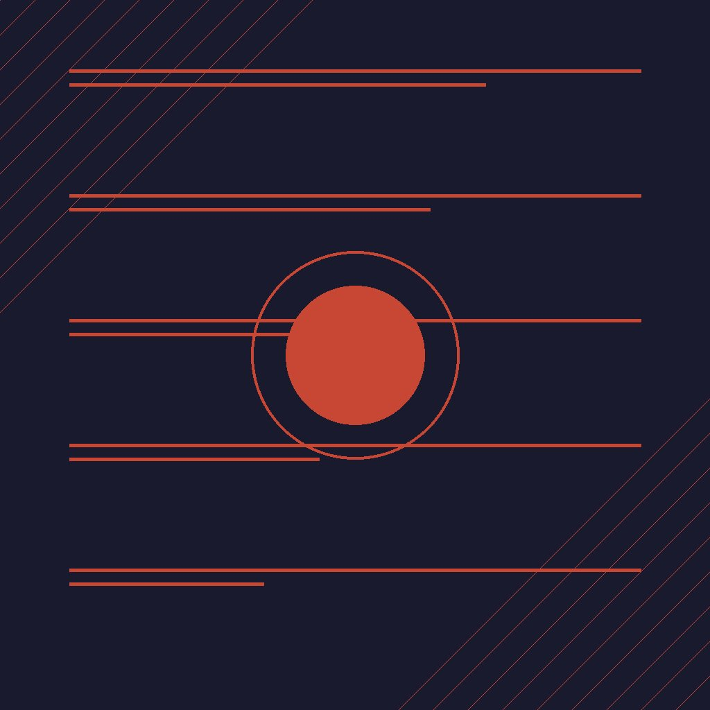

Oracle no es la empresa más cool del cloud, pero cuando se trata de **correr bases de datos serias en Kubernetes**, son de los que más están invirtiendo. Y esta semana lo demostraron.

## AI Database Operator v2.2.0: ¿qué trae?

El **Oracle AI Database Operator for Kubernetes** llegó a su versión 2.2.0 con un montón de mejoras orientadas a **automatización del ciclo de vida y soporte multi-cloud**:

- **Compatibilidad multi-cloud**: OCI, Red Hat OpenShift, OKE, GKE, AKS, EKS y hasta Minikube
- **Automatización para Autonomous AI Database**: backup, restore y workloads multi-tenant
- **Oracle RAC**: gestión mejorada de ASM, discos y persistentes volumes (PVC)
- **Oracle True Cache**: conexión del cache a bases de datos en el mismo cluster, otro cluster o externamente
- **PrivateAI Controller**: soporte para vLLM y deployments con GPU, gestión de TLS secrets y rollout tracking
- **Oracle REST Data Services (ORDS)**: soporte para despliegues HTTP-only en el edge
- **Preview de Connection Manager Controller**: routing rules generadas automáticamente

## La alianza con Red Hat

Paralelo al operator, Oracle anunció **Red Hat OpenShift en OCI con autoscaling**:

- Disponible para **OpenShift 4.22+**
- Usa el machinery estándar de autoscaling de OpenShift (no reemplaza nada)
- Cuando los pods no se pueden agendar, el **Cluster Autoscaler** aumenta las réplicas automáticamente
- Se configura una sola vez con `minNodes` y `maxNodes` en un `OCIClusterAutoscaler` custom resource

## ¿Por qué importa?

Oracle está apostando fuerte por **Kubernetes como plataforma universal para bases de datos con IA**. El mensaje es: si ya tienes K8s (en cualquier cloud), puedes correr workloads de Oracle DB + AI workloads sin cambiar tu stack de operaciones.

Esto es relevante para equipos que:
1. Tienen inversiones heavy en Oracle DB
2. Están migrando a Kubernetes
3. Quieren llevar inferencia de modelos (vLLM + GPU) al mismo cluster donde están sus datos

No es la noticia más sexy de la semana, pero es el tipo de actualización **enterprise que mueve presupuestos reales**.

### Update: 13 de agosto — OKE GPU Add-ons

Oracle también anunció **tres add-ons nuevos para OKE** (Oracle Kubernetes Engine) orientados a **workloads GPU-acelerados** en clusters enhanced:

1. **NVIDIA GPU Operator:** automatiza el deploy de drivers, container runtime, device plugins y monitoring de GPUs. Se acabó el dolor de configurar manualmente cada nodo GPU.
2. **NVIDIA Network Operator:** maneja drivers de red, RDMA y networking secundario para workloads HPC/AI que necesitan baja latencia.
3. **Node Feature Discovery:** detecta y etiqueta automáticamente las capacidades de hardware de cada nodo (tipo de GPU, cantidad de VRAM, características especiales).

Estos add-ons son **opcionales y vienen deshabilitados por defecto**. Oracle maneja el lifecycle completo (incluyendo updates automáticos compatibles con la versión de K8s del cluster).

La movida tiene sentido: si Oracle quiere que la gente corra **PrivateAI workloads con vLLM + GPU** en OKE (que es justamente lo que el AI Database Operator habilita), facilitar la configuración GPU es un requisito básico. Antes tenías que alinear drivers, runtime, plugins y labels manualmente. Ahora es toggle on/off.
