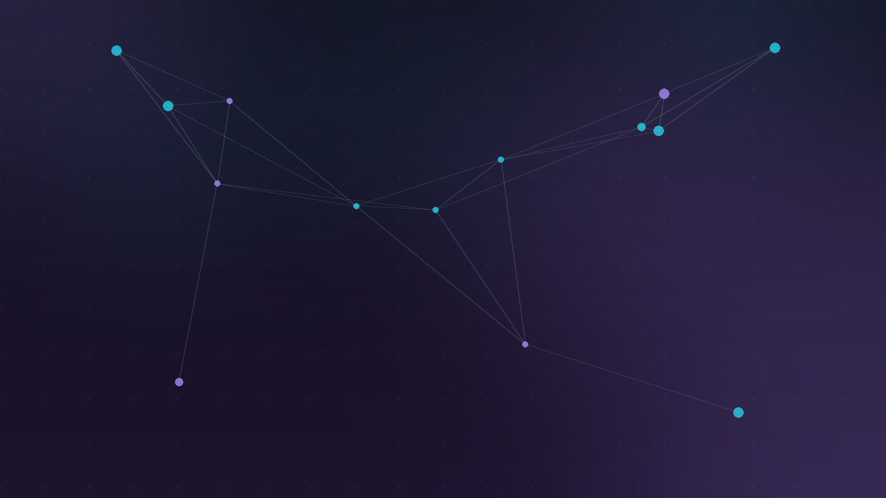

Claude Code sigue evolucionando a un ritmo que ya da miedo. La versión **v2.1.224** trae dos funciones que cambian la forma de trabajar con el agente: sesiones que se mandan mensajes entre ellas, y cloud sessions corriendo en tu propia infraestructura.

## Cross-session messaging: tus Claudes se coordinan solos

Ahora las sesiones de Claude Code **pueden hablar entre sí**. El agente descubre sus otras sesiones con la herramienta `ListAgents` y les envía mensajes con `SendMessage`, ya sea porque se lo pides o porque detecta que un cambio en una sesión afecta lo que otra está haciendo.

El caso de uso es obvio: tienes una sesión trabajando en el API de pagos y otra en el frontend. Le dices a una *"avísale a la que trabaja en payments que `users.name` ahora es `users.display_name`"*, y el mensaje llega como una fila "Message from" que se expande con Ctrl+O. Importante: el mensaje es texto que un Claude escribe para el otro — **nunca tu historial de conversación ni tus archivos**. Disponible en macOS y Linux desde v2.1.224.

## Self-hosted environments: la nube eres tú

La otra bomba: **entornos self-hosted en beta pública** para planes Team y Enterprise. Corres `claude self-hosted-runner` en tus propias máquinas o contenedores y se convierten en runners. Cuando alguien elige tu entorno al iniciar una sesión desde claude.ai, las apps o `claude --cloud`, esa sesión **corre dentro de tu red**, con acceso a tus servicios internos.

Para empresas con requisitos de compliance o sistemas legacy que no ven internet, esto es exactamente lo que faltaba: la experiencia cloud de Claude Code sin salir de casa. Un Owner/admin activa "Allow self-hosted environments" y corre el setup guiado con `claude self-hosted-runner setup`.

## Auto mode ya es el default

Como ya habíamos cubierto, desde el **14 de agosto** auto mode es el modo por defecto en Pro, Max y Team. Lo nuevo: las llamadas del clasificador de auto mode **ya no cuentan contra tus límites de uso**.

## Otros cambios que valen la pena

- **Focus view en VS Code**: esconde la actividad de tools en una fila expandible (Ctrl+Alt+F)
- **Plugins como zip**: marketplaces pueden distribuir plugins en archivo con SHA-256 pin, sin git ni npm
- **`/fork` con worktree propio**: la sesión copiada hace sus cambios en un worktree separado
- **Fuera el cap de 200 subagentes por sesión** (los límites de concurrencia y profundidad siguen)
- **Endurecimiento de seguridad**: un comando de Bash ya no puede ocultar partes de sí mismo de los checks de permisos (adiós al padding con tabs o Unicode invisible), y el aislamiento por worktree ahora bloquea también comandos Bash y redirects de git hacia el checkout principal

La conclusión es simple: Claude Code dejó de ser un CLI para convertirse en una **plataforma de orquestación de agentes**. Con sesiones coordinándose entre sí, infraestructura propia y modos autónomos por defecto, la pregunta ya no es si usar agentes de código, sino cómo gobernarlos.

---

**Fuente:** [Claude Code What's New](https://code.claude.com/docs/en/whats-new/2026-w32) · [Releasebot](https://releasebot.io/updates/anthropic/claude-code)
