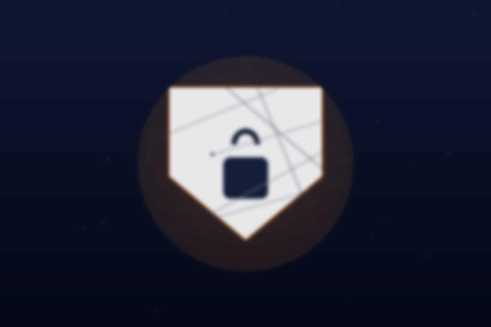

Con la era del "vibe coding", cualquier persona de la empresa puede armar una app en una tarde y dejarla en el internet público en cinco minutos más. Genial para la productividad, pesadilla para el CISO. Cloudflare lo resolvió con un lanzamiento directo: **Cloudflare Access para Workers**.

## La solución es casi obvia (por eso nadie la había hecho bien)

Ahora puedes adjuntar una política de Access **directamente al Worker**, y esa política aplica en todos lados donde el Worker corre: rutas, dominios custom, workers.dev y URLs de preview. Automático, sin depender de que cada developer se acuerde de configurarlo.

Lo que se puede hacer:

- **Política a nivel de cuenta**: todas las deployment de preview y producción quedan detrás del login corporativo por defecto.
- **Política por aplicación**: la autenticación se aplica en cada dominio asociado, sin importar cómo se despliegue.
- **Saber quién visita tu app**: email, nombre y grupos del usuario autenticado llegan directo al código, sin tener que validar JWT a mano.
- **Plataforma interna privada por defecto**: abrieron un [template open source](https://github.com/cloudflare/templates/tree/main/internal-sites-template) para armar una plataforma de sitios internos donde todo lo que se despliega es privado.

## Cómo funciona

Antes había que configurar Access por hostname, y si agregabas un dominio nuevo había que acordarse de actualizar la política primero, o ese dominio quedaba abierto. Ahora la política va pegada al Worker: si Access está activo, la autenticación se exige **antes** de que la petición llegue a tu código, por el camino que llegue.

Puedes elegir proteger solo los previews (workers.dev o dominios custom de preview) o todos los hostnames del Worker. La autenticación se conecta al identity provider existente, o se restringe por email, dominio o grupos. Para agentes, hay service tokens.

## Por qué importa

El problema del shadow IT siempre fue la fricción: hacer las cosas bien era lento, así que la gente saltaba los controles. Con esto, la empresa puede dejar que cualquiera despliegue Workers sin que cada app interna sea una fuga potencial. La seguridad deja de ser un paso del developer y pasa a ser un default de la plataforma.

Ese es el patrón ganador: privado por defecto, no privado por disciplina.

Más info en el [blog de Cloudflare](https://blog.cloudflare.com/workers-protected-by-access/) y la [documentación](https://developers.cloudflare.com/workers/configuration/cloudflare-access/).
