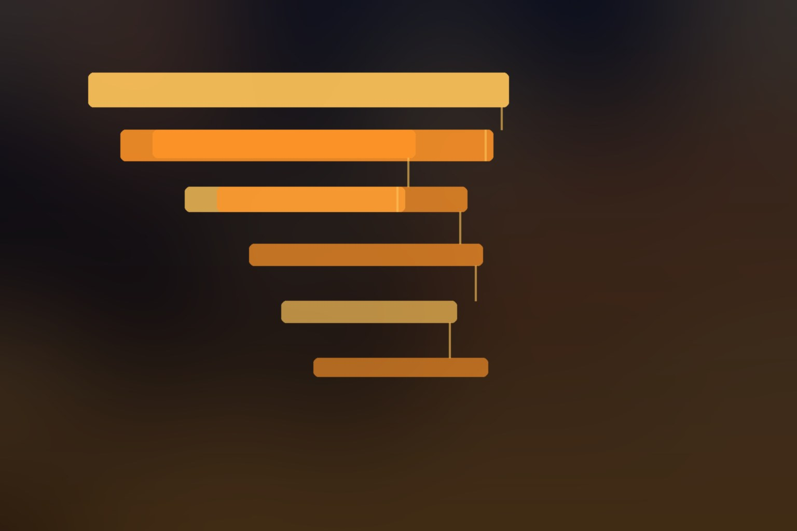

Si alguna vez intentaste debuggear un agente de IA en producción, sabes el problema: el agente devuelve HTTP 200 y aun así falló. Eligió la tool equivocada, le pasó contexto viejo a un subagente o se quemó los tokens en un loop de retries — y tu telemetría tradicional no muestra nada de eso.

Cloudflare acaba de lanzar **Agent Tracing**, el primer componente de **Cloudflare Agents**, un dashboard que reúne las sesiones de agentes desplegados en un solo lugar.

## Qué agrega exactamente

Workers ya tenía tracing a nivel de infraestructura (fetch calls, lecturas de KV, queries a D1). Lo nuevo son **spans de nivel agente**:

```text
invoke_agent {agent class}
├── chat {model}
└── execute_tool {tool}
    └── tool_approval {tool}
```

Cada turno produce un trace con el modelo usado, consumo de tokens, tools ejecutadas y aprobaciones. El trabajo de subagentes se anida bajo la operación que lo invocó, así que un agente padre delegando a un hijo que consulta D1 y escribe en KV se ve como **un solo waterfall** cruzando las dos capas. Ver la llamada al modelo directamente arriba del argumento de tool que falló es literalmente la vista de debugging que uno quiere.

También hay **session replay**: reensambla la conversación grabada (mensajes, reasoning, tool calls con argumentos y resultados). Ojo: reproduce datos grabados, no re-ejecuta el agente.

## Las letras chicas (que importan)

- **Payload defaults inconsistentes**: el harness `Think` no guarda mensajes ni tool payloads por defecto; `Flue` guarda todo por defecto. La misma feature de plataforma con defaults de privacidad opuestos. Si tu harness es verboso, estás mandando mensajes (con potencial data personal y secrets) al trace sin darte cuenta.
- **Los traces no son lossless**: hay límites de tamaño por span, así que mensajes largos, reasoning y resultados se pueden truncar. Session replay no muestra imágenes. No lo uses como audit trail.
- **El span de approval no mide lo que te imaginas**: registra el evento dentro de la invocación del Worker, pero no el tiempo que un humano se demoró en aprobar. La latencia human-in-the-loop —quizás el número más interesante de un flujo con aprobaciones— no está.
- **Pricing desde el 1 de octubre de 2026**: gratis durante la beta; después cae bajo Workers Observability. Free: 200.000 eventos/día con retención de 3 días. Paid: 20 millones/mes, 7 días de retención, USD $0,60 por millón adicional. Detalle clave: **cada span cuenta como un evento**, incluyendo los de internals del SDK que el dashboard ni siquiera muestra. Un harness verboso cuesta más de lo que el dashboard sugiere.

## Lo bueno

Los spans siguen las **convenciones semánticas GenAI de OpenTelemetry** y exportan a cualquier endpoint OTLP. Custom harnesses usan la API de custom spans de Workers. Cloudflare dice que viene soporte directo de la API de OpenTelemetry, lo que permitiría integrar frameworks que emiten spans estándar sin instrumentación manual.

## La tendencia

No es solo Cloudflare: el Agent Framework harness de Microsoft salió con OpenTelemetry activado por defecto, y el tier AI Gateway de Azure API Management exporta métricas de tokens a Application Insights, Datadog y Grafana. Todos llegan a la misma conclusión desde ángulos distintos: **el runtime de agentes necesita su propia capa de telemetría**, porque los spans de infraestructura solos no explican qué hizo el agente.

Si corres agentes en Workers, actívalo ahora que es gratis. Y revisa los defaults de payload de tu harness antes de octubre.
