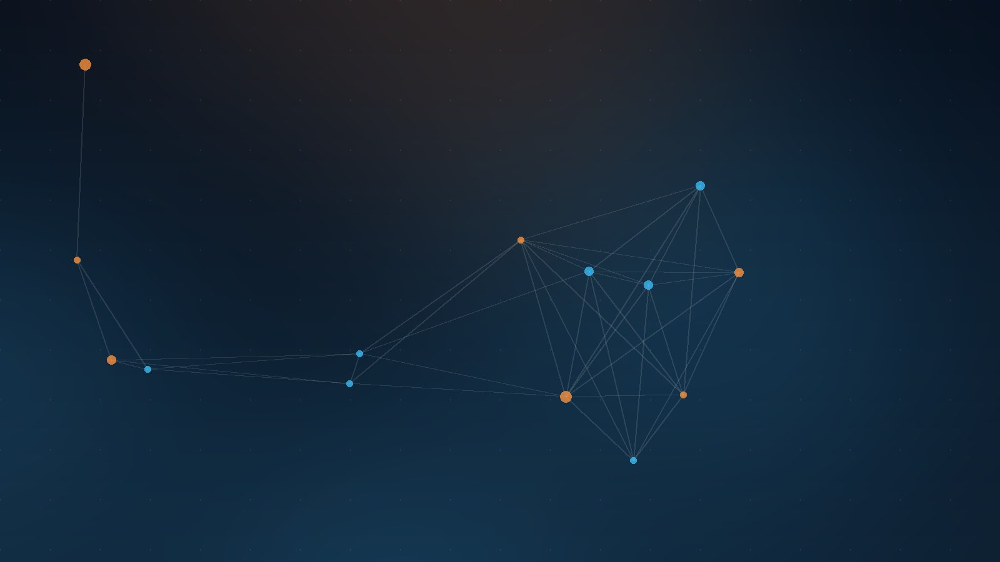

Kubeflow está a punto de ponerse la toga: el proyecto está avanzando rápido hacia su **graduación en la CNCF**, y para demostrar que está a la altura acaba de renovar prácticamente todo su stack. InfoQ hizo un resumen completo y acá va lo importante.

## Kale 2.0: del notebook al pipeline sin escribir SDK

La joya de la actualización. Kale convierte **Jupyter notebooks anotados en pipelines listos para producción** sin escribir una línea del SDK de Kubeflow Pipelines. La versión 2.0 ahora soporta la arquitectura de **Kubeflow Pipelines v2**, acortando de forma brutal el camino entre experimentación y producción. Los data scientists ya no tienen excusa para dejar sus notebooks tirados.

## Notebooks v2: rediseño total con CRDs

Los notebooks se reescribieron desde cero con una arquitectura **declarativa basada en CRDs**. La idea: que los platform teams tengan control con templates sobre entornos interactivos tipo JupyterLab o VS Code corriendo en Kubernetes. Hay una **alpha disponible** para ir probando antes del GA.

## Trainer: entrenar IA y correr HPC en el mismo cluster

El nuevo Kubeflow Trainer unifica **entrenamiento distribuido de IA y workloads HPC** con soporte MPI. Lo más destacado: la integración oficial con el **Flux Framework**, que permite correr simulaciones HPC masivas junto a jobs de entrenamiento en un mismo cluster Kubernetes, coordinados vía PMIx (Process Management Interface Exascale). HPC cloud native dejando de ser oxímoron.

## SDK con Spark nativo y Hub (ex-Model Registry)

- El SDK ahora trae **soporte nativo para Spark** en Kubernetes sin configuración de infraestructura, además de blueprints integrados para **fine-tuning de LLMs**. En el roadmap: instrumentación con **OpenTelemetry** y tracking con MLflow.
- El **Model Registry fue renombrado a Hub**, ampliando su alcance con un Model Catalog y un **MCP Catalog** para buscar y desplegar servidores MCP, usando OCI como estándar de almacenamiento.

## KServe le da categoría de primera clase a los LLMs

KServe estrenó el CRD **LLMInferenceService**, convirtiendo el serving de modelos de lenguaje en una primitiva de plataforma nativa: soporta **inferencia distribuida multi-nodo** y expone **APIs compatibles con OpenAI**.

## Community Distribution 26.03

Validada oficialmente para **Kubernetes 1.34+**, con defaults multi-tenant más estrictos y compatibilidad con **Pod Security Standards Restricted**.

## El dato curioso

Subaru ganó un concurso de case studies de la CNCF usando Kubernetes + Argo CD para bajar el tiempo de pull de **imágenes de contenedores de IA de más de 30 GB: de 3 horas a 3 minutos**. Cuando la comunidad dice que K8s es la base de la IA en producción, no está bromean.

### Update: 19 de agosto — Oficial: la CNCF graduó Kubeflow

Se cayó la toga. La CNCF anunció la **graduación de Kubeflow**, su máxima designación de madurez, confirmando lo que veníamos siguiendo en este post. La ceremonia viene con números de contexto que explican por qué ahora:

- **~260 millones de descargas** de sus paquetes Python en PyPI
- **Más de 6.600 contribuidores** de **+1.000 organizaciones**, y 33.000+ estrellas en GitHub
- **NVIDIA, Red Hat, Spotify y Bloomberg** entre los usuarios de sus subproyectos
- Superó una **auditoría de seguridad independiente** y formalizó su **steering committee**, requisitos obligatorios de la graduación

El timing no es casual: con la IA enterprise saliendo de la etapa experimental, las empresas necesitan operar modelos de forma confiable a escala, y Kubeflow les ofrece el ciclo completo (datos, entrenamiento, fine-tuning, inferencia, serving) sobre Kubernetes **sin amarrarse a un vendor**. El roadmap post-graduación apunta justo a lo más caro de la IA: orquestación de LLMs, post-training, data engineering avanzado y agentes.

Para los platform teams que venían postergando la decisión: graduación = señal de longevidad y gobernanza. El stack Kale 2.0 + Notebooks v2 + Trainer + KServe que revisamos arriba ya no es apuesta, es infraestructura con sello CNCF.

**Fuente del update:** [Cloud Native Now](https://cloudnativenow.com/features/cncf-graduates-kubeflow-for-production-ai-on-kubernetes/)

---

**Fuente:** [InfoQ](https://www.infoq.com/news/2026/08/kubeflow/) · [CNCF Blog](https://www.cncf.io/blog/2026/07/28/kubeflow-unveils-new-cloud-native-innovations-to-supercharge-ai/)
