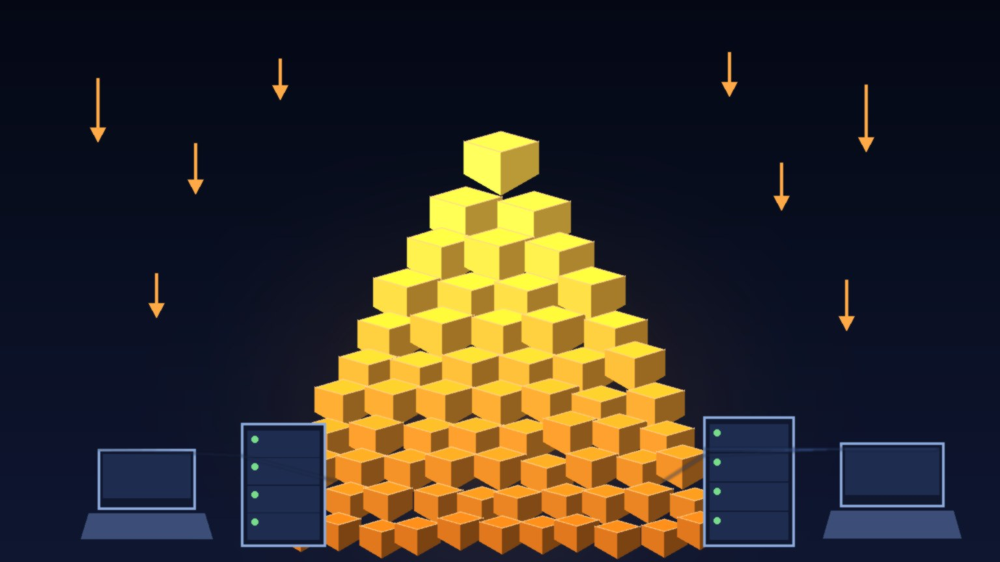

Dato para sentarse un segundo: la familia **Qwen de Alibaba acumuló más de 3.000 millones de descargas globales en solo seis meses**, según confirmó la propia empresa citando el nuevo reporte *State of Open Models* de Hugging Face (publicado el 14 de agosto). Con eso, Qwen se convirtió en la **familia de modelos de IA número 1 del mundo en descargas open source**, dejando atrás a Meta, Google y a todos los rivales chinos.

## Los números, porque los números no mienten

- **Qwen: +3.000 millones de descargas** en los últimos seis meses
- **Google: 418 millones** de descargas en 2026
- **Meta: 227 millones**

O sea, Alibaba tiene varias veces lo que Meta y Google **juntos**. Y según el reporte de Hugging Face, Qwen hoy representa **más del 50% de todas las descargas de modelos open source del planeta**. Más de la mitad del pastel completo.

## El ecosistema que se construyó alrededor

Esto no es un solo modelo exitoso, es una estrategia de ecosistema completa:

- **Más de 460 modelos open source** liberados bajo la familia Qwen
- **Más de 300.000 modelos derivados** creados por la comunidad (fine-tunes, quants, variantes)
- Distribución empresarial vía **Alibaba Cloud** en mercados donde otros no llegan fácil: Sudeste Asiático y África

El reporte de Hugging Face lo dice crudo: *"Qwen se ha convertido en parte del workflow por defecto para developers que deciden qué modelos hacer fine-tune y deployear"*. Ese es el tipo de adopción que Google y Meta llevan años intentando comprar con campañas. Alibaba la consiguió con pesos abiertos y precio.

## Por qué importa

Primero, porque **la vara de la influencia cambió**. En la carrera IA EE.UU.-vs-China, las descargas y los derivados son el termómetro de qué están eligiendo los developers para construir. Y los developers están eligiendo masivamente modelos chinos: baratos, capaces y fáciles de adaptar. Qwen, Moonshot (Kimi), DeepSeek y compañía están **replicando performance frontier** sin dramas, y los controles de exportación de chips no han logrado frenarlos (la breve prohibición de acceso overseas a Fable 5 de Anthropic este verano tampoco frenó a nadie).

Segundo, porque **la respuesta gringa ya empezó, pero va atrás**: en las últimas semanas Meta sacó sus Muse Glimmer y Nvidia sus Nemotron Lightning como apuestas open-weight para competir por developers (ambos ya los cubrimos acá). Son buenos modelos, pero ni Meta ni Nvidia le han quitado la corona a los labs chinos. Como resume Hermann Hauser, cofundador de Arm: plantaron una "bandera muy firme", pero la carrera sigue liderada desde China.

Tercero, y lo más práctico para el que opera infra: **open weights = control**. Mientras los labs cerrados suben precios y ponen restricciones, el ecosistema open te deja hacer fine-tune, correr on-prem y no depender del humor de nadie. Que más de la mitad del mundo open source corra sobre una sola familia es una noticia grande para DevOps, FinOps y arquitectura en general — y también una concentración de la que hay que estar consciente.

**Fuentes:** [Fortune/Bloomberg](https://fortune.com/2026/08/15/alibaba-qwen-open-ai-models-3-billion-downloads-meta-google/), [Business Standard](https://www.business-standard.com/world-news/alibaba-s-qwen-ai-models-cross-3-billion-downloads-overtake-meta-google-126081501092_1.html), [Hugging Face - State of Open Models](https://huggingface.co/blog/state-of-open-models-summer-2026)
