AWS está metiendo su infraestructura de seguridad con IA directo en los entornos de desarrollo construidos por dos de sus rivales más duros — Claude Code de Anthropic y Codex de OpenAI — y con eso hace una apuesta bien clara: **controlar la capa de seguridad importa más que controlar el modelo**.

El anuncio salió en **Black Hat USA 2026**: la plataforma **Continuum** para vulnerabilidades de código se integrará de forma nativa en Claude Code, Codex y el propio Kiro IDE de AWS. En paralelo, AWS expandió **Security Hub Extended** (su marketplace de seguridad de factura única lanzado en febrero) con una décima categoría dedicada a **protección de supply chain**, sumando a Chainguard y Socket como partners.

## Por qué ahora: el efecto Mythos

El contexto no es casualidad. Claude Mythos Preview de Anthropic, mostrado en abril, identificó **miles de zero-days desconocidos** en todos los mayores sistemas operativos y navegadores. Más del **99% sigue sin parchear**, y el tiempo mediano entre descubrimiento y exploit weaponizado — que ya colapsó de 771 días en 2018 a menos de 4 horas en 2024 — se proyecta bajo la **hora** para fin de 2026.

Chet Kapoor, VP de search, security y observability de AWS, lo resumió sin anestesia: los CISOs ya tenían backlog de vulnerabilidades, "y llegó Mythos y lo empeoró 5x". Su visión para la seguridad: pasar de "telemetría, storage, query y dashboards para humanos" a "telemetría, contexto, razonamiento y **acciones por agentes**". El eslogan de Black Hat: seguridad autónoma a velocidad de máquina.

## Cómo funciona Continuum por dentro

 Continuum opera con lo que AWS llama una **arquitectura de loop de equipos de agentes**: un orquestador que elige el modelo adecuado para cada tarea y entrega código seguro validado, en cuatro fases:

1. **Discovery**: múltiples modelos frontier escanean el código e ingieren el backlog existente.
2. **Priorización** (según Kapoor, el mayor value add): contextualiza cada hallazgo contra el entorno y riesgo real del cliente. De 100 a 2.000 vulnerabilidades, ¿cuáles importan de verdad?
3. **Validación**: construye exploits reproducibles en sandbox aislado para confirmar si la vulnerabilidad es explotable y calcular el blast radius. Cubre código propio y dependencias open source.
4. **Remediación**: propone fixes — cambios de red, políticas o parches de código.

Sobre qué modelo usa para qué, Kapoor fue pragmático: "GPT Cyber es bueno en algunas cosas, Mythos en otras". El sistema optimiza por tarea.

## La jugada estratégica

Lo más interesante del anuncio es la integración con herramientas de la competencia directa. AWS compite de frente con Anthropic y OpenAI en servicios de IA en la nube, pero igual abre sus herramientas de seguridad para sus workflows. Mientras el mercado de infraestructura cloud supera los **US$143 mil millones por trimestre** (Synergy Research), posicionarse como el **control plane de seguridad por defecto** para el desarrollo enterprise en la era IA es un negocio gigante.

La lectura corta: en un mundo donde cualquier modelo puede escribir el código, el que controla la verificación de que ese código no te quema — gana.

**Fuentes:** VentureBeat, AWS Security Blog, Synergy Research Group.
