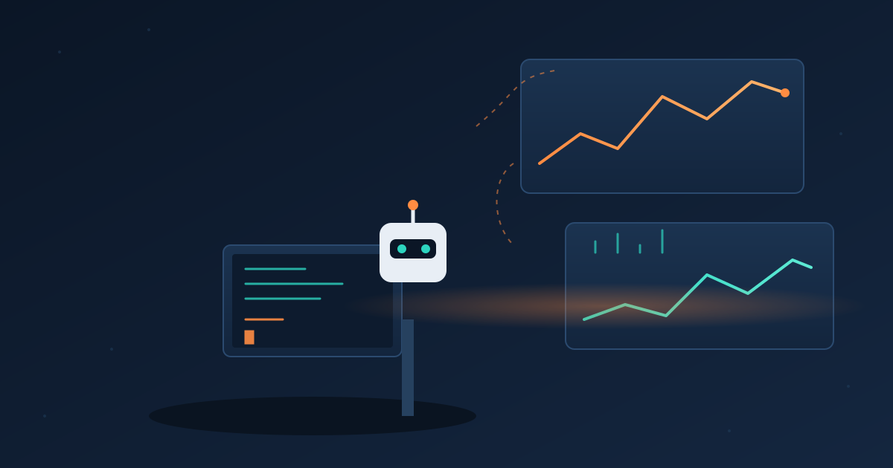

Grafana Labs acaba de mandar a **disponibilidad general** dos herramientas que apuntan directo al problema más incómodo del coding con IA: que los agentes escriben código más rápido de lo que cualquiera lo entiende. Se trata del **CLI gcx** y el **Grafana MCP Server**, ambos anunciados en GrafanaCon 2026 y ahora disponibles para todo el mundo.

## El problema que atacan

La mecánica es conocida: planificas, implementas y revisas cambios mayormente con un LLM, y terminas mergeando un PR sin haber construido el modelo mental del cambio. Antes ese modelo se formaba mientras escribías el código a mano. Cuando el diff lo escribe un agente — y encima llegan approvals tipo "LGTM" de otros agentes — la confianza falsa se acumula. La apuesta de Grafana: meter **observabilidad como capa de verificación basada en evidencia**, no solo code review.

## Dos herramientas, dos niveles de opinión

- **Grafana MCP Server**: set fijo de herramientas para casos de uso comunes. Funciona self-hosted o con endpoint alojado para stacks de Grafana Cloud.
- **gcx**: CLI más flexible y menos opinado, para que los agentes armen workflows propios contra Grafana Cloud, OSS o Enterprise.

Ambos permiten que un agente tire de **métricas, logs, traces, SLOs y Synthetic Monitoring**. Además vienen con bundles de skills instalables (`gcx agent skills install`) y plugins separados para Claude Code, incluida una capa de guía con Grafana Assistant.

## El flujo práctico (con ejemplo real)

El caso que muestra Grafana: agregar un nuevo proveedor de pagos. En vez de adivinar la carga, el agente consulta las métricas RED actuales, detecta que la latencia p95 del proveedor existente es de 2 segundos, y usa ese dato para fijar latencias mockeadas en tests unitarios e de integración. También puede leer y modificar dashboards, trazear queries hasta el código que genera la telemetría, y pushear definiciones actualizadas de vuelta a Grafana o al source control.

Para iterar local, los agentes pueden levantar un OpenTelemetry Collector o usar la imagen `grafana/otel-lgtm` de Docker para un stack LGTM completo en local, y sincronizar dashboards de producción con `gcx resources pull`. El golpe final: usar telemetría real para generar scripts de carga con k6 (`k6 x agent init`), algo que antes tomaba un día de trabajo manual.

## Un PR que se ve distinto

El resultado práctico es que un PR ya no es solo un diff generado por agente: incluye links a dashboards mostrando el build local bajo carga realista. El squad de Tempo en Grafana ya usa un harness agéntico similar para perfilar entornos con terabytes de datos y medir optimizaciones contra un baseline. También hay una feature experimental de **Agentic Testing** que verifica flujos de UI en aplicaciones web vivas con instrucciones en lenguaje natural.

La pregunta cambia de *"¿el agente entendió el ticket?"* a *"¿el sistema corriendo se comporta como esperamos?"*. En un mundo donde el código lo escribe una IA, esa verificación basada en telemetría probablemente se vuelva estándar, no lujo.

**Fuentes:** InfoQ, Grafana Labs blog.
