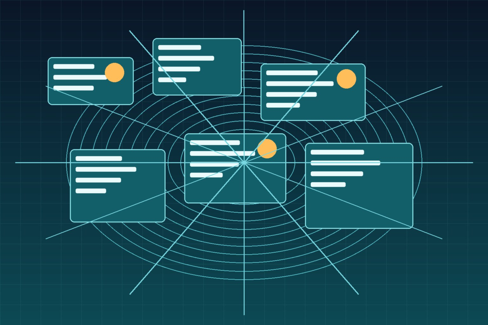

Mientras Occidente discute benchmarks de modelos de texto, Alibaba sigue metiendo leña al ecosistema Qwen. Esta vez le tocó a las imágenes: la familia **Qwen-Image llega a su tercera generación** con **Qwen-Image-3.0**, y la versión **Pro ya está disponible** en la plataforma de Qwen para usarla vía API.

## La apuesta: útil antes que bonita

El pitch oficial es bastante claro y bastante distinto al de la competencia: no están persiguiendo la foto hiperrealista para redes sociales, sino que la **generación de imágenes como herramienta de productividad real**. En concreto:

- **Prompts de hasta 4.500 tokens** y generación de layouts densos en una sola pasada: periódicos, storyboards, menús, exámenes, infografías con mucha información
- **Renderizado de texto chico (10px) con precisión**, incluyendo microexpresiones, poros y pelo con detalle fotográfico
- **12 idiomas con renderizado nativo** y múltiples fuentes tipográficas
- **Simulación realista de interfaces**: páginas web, videojuegos, transmisiones en vivo

O sea, el talón de Aquiles histórico de los image models —el texto ilegible y los layouts que se arman a medias— es exactamente lo que Alibaba dice haber resuelto.

## Detalles prácticos de la API

Para los que quieran probarla en un pipeline, los rate limits iniciales de la versión Pro en la plataforma: **10 requests concurrentes, cola asíncrona de hasta 200 tareas y 5 RPM**. O sea, pensada más para tareas batch asíncronas (generar documentos, mocks, material gráfico) que para serving en tiempo real masivo.

## Por qué importa

Primero, porque la guerra de image gen estaba relativamente tranquila, y que Alibaba meta una tercera generación con foco en **texto y densidad de información** empuja el estándar completo: si esto funciona, cosas como generar mocks de UI, material educativo o documentación visual se vuelven triviales.

Segundo, porque es una pieza más del ecosistema Qwen que hace días pasó los 3.000 millones de descargas en modelos abiertos. La estrategia es obvia: ser la plataforma por defecto donde los developers construyen cualquier cosa con IA — texto, código, video (Wan 3.0) y ahora imágenes. Y por ahora les está funcionando mejor que a Meta y Google juntos.

**Fuentes:** [Qwen](https://qwen.ai/), [QwenCloud](https://www.qwencloud.com/), [Plataforma Qianwen](https://www.qianwenai.com/models/qwen-image-3.0-pro)
