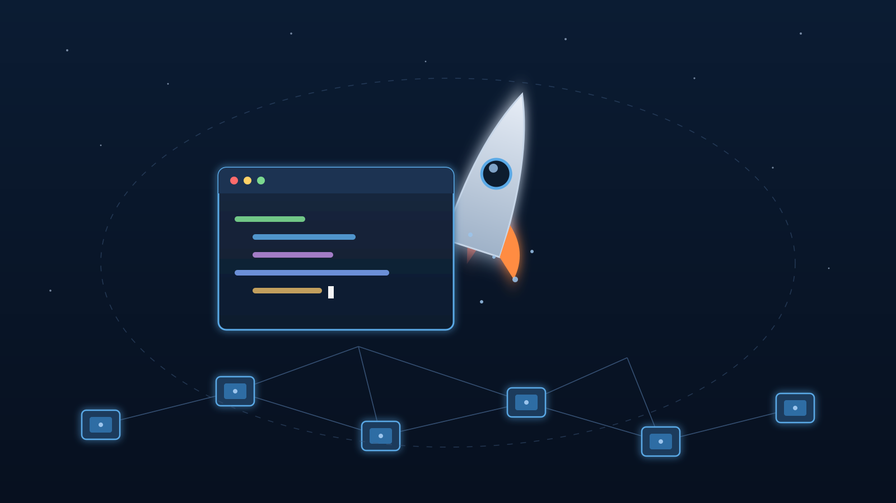

Después de meses de ida y vuelta, regulequeo regulatorio y especulación, **SpaceX completó la compra de Cursor por US$60 mil millones**, pagada 100% en acciones. La compra más grande en la historia del software — y de las más grandes en cualquier industria — ya es un hecho: el asistente de coding de Anysphere pasa a ser parte del ecosistema Grok de **SpaceXAI** (la entidad que nació cuando SpaceX se fusionó con xAI de Musk).

## Los números del deal

- **US$60 mil millones, todo en stock** de SpaceX, posible gracias al IPO de junio. Cero cash.
- Cursor llegaba con **~US$2.600 millones de revenue anualizado**, uno de los productos SaaS de crecimiento más rápido de la historia.
- Clientes enterprise de lujo: **LinkedIn, Figma, Stripe**, entre otros.
- El deal fue anunciado formalmente en junio y **cerró el 14-15 de agosto** tras la revisión regulatoria.

## Lo que gana Cursor (y lo que gana Musk)

La pieza clave: acceso a lo que Cursor describe como **"la mayor flota de GPUs del mundo"** (Colossus). El plan es entrenar modelos mejores y ofrecerlos más baratos. Ya hay resultados: **Grok 4.5** y **Grok 4.6** fueron co-desarrollados con Cursor — el segundo entrenado específicamente para coding, desarrollo web y diseño automatizado (ambos ya los cubrimos acá cuando salieron).

Para Musk, el cálculo es lock-in vertical: cohetes + GPUs + el tool de coding más usado en enterprise. Comprar la capa de aplicación antes que la competencia.

## Los pero (y son grandes)

- **Grok 4.5 está bloqueado en toda la UE** (los 27 países) bajo el AI Act, clasificado como modelo de riesgo sistémico. Sin timeline claro de certificación antes de fines de 2026. O sea: el flamante combo Cursor+Grok no se puede usar en Europa.
- **Market share en baja**: según datos de gasto de Ramp, Cursor cayó del 41% del mercado enterprise en junio 2025 al **26% en mayo de 2026**, con GitHub Copilot acortando. La compra se ve menos como apuesta de crecimiento y más como asegurar ventaja de compute antes de que la brecha se cierre.
- **FTC al acecho**: se espera escrutinio bajo precedentes de integración vertical. Los competidores ya reclaman por la disparidad de acceso a GPUs: Cursor ahora tiene una infra que ningún rival independiente puede igualar.
- Y sobre la "independencia" prometida: según reportes de The Information, en el all-hands interno la gestión reconoció que Anysphere **será completamente absorbida**, no preservada.

## Por qué importa

Porque marca el fin de una era: **la herramienta de coding favorita de los developers ahora le responde a Musk**. Para equipos que ya usaban Cursor con modelos de Anthropic u OpenAI, la pregunta incómoda es cuánto durará esa libertad de elección. Y para la industria completa, confirma que la guerra del AI coding ya no se pelea solo con productos: se pelea con **compute, acciones y adquisiciones de US$60 mil millones**.

Mientras tanto, Copilot, Windsurf y Claude Code tienen una ventana para capturar a los incómodos con el nuevo dueño. Y Europa, literalmente, mirando desde afuera.

**Fuentes:** gagadget, Verdict, Crowdfund Insider, The GPU, Ramp vía Digital Applied.
