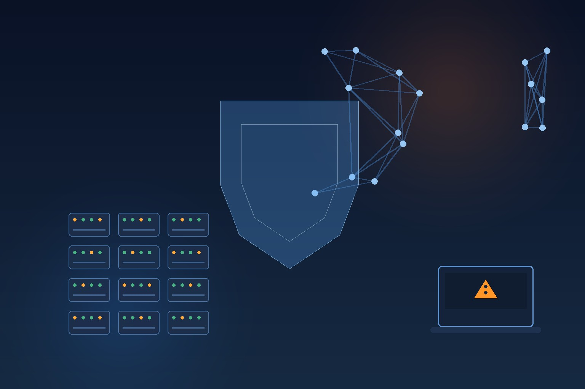

Si trabajas con workloads de ML o IA distribuida, seguro conoces **Ray**: el framework open-source que se transformó en el estándar de facto para escalar entrenamiento e inferencia (hasta OpenAI lo usa). Bueno, CISA acaba de mandar un mensaje bastante claro: el **CVE-2025-62593** entró al catálogo **KEV (Known Exploited Vulnerabilities)** con explotación activa confirmada, y las agencias federales tienen **solo 3 días** para parchear. Tres días. Los plazos normales son de semanas.

## El bug en detalle

- **CVE-2025-62593**, CVSS v4 **9.4** (crítico)
- Afecta **Ray anterior a 2.52.0**
- Es una falla de code injection en el **dashboard y la API de Ray**, que estaban insuficientemente protegidos contra ataques originados en el navegador
- Fue divulgado en **noviembre de 2025**... y acá estamos, nueve meses después, con explotación activa en el wild

## El vector es lo que lo hace picante

Acá está la parte creativa: el ataque funciona vía **DNS rebinding**. Una persona del equipo de data science visita una página web maliciosa desde Firefox o Safari, y el sitio puede alcanzar el dashboard de Ray corriendo en `localhost` o en la red interna, enviando requests que ejecutan código arbitrario en el cluster.

O sea, no necesitas un error de configuración en el firewall ni un phishing elaborado: **bastó con que alguien del equipo de ML entrara a una web mala** mientras el dashboard estaba arriba. Y como Ray suele correr con privilegios elevados en containers, el RCE equivale a controlar el cluster completo.

## Por qué tardó tanto en tomarse en serio

La historia de este CVE es un poco incómoda: el equipo de Ray argumentó inicialmente que era un comportamiento "por diseño" (el dashboard no está pensado para estar expuesto), y la discusión sobre si era realmente una vulnerabilidad se arrastró meses. Mientras tanto, clusters enteros siguieron corriendo versiones viejas. CISA puso punto final a la discusión: hay explotación activa, y el que tenga Ray sin parchear está en la fila de los comprometidos.

## Qué hacer ahora

1. **Actualizar a Ray 2.52.0 o superior** (el fix lleva desde fines de 2025 disponible)
2. Si no puedes parchear hoy: **restringir el acceso al dashboard/API** (que no sea alcanzable desde workstations, solo vía VPN o bastion)
3. Correr Ray **sin privilegios de root** en los workers
4. Revisar logs del dashboard por jobs o tasks que no reconozcas — la explotación lleva tiempo activa

## Contexto para el que opera infra

Ray está en todas partes en el stack de IA moderna: pipelines de entrenamiento, serving, tuning distribuido. Con [Nscale comprando Anyscale](/posts/nscale-adquiere-anyscale/) y KubeCon dedicándole track completo a IA sobre Kubernetes, la superficie de ataque solo crece. La lección repetida de este año (vCenter, GitLab, ahora Ray): **los componentes de infra de IA son el nuevo target preferido**, y los plazos de parcheo se acortaron de meses a días.

Tres días de plazo federal no es una sugerencia, es una alarma.

**Fuentes:** [The Register](https://www.theregister.com/security/2026/08/18/cisa-gives-feds-3-days-to-fix-actively-exploited-ray-rce-bug/5289007), [The Hacker News](https://thehackernews.com/2026/08/cisa-flags-actively-exploited-ray-flaw.html), [Security Affairs](https://securityaffairs.com/197419/security/u-s-cisa-adds-a-ray-project-ray-flaw-to-its-known-exploited-vulnerabilities-catalog.html)
