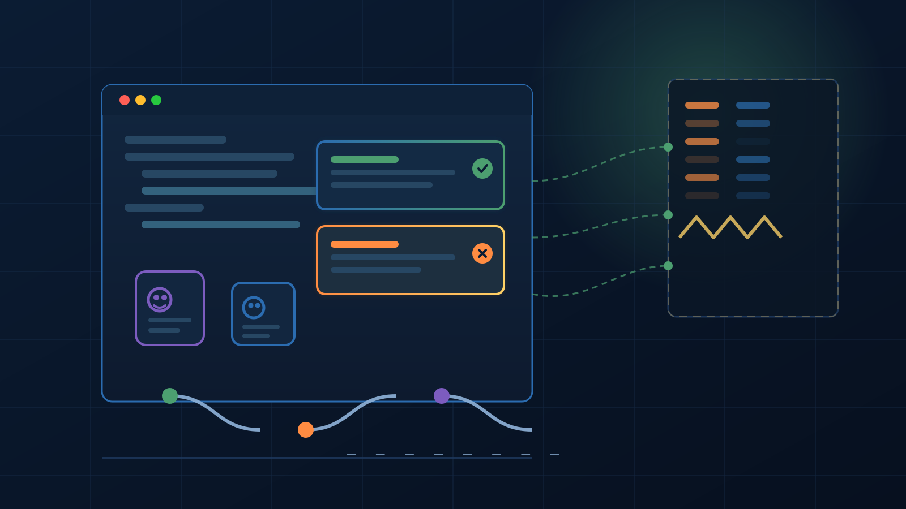

Si el año pasado te dijeron que alguien iba a retar a GitHub en hosting de código, habrías dado una risa nerviosa. Pero 2026 es 2026: **Cursor (ahora parte de SpaceX) lanzó Origin**, su propia plataforma de hosting y colaboración de código, construida desde cero para la era de los agentes de IA. Y el timing fue de guion de cine: lanzaron un lunes en la mañana… y tres horas y media después **GitHub se cayó mundialmente por 6 horas y 42 minutos**.

## Qué es Origin

No es "otro Git hosting". Es un **forge completo dentro de Cursor**: la nueva pestaña Codebase deja crear un codebase (que pasa a ser parte de la URL), hacer push por CLI, y de ahí tienes todo el machinery esperable — almacenamiento, permisos, checks, merges y **pull requests con timelines, commits y diffs**. Los reviewers leen, comentan y mergean **sin abrir el navegador**.

La apuesta real: **"tu código, tus PRs y tus agentes ahora viven en el mismo lugar"**. Puedes preguntar por el archivo en pantalla, pasarle un comentario de review a un agente para que revise el PR en el sitio, o pedirle que pushee una branch. Todo dentro del editor. Para los equipos que ya viven en workflows agénticos, esto es la diferencia entre coordinar tres herramientas y coordinar una.

## La jugada maestra: no te pide dejar GitHub

Acá está lo más inteligente del diseño, y lo que cualquier equipo platform debería estudiar: **Origin no exige migrar nada**. Conectas tu organización de GitHub, eliges repos, y GitHub **sigue siendo el source of truth**. Los permisos se reflejan desde GitHub, y las conversaciones de los PRs se sincronizan en ambas direcciones — comentas en Cursor y aparece en GitHub; responden en GitHub y lo ves en Cursor en segundos.

Estrategia de cuña clásica: nadie firma un rip-and-replace del source control (uno de los proyectos de mayor riesgo que existen), pero probar "una segunda ventana" sobre el código que ya tienes es una petición mucho más fácil de aprobar. Y las integraciones del día uno apuntan justo a eso: **Vercel** (preview deploy por cada PR, beta para Pro/Enterprise), **Depot y Buildkite** para CI — ejecutando tus **GitHub Actions workflows sin cambios**. Si tu forge corre los Actions que ya tienes y deploya al CDN que ya pagas, deja de ser un visor de código y pasa a ser candidato real.

## Y mientras tanto, GitHub se murió 6 horas

La mañana del lanzamiento, el status page de GitHub se puso rojo: error rates cercanos al **20% en PRs, issues y API**, y casi **50% en descargas de archivos raw y archives**. Se cayó también todo el SSO enterprise (SAML, OIDC, SCIM, Team Sync). Y Copilot. Todo.

Fue el **séptimo incidente en 15 días** para GitHub, que en su reporte de disponibilidad de mayo ya reconocía que los workflows de IA y agentes están **añadiendo carga estructural** a su infraestructura. La ironía no pasó desapercibida: *"Íbamos a lanzar esto antes, pero GitHub estaba caído"*, tuiteó Matt Palmer de Cursor. La frase del año.

## Por qué importa

- **Nueva pregunta de procurement**: por 18 años, dónde hostear el código fue la decisión más aburrida de una organización de ingeniería. Los agentes la volvieron interesante — y ahora viene con problema de gobernanza incluido (¿dónde vive el source of truth cuando los agentes escriben el 30% del código?).
- **Confianza en GitHub en juego**: con 7 caídas en 15 días, " pero GitHub nunca se cae" ya no es argumento. La concentración de todo el ecosistema developer en un solo proveedor (que ya discutimos con Cloudflare) tiene a los platform teams buscando plan B.
- **El plan de Musk se aclara**: primer gran producto post-compra de US$60 mil millones. No es un feature más del editor — es Cursor yendo por la capa de plataforma completa. Cohetes, GPUs, editor y ahora forge.

¿Va a migrar alguien masivo a Origin mañana? No. ¿Puede un forge agent-first con la compatibilidad de GitHub Actions y el respaldo de compute de Colossus comerse el mercado en dos años? Esa ya es una pregunta seria. Y GitHub, con su status page en rojo cada semana, parece decidido a regalarle la oportunidad.

**Fuentes:** VentureBeat, TechCrunch, SiliconANGLE, The Register, githubstatus.com.
