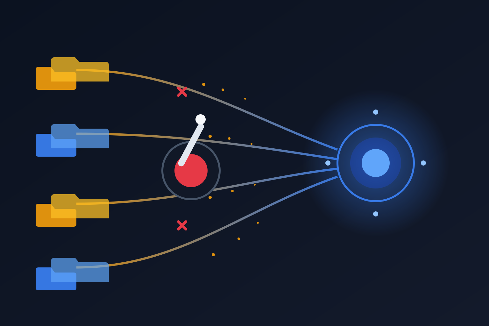

Si tu equipo usa **Vibe Work** de Mistral con los conectores nativos de Google Drive o SharePoint, anota la fecha: **31 de agosto**. Ese día ambos **Knowledge Connectors se apagan y se eliminan**. No es un deprecation silencioso ni una transición con gracia: es un switch off.

## Lo que sabemos

- Los conectores legacy de Google Drive y SharePoint se **apagan y borran** el 31 de agosto.
- El reemplazo son **conectores basados en MCP** (Model Context Protocol), que hay que instalar **manualmente** antes de la fecha.
- **No existe migración automática**. Si no llegas con los MCP instalados y configurados, cada usuario pierde el acceso a su conocimiento indexado de origen.

El detalle incómodo que levanta The New Stack: la documentación no deja claro **qué pasa exactamente con los datos ya indexados** cuando el conector viejo desaparece. ¿Se purgan los índices? ¿Quedan huérfanos? ¿Los permisos heredados de Drive/SharePoint se respetan al reconectar vía MCP? Preguntas abiertas, deadline cerrado. Combinación clásica.

## El contexto: todo el mundo está yendo a MCP

La decisión no es aislada. MCP se está comiendo el ecosistema de integraciones de agentes: Anthropic lo creó, OpenAI lo adoptó, y cada semana un vendor más lo pone como capa estándar para conectar agentes con fuentes de datos (Acá en el blog hemos cubierto desde los MCP servers de Grafana hasta los sandbox de agentes de AWS/Google/Azure).

El argumento técnico es razonable: en vez de N conectores propietarios con permisos custom, un protocolo estándar donde la autenticación y las capacidades se negocian de forma uniforme. El problema es el **cómo**: un hard cutoff a 12 días vista, sin tooling de migración y sin respuestas claras sobre datos y permisos hereda el peor de los mundos — la fricción de una migración con la incertidumbre de un deprecation.

## Qué hacer si te afecta

1. Instala los reemplazos MCP **antes** del 31 (documentación de Knowledge Connectors de Mistral).
2. Documenta qué espacios/repositorios tenían indexados los usuarios, porque después del corte vas a estar reconstruyendo a ciegas.
3. Si tienes requisitos de retención o compliance, pregunta a Mistral directamente qué pasa con el índice viejo. No asumas que se elimina solo.

La lección de arquitectura sigue la misma de todo 2026: si tu stack de agentes depende de conectores propietarios de un solo vendor, el roadmap de ese vendor es tu roadmap. MCP reduce el lock-in a largo plazo, pero las transiciones las paga siempre el equipo de operaciones.

**Fuentes:** [The New Stack](https://thenewstack.io/mistral-mcp-connector-migration/), documentación de Knowledge Connectors de Mistral, develeap.
