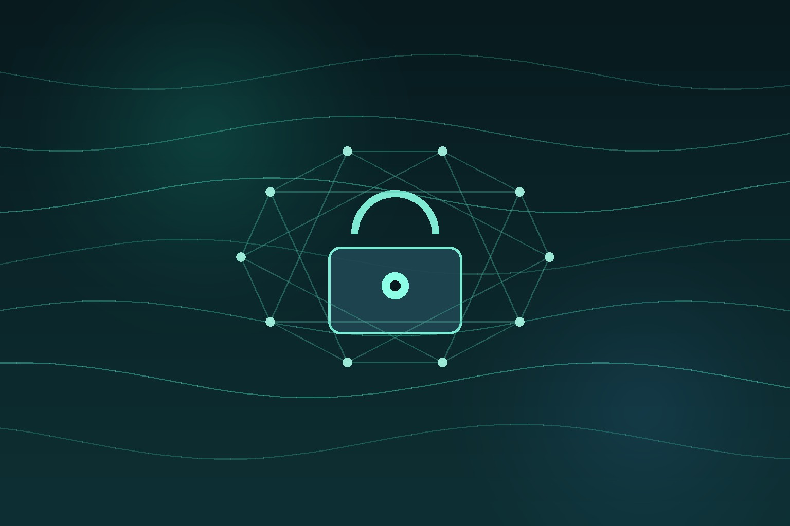

Interesante movimiento de OpenAI un día miércoles: anunció que está testeando con clientes early adopters un sistema llamado **Private Safety Processing (PSP)**, diseñado para **detectar patrones de misuse a través de múltiples interacciones** —no una por una— **sin romper la promesa de Zero Data Retention (ZDR)** para los usuarios de pago de la API.

## El problema que intenta resolver

Para clientes enterprise, OpenAI ofrece ZDR: después de procesar un request, **no retiene prompts ni respuestas**, y no tiene acceso al contenido del cliente. Genial para privacidad y compliance, pero con un costo: los controles de seguridad solo podían evaluar **cada request de forma aislada**. Un actor malicioso repartiendo su ataque en múltiples interacciones quedaba invisible por diseño.

PSP apunta a cerrar esa brecha: identificar **patrones de riesgo a través de interacciones relacionadas**, disuadiendo tanto a bad actors como a **agentes desalineados** (sí, agentes IA que se van de la rails en producción), todo sin almacenar el contenido.

## El contraste con Anthropic

Acá viene lo jugoso, porque las dos empresas tomaron caminos opuestos el mismo día:

- **OpenAI**: "vamos a detectar patrones sin guardar tus datos"
- **Anthropic**: movió sus términos para **requerir logs de datos de 30 días**, según reportó Axios

Para equipos que deciden entre APIs de uno u otro lab con requisitos de compliance estrictos (banca, salud, legal), esta divergencia recién se volvió un criterio de compra concreto. El trade-off es real: más telemetría = mejor detección de abuso, pero más superficie de gobernanza de datos.

## Contexto (no menor)

Todo esto llega menos de una semana después de que supiéramos que OpenAI [disolvió su equipo de Preparedness](/posts/openai-disuelve-equipo-preparedness-safety/) camino al IPO. La lectura cínica: necesitan mostrar que la seguridad no se cayó del camión justo cuando los headlines apuntan lo contrario. La lectura generosa: es una solución técnicamente interesante a un problema genuino. Probablemente ambas cosas son verdad.

Y con Anthropic empujando su IPO de US$2 billones para octubre y la carrera de revenue en máximo, el eje **"seguridad vs. privacidad vs. confianza enterprise"** va a seguir dando titulares.

## Qué significa para tu stack

Si operas agentes o pipelines sobre estas APIs:

1. **Revisa los terms de retención** de tu provider favorito — cambiaron este mes y afecta tu DPIA/paperwork de compliance
2. Si ZDR es duro requisito para ti, OpenAI acaba de ganar un argumento comercial; si prefieres detección de abuso más robusta, los logs de Anthropic tienen lógica
3. Pregúntate cómo funciona "detección de patrones sin retención" en la práctica (¿inferencias efímeras? ¿enclaves?): merece una pregunta directa a tu account manager antes de creerse el brochure

**Fuentes:** [Bloomberg](https://www.bloomberg.com/news/articles/2026-08-19/openai-to-enhance-safety-processes-for-paid-tool-customers), [Axios](https://www.axios.com/2026/08/19/openai-previews-zero-retention-safety-system-as-anthropic-requires-data-logs), [Firstpost](https://www.firstpost.com/tech/openai-tests-zero-retention-safety-system-as-anthropic-moves-to-30-day-data-retention-14039367.html)
